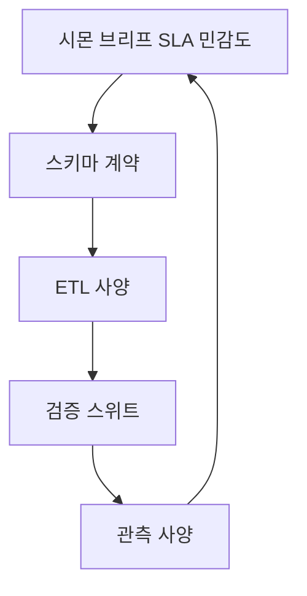

# 데이터 파이프라인 설계 하네스

**정본**: [protocols/README.md](../../../protocols/README.md)(1~5 설계·승인, 7~10 리뷰·검증), [AGENTS.md](../../../AGENTS.md), [architecture.mdc](../../rules/architecture.mdc). Django DB 변경은 [database.md](../../../documents/ai/manuals/database.md)·승인 게이트를 따른다.

**관계**: 전역 오케스트레이션·IDE 습관은 [shapez2-harness](../shapez2-harness/SKILL.md), [cursor-shapez2-harness](../cursor-shapez2-harness/SKILL.md).

채팅에서 켜려면 `@data-pipeline-harness` 또는 에이전트에 이 Skill을 포함한다.

## 에이전트 팀과 계층적 위임

한 스레드에서 **역할 태그**로 발화를 구분한다. 상위가 **산출물·게이트**를 명시하고 하위가 수행한다. 하위가 스키마·계약을 바꾸려면 상위로 **되돌림** 요청을 한다.

| 태그 | 책임 | 레포 페르소나 정렬 | 하위로 넘기는 것(계약) |
|------|------|---------------------|-------------------------|
| `[시몬]` | 범위·SLA·민감도·단계 게이트·최종 클로징 | [persona/simon.md](../../../persona/simon.md) | 플랜에 넣을 **파이프라인 목표·금지 사항** |
| `[스키마]` | 논리/물리 모델, 키·버전·진화 전략 | [도미닉](../../../persona/dominic.md)(불변식·엔티티) | **스키마 계약서**: 엔티티, 관계, PK/FK, 파티션·보존, 마이그레이션 순서 |
| `[ETL]` | 추출·변환·적재, 증분·멱등·백필 | [유리](../../../persona/yuri.md)(유스케이스·경계) + [아다](../../../persona/ada.md)(소스/싱크 어댑터) | **ETL 사양**: 잡 단위, 입력/출력 매핑, idempotency 키, 재시도·DLQ, 스키마 계약 참조 버전 |
| `[검증]` | 품질 규칙·대표성·회귀 | [테스](../../../persona/tess.md) | **검증 스위트**: 스키마 테스트, 변환 단위 테스트, 통합 픽스처, Great Expectations 등 **선언 규칙** 목록 |
| `[모니터링]` | SLO, 알림, 대시보드, 데이터 신뢰도 지표 | 시몬 클로징 + 구현자(아다/지나는 알림 채널 어댑터) | **관측 사양**: 메트릭 이름, 임계값, Runbook 링크, 검증·ETL 잡과의 매핑 |

**위임 순서(고정)**: `[시몬]` 브리프 → `[스키마]` 계약 확정 → `[ETL]`이 그 계약만 소비 → `[검증]`이 스키마+ETL 계약 소비 → `[모니터링]`이 세 계층의 신호·실패 모드를 소비 → `[시몬]` 최종 정합.

## 단계 게이트(설계 파이프라인 안에서)

- [ ] **G0 브리프** (`[시몬]`): 데이터 출처/싱크, 법·PII 등급, RPO/RTO, 비용 상한, **플랜 승인 필요 여부** 명시.
- [ ] **G1 스키마 동결** (`[스키마]`): 계약서 초안 → `[시몬]`·기획 듀오 검토 → **사람 승인** 후에만 ETL 상세 설계.
- [ ] **G2 ETL 동결** (`[ETL]`): 멱등·증분·실패 모드 문서화 → `[검증]`이 규칙 초안을 달 수 있는 수준.
- [ ] **G3 검증 동결** (`[검증]`): 실패 시 **어느 계층 버그인지** 판별 기준(스키마 vs 변환 vs 소스) 명시.
- [ ] **G4 관측 동결** (`[모니터링]`): 알림이 **행동 가능**한지(Runbook, owner) 확인 → `[시몬]` 문서 동기화.

의미 있는 스키마/저장소 변경은 [AGENTS.md](../../../AGENTS.md) **명시적 승인**·[database.md](../../../documents/ai/manuals/database.md) 전제를 따른다.

## `[스키마]` 체크리스트

- [ ] 식별자·자연 키·대리(surrogate) 키 정책.
- [ ] 스키마 진화: additive 우선, breaking 시 이중 쓰기/백필 단계.
- [ ] 도메인 레이어: I/O 없음 ([architecture.mdc](../../rules/architecture.mdc)).

## `[ETL]` 체크리스트

- [ ] 입력 스키마 버전 고정(pinning); 출력은 G1 계약과 diff 검사.
- [ ] 멱등 키·워터마크·chunk 경계; 부분 실패 시 재실행 안전.
- [ ] PII: 마스킹·토큰화는 **어댑터**([아다])에서, 비즈니스 규칙은 유스케이스([유리]).

## `[검증]` 체크리스트

- [ ] 계약: null 비율, 유니크, 참조 무결성, 비즈니스 불변식.
- [ ] 변환: 대표 입력·골든 파일·경계(빈 배치, 큰 배치).
- [ ] 소스 드리프트: 샘플링 또는 프로파일링 잡 정의.

## `[모니터링]` 체크리스트

- [ ] 잡: 성공/실패/지연/처리량; 큐 적체.
- [ ] 데이터: 검증 규칙 위반율, 신선도(최종 성공 타임스탬프).
- [ ] 알림: 페이지 조건 vs 티켓 조건 분리; 노이즈 억제(재알림 간격).

## 구현 단계(파이프라인 6번)에서의 3단계

[persona-dialogue.mdc](../../rules/persona-dialogue.mdc)와 동일: 요약·분배 → 담당 한두 문장 → 코드. 데이터 작업도 **2 없이 3 금지**.

## 마감·자동 검증(렉스)

[persona/rex.md](../../../persona/rex.md) 순서: `python -m pytest` → `ruff check .` → `mypy .` → `black .`. 데이터 전용 테스트는 `[검증]`이 경로·마커를 브리프에 적는다.

## 산출물 권장 위치

- 플랜·계약 본문: `documents/` (한국어 본문, [AGENTS.md](../../../AGENTS.md) 문서 권위).
- 코드·마이그레이션: 레이어 규칙에 맞는 앱·모듈.

## 참고

- Cursor에서의 컨텍스트·MCP: [cursor-shapez2-harness](../cursor-shapez2-harness/SKILL.md).
