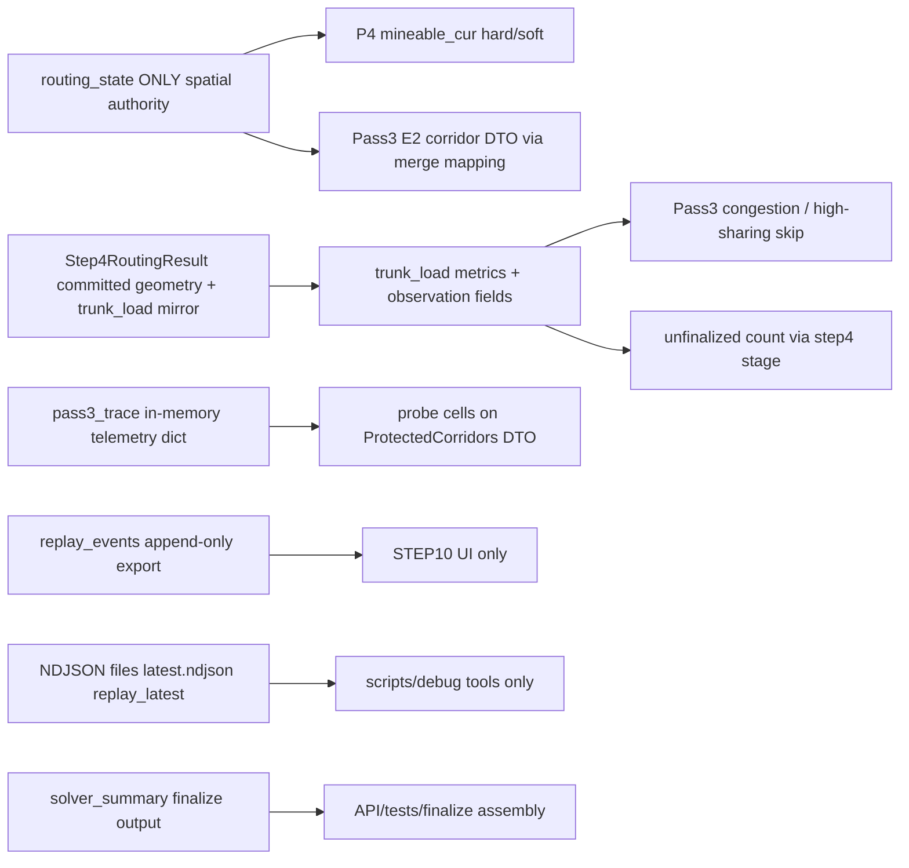

# authority_drift_matrix (read-only audit)

Principal Runtime Authority Auditor deliverable. No code changes; matrix reflects repository state at audit time.

## Canon source note

- Requested paths `documents/canon/03_…` through `14_…` are **not present** in this checkout. Equivalent canonical text was taken from [`documents/Algorithm/mining_solver_cursor_sessions/`](documents/Algorithm/mining_solver_cursor_sessions/) (`03_data_schema_dto.md`, `08_step4_routing.md`, `10_step6_reclaim_loop.md`, `11_step8_recovery.md`, `12_protected_corridor.md`, `14_step10_replay_ui.md`).
- [`authority_drift_report.md`](authority_drift_report.md) is **partially superseded** for reclaim corridor sourcing: it describes `merge_step4_corridor_routing_mapping` importing corridors from `trunk_load` and pass3_trace fallbacks for hard/soft. Current [`reclaim_corridors.py`](django_apps/shapez_asteroid/services/asteroid_mining_layout/reclaim/reclaim_corridors.py) ignores `trunk_load` (`_ = trunk_load`, line 118) and ignores `pass3_trace` for hard/soft pool selection (`_ = pass3_trace`, line 226). See **D7** below for remaining `pass3_trace` coupling (probe fields only).

## Critical canonical rules (audit lens)

- `routing_state` is the **only** runtime spatial authority for committed corridors / route ownership (per session canon `03` / `08` / `12`).
- `trace_event`, replay NDJSON, `replay_events`, `solver_summary`, `latest.ndjson`, debug NDJSON are **output layers** only (`14`).
- `trunk_load` mirrors STEP4 metrics / observation; **`step4_committed` in trunk_load is not a substitute for explicit gate args** (`08` §9.6 state source table).
- `recovery_trigger` ≠ `commit_reason` (`11` §13.5).
- `ROUTED_CONFIRMED` ≠ route geometry immunity (`03` / `08`).
- Replay must never drive runtime routing decisions (`14`).

## Authority model (canon-aligned)

## Drift matrix

| ID | File | Function / entry | Line(s) | Canonical violation | Runtime risk | Suggested deletion/refactor path (no new framework) |
|----|------|-------------------|---------|---------------------|--------------|--------------------------------------------------------|
| D1 | `django_apps/shapez_asteroid/services/asteroid_mining_layout/pass3/pass3_transport.py` | `run_pass3_transport_minimization_from_maps` | Doc L127–133; call L212–225; L261–303 | **08 §9.6 / 03 §19.1**: `trunk_load` is a STEP4 **observation mirror**; using it to steer lex/greedy shifts route search authority away from `routing_state` + live map. | Congestion / victim-skip order can diverge from true layout if mirror lags or is mis-aggregated. | Derive congestion from one authoritative source (`routing_state` + current transport map, or a single merge-state snapshot at STEP4 commit). Update docstring L132–133: `merge_step4_corridor_routing_mapping` **no longer reads** `trunk_load`. |
| D2 | `django_apps/shapez_asteroid/services/asteroid_mining_layout/pass3/pass3_e2_shadow.py` | `_p3e2_shadow_trace` | L94–101 | Same: `pass3_edge_congestion_weights_from_trunk_load(trunk_load)` drives lex weights. | Shadow/guarded preview can disagree with true protected pool + map. | Same as D1 for edge weights; pass `trunk_load=None` at merge call if redundant, and fix docs so mirror is not implied authority. |
| D3 | `django_apps/shapez_asteroid/services/asteroid_mining_layout/pass3/pass3_e3_guarded_lex_collect.py` | (lex collect entry) | L76–77 | Mirror-driven lex cost. | Atomic candidate search skew. | Same as D1. |
| D4 | `django_apps/shapez_asteroid/services/asteroid_mining_layout/pass3/pass3_greedy_core.py` | `reconstruct_mining_priority_transport` | L500–501 | **Recovery branching**: `cells_on_high_sharing_trunk_edges(trunk_load, …)` uses mirror edge sharing for removal skips. | Under recovery, removal order depends on telemetry mirror, not `routing_state`. | Derive high-sharing from committed route geometry in `routing_state` / live `transport_cells` snapshot. |
| D5 | `django_apps/shapez_asteroid/services/asteroid_mining_layout/solver_pipeline/step4.py` | Stage wrapper (before `Step4StageResult`) | L262–263; L182–204 (replay payload only) | **03 `routing_state` vs FSM**: `unfinalized_placement_count` for downstream **Pass3 permission** is read from `step4_result.trunk_load`, not `routing_state.placement_commit_by_id`. | If `trunk_load` and `routing_state` diverge, Pass3 eligibility is wrong under strict single-authority reading. | Compute unfinalized from `routing_state` / `placement_commit_by_id` at handoff; keep trunk_load field as echo for summaries only. |
| D6 | `django_apps/shapez_asteroid/services/asteroid_mining_layout/step4/step4_recovery_trigger.py` | `step4_primary_recovery_trigger_from_result` | L35–46 | Capacity discriminator reads `result.trunk_load[…]` alongside `routing_failures` rows. **11 §13.5**: keep namespaces distinct; mirror bool is secondary evidence. | Mis-classification if mirror bool and failure rows disagree. | Promote capacity signal to explicit field on `Step4RoutingResult` or `routing_state`; keep `trunk_load` copy report-only. |
| D7 | `django_apps/shapez_asteroid/services/asteroid_mining_layout/reclaim/reclaim_corridors.py` | `protected_corridors_read_for_reclaim` | L256–263; helpers L41–47 | **14 / 12**: Hard/soft are **not** taken from trace (good), but **probe** sets are parsed from `pass3_trace` into runtime DTO `ProtectedCorridors`. Trace layer bleeds into runtime DTO. | **Low today**: `reclaim_shadow_scan` uses hard/soft only for `mineable_cur` (L394–416); risk rises if `corridor_lifecycle_state_for_cell` gates placement later. | Move probe lifecycle into `routing_state` or strip probes from runtime reclaim DTO; keep in NDJSON/replay assembly only. |
| D8 | `django_apps/shapez_asteroid/services/asteroid_mining_layout/reclaim/reclaim_shadow_commit_b2_incremental.py` | `_p4_b2_try_commit_incremental_route` | L126–129 | **10 §12.2**: reclaim internal-transport budget must align with Pass3 savings; code sets `pass3_saved = 0` after `_ = pass3_trace`, so budget uses floor path unrelated to actual Pass3 delta. | B2 accepts/rejects incremental routes on **wrong budget** vs scan path (scan recomputes from maps L496–502 in `reclaim_shadow_scan.py`). | Pass the same map-derived `pass3_internal_transport_saved` int as scan, or one summary field populated once from maps. |
| D9 | `django_apps/shapez_asteroid/services/asteroid_mining_layout/solver/solver_permission.py` | `p4_reclaim_permission_snapshot`, `post_reclaim_pass3_permission`, `post_reclaim_pass3_gate` | L58–120 | **11 / 03**: P4 / post-reclaim gates branch on `pass3_summary` keys — mutable dict surface parallel to `routing_state`. | Skip or wrong rerun if summary keys stale or overwritten. | Narrow gates to typed stage results or explicit flags on `routing_state` / small structs at commit boundaries. |
| D10 | `django_apps/shapez_asteroid/services/asteroid_mining_layout/solver_pipeline/p4_reclaim.py` | `run_p4_reclaim_stage` (inline) | L213–215, L223–241 | `pass3_summary.update({k:v from p4_trace …})` merges **P4 trace keys into Pass3 summary namespace** — **11 §13.5** hygiene. | Key collisions; recovery tagging reads merged dict. | Keep `p4_trace` separate; copy explicit fields under `p4_*` or nested `p4_reclaim`. |
| D11 | `django_apps/shapez_asteroid/services/asteroid_mining_layout/step4/step4_p2c_corrective.py` | Cascade / replay payload branch | ~L235 (`normalize_replay_transport_kind`) | Core STEP4 imports **replay schema helper** for transport kind strings (**14** coupling). | Low: mostly serialization; tight module coupling. | Minimal kind literals in step4 or shared neutral `constants` without `solver_replay_events`. |
| D12 | `django_apps/shapez_asteroid/services/asteroid_mining_layout/validation/trunk_load_observation_soft.py` + `solver_pipeline/finalize.py` | `trunk_load_observation_soft_warnings` (caller in finalize ~L659) | finalize ~L659 | Soft-warning uses `transport_usage_load` inside `trunk_load` for validation **messaging**, not routing. Borderline vs strict “mirrors not authority”. | Low if warning-only; risk if promoted to hard gate without recomputing from map. | Keep warning-only; any hard gate must use map-derived usage. |

## Non-drift / isolated (completeness)

- **`replay_events`**: Append-only in pipeline modules (`finalize.py` ~L781–782; `recovery_orchestrator.py` module doc L6–7). Guard: `tests/unit/shapez_asteroid/test_step10_replay_contract.py`.
- **`latest.ndjson` / `replay_latest.ndjson`**: Reads under `scripts/debug/` and tests; not mining algorithm hot path (`solver_trace.py` doc).
- **`solver_summary`**: Built in `finalize.py`; routing modules guarded by `tests/unit/shapez_asteroid/test_step4_telemetry_regression_gates.py`. No disk NDJSON read-back into routing found.
- **`trace_event` / `debug_trace_event`**: Writers + e.g. `placement/pass2_spine.py` logging; no routing **reads** in audited paths.
- **`step4_recovery_trigger.py`**: Doc states no `solver_summary` / replay consumption for classification.

## Validation

- Read-only audit; no patches, no new frameworks, no architecture refactor in this deliverable.

## Follow-up

- Remediation for D1–D4, D5, D8, etc. is out of scope here; apply minimal patches only after a separate implementation approval.
- `authority_drift_report.md` was annotated in the same change set to point at this matrix where the older report disagrees with current `reclaim_corridors.py`.
