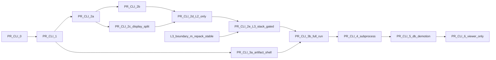

# Asteroid Lab CLI-first Split — Per-PR Plan Set

**Status:** APPROVE WITH STRUCTURAL AMENDMENTS (2026-05-30, 2nd review)
**This folder is the authoritative per-PR set.** Superseded summary: [`../archived/2026-05-30-asteroid-lab-cli-first-split.md`](../archived/2026-05-30-asteroid-lab-cli-first-split.md)
**Cursor plan mirror:** `.cursor/plans/asteroid_cli-first_split_6dd5f267.plan.md`
**Spec (author in PR-CLI-0):** [`../../specs/2026-05-30-asteroid-lab-cli-first-artifact-design.md`](../../specs/2026-05-30-asteroid-lab-cli-first-artifact-design.md)

This folder holds one detailed, independently-executable plan per PR. Each file is self-contained:
goal, scope, non-goals, file map, step-by-step tasks, tests, verification commands, risks, done criteria.

**Execution tracker:** [`checklist.md`](checklist.md) — cross-PR master checklist (frozen decisions, blocking
amendments, guards, per-PR steps, done criteria). Use it to track progress; PR files remain the detailed contract.

## Frozen decisions (every PR must preserve)

```text
1. package root = src/shapez2_factory/
2. hybrid now → subprocess/artifact default later (subprocess_only = target)
3. DB = run registry / artifact index / option cache only (not solver state SoT)
```

## Blocking amendments (cross-cutting; each PR restates the ones it touches)

| ID | Requirement |
|----|-------------|
| BA-1 | `src/shapez2_factory/**` must not import `django`, `django_apps`, `config`, ORM, settings, web/replay UI. Shims one direction only. |
| BA-2 | No monolithic move PR; 2a–2e split + CLI as own PR. |
| BA-3 | No active L3 relocation during boundary-m-repack PR-B/C; PR-CLI-2e gated. |
| BA-4 | `output/replay_core.jsonl` is core/deterministic; Django enrichment only; no web-ready core payload. |
| BA-5 | Atomic write `.tmp/<run_key>` → hash → manifest last → rename; DB ingest after `ARTIFACT_WRITTEN`. |
| BA-6 | Phase D manifest parsing via `artifact_manifest_reader.py` (Option 1, no core import). |
| BA-7 | Subprocess: `shell=False`, list args, `sys.executable`, fixed cwd, timeout, log capture, path-traversal guard, typed exit codes. |
| BA-8 | `game_data_snapshot.json` fail-closed; ORM → export → JSON adapter single path. |

## Structural amendments (2nd review, 2026-05-30)

| SA | Change |
|----|--------|
| SA-1 | PR-CLI-2d **drops `stack_runner` move** (would force a `django_apps` bridge → BA-1 violation). 2d = L2 + shared + contracts only. |
| SA-2 | `stack_runner` moves in **PR-CLI-2e together with L3–L6** — no bridge ever left in core. |
| SA-3 | PR-CLI-3 **split** into `3a` (artifact shell + `validate-artifact`, depends CLI-1/2a) and `3b` (full pure run-stack, depends CLI-2e). |
| SA-4 | PR-CLI-2c gains **blocking `display_map` pure/viewer split** (`complete_map` transitively imports `replay/*`). |
| SA-5 | PR-CLI-6 uses **Option A**: in-process removed from request path entirely (no escape hatch). |

## Guards (cross-cutting)

| Guard | Where | Test |
|-------|-------|------|
| A schema version | 3a | `test_manifest_rejects_unknown_schema_version` |
| B replay monotonic | 3b | `test_replay_core_rejects_non_monotonic_frame_index` |
| C artifact root + run_key safety | 3a (+ reused in 4) | `test_run_key_safety` |
| D JSONL streaming-only | 3b policy, enforced 5 | `test_ssr_does_not_inline_full_replay` |
| run_key collision (writer-level) | **1** (default reject) + 3a (`--replace-existing`) | `test_artifact_writer_rejects_existing_dir` |
| shim identity | 2d | `test_contract_shims_preserve_identity` |
| replay_core no-django | 3b | `test_replay_core_does_not_import_django_replay` |
| replay loader is iterator | 5 | `test_artifact_replay_loader_returns_iterator` |

## PR index

| PR | File | Depends on | Note |
|----|------|-----------|------|
| PR-CLI-0 | [`pr-cli-0-spec-and-gates.md`](pr-cli-0-spec-and-gates.md) | — | spec/ADR/gates |
| PR-CLI-1 | [`pr-cli-1-core-scaffold.md`](pr-cli-1-core-scaffold.md) | CLI-0 | scaffold + atomic writer |
| PR-CLI-2a | [`pr-cli-2a-dto-move.md`](pr-cli-2a-dto-move.md) | CLI-1 | leaf DTO |
| PR-CLI-2b | [`pr-cli-2b-game-data-port.md`](pr-cli-2b-game-data-port.md) | CLI-2a | GameDataRulesPort |
| PR-CLI-2c | [`pr-cli-2c-reconstruction-move.md`](pr-cli-2c-reconstruction-move.md) | CLI-2a | + display_map split (blocking) |
| PR-CLI-2d | [`pr-cli-2d-l2-shared-contracts-move.md`](pr-cli-2d-l2-shared-contracts-move.md) | CLI-2b, CLI-2c | **L2+shared+contracts only; NO stack_runner** + shim identity test |
| PR-CLI-2e | [`pr-cli-2e-l3-gated-move.md`](pr-cli-2e-l3-gated-move.md) | CLI-2d + L3 stable | **L3–L6 + stack_runner together; gated** |
| PR-CLI-3a | [`pr-cli-3a-artifact-shell.md`](pr-cli-3a-artifact-shell.md) | CLI-1 (+2a) | artifact shell + validate |
| PR-CLI-3b | [`pr-cli-3b-full-run-stack.md`](pr-cli-3b-full-run-stack.md) | CLI-2e + CLI-3a | full pure run |
| PR-CLI-4 | [`pr-cli-4-django-subprocess-ingest.md`](pr-cli-4-django-subprocess-ingest.md) | CLI-3b | subprocess + ingest |
| PR-CLI-5 | [`pr-cli-5-db-demotion-replay.md`](pr-cli-5-db-demotion-replay.md) | CLI-4 | DB demotion + JSONL streaming |
| PR-CLI-6 | [`pr-cli-6-subprocess-only-default.md`](pr-cli-6-subprocess-only-default.md) | CLI-5 | subprocess_only (Option A) |

## Dependency graph



## Global verification

```powershell
python -m pytest tests/unit/architecture/test_shapez2_factory_core_purity.py -v
python -m pytest tests/unit/shapez2_factory/ -v
python -m ruff check src/shapez2_factory
python -m mypy django_apps config src
```

Closing of each PR follows [`AGENTS.md`](../../../../AGENTS.md) Caveman six sections. No commit/push/PR without explicit user request.
