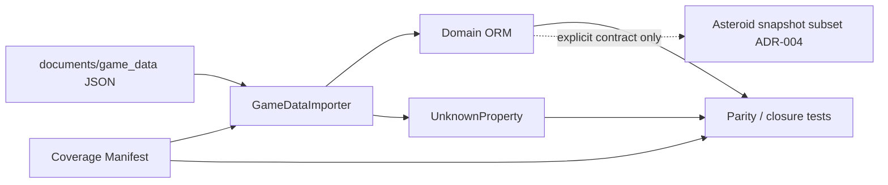

# game_data Domain-Complete Coverage — Design Spec

**Status:** Phase 0–1, 1d, 3 + Phase 2 simulation path audit implemented (2026-05-22)  
**Scope:** `documents/game_data/` (A) vs normalized ORM (B) — **not** byte-identical backup  
**Plan:** [`2026-05-22-game-data-domain-complete-coverage.md`](../plans/2026-05-22-game-data-domain-complete-coverage.md)  
**Domain guide:** [`game_data_coverage.md`](../../domain/game_data_coverage.md)

## Problem

Prior comparisons (row counts, `ArtifactChecksum`, `dumpdata` shape) proved **source file integrity at import time**, not that every nested JSON path is either domain-rowified or explicitly classified.

| Finding | Implication |
| ------- | ----------- |
| B is ORM projection | Lossy by design for reflection/runtime/delegate paths |
| Some domains are well decomposed | e.g. `shapes.json`, `building_variants.json` |
| Some paths are ambiguous | e.g. `simulation_systems` deep state, toolbar `Children[]` vs 204 flat rows |
| `items.json` has no `Item` model | **Intentional** — recipes normalize to `ShapeRecipe`; provenance must not be destroyed on overlap |

**Incorrect claim:** A and B are “identical.”  
**Correct claim:** B is a **domain-complete** projection of A when every relevant nested path is `promoted`, `cross_ref`, or `ignore_audit`.

## Success criterion

```text
∀ artifacts in documents/game_data/*.json:
  ∀ registered nested paths p (coverage manifest):
    exactly one disposition:
      promoted      → ORM row(s) + SourceObject / FK cross-ref
      cross_ref     → FK or lookup to another domain row
      ignore_audit  → UnknownProperty(reason_code) or documented no-op
```

**Non-goals**

- Full structural mirror of all nested nodes (e.g. 6k+ `ChainPositions` without domain proof)
- `JSONField` / `raw_json` on domain models (`validators.py`, `ALLOWED_JSON_MODELS`)
- Replacing interchange backup A with B only
- Auto-expanding `AsteroidGameDataSnapshot` (ADR-004) when coverage tables grow

## Backup strategy (unchanged)

| Tier | Path | Role |
| ---- | ---- | ---- |
| A | `documents/game_data/` | Full interchange source |
| B | `game_data_backup/` (`dumpdata`) | ORM restore snapshot |

DB work **augments** B’s meaning; it does **not** subsume A.

## Approach: A1 + A2 hybrid

| Layer | Owner | Rule |
| ----- | ----- | ---- |
| **A1 — Coverage manifest** | `django_apps/game_data/coverage/` | Static path → disposition; tests enforce registry |
| **A2 — Importer promotion** | importers + models | New tables **only** when manifest says `promoted` and parity tests fail |

Manifest owns the success definition; code changes are **reactive** to test failures, not speculative table sprawl.

## Architecture



### New modules (planned)

| Module | Purpose |
| ------ | ------- |
| `game_data/coverage/manifest.py` | Path prefixes → `promoted` \| `cross_ref` \| `ignore_audit` |
| `game_data/coverage/reason_codes.py` | Enum aligned with `UnknownProperty.reason_code` |
| `docs/domain/game_data_coverage.md` | Human-facing disposition index (Phase 3) |

## Mandatory invariant (items provenance)

```text
ShapeRecipe import must be provenance-preserving.
items.json import must not overwrite shapes.json provenance.
catalog_source is source appearance metadata, not destructive canonical ownership.
```

**Forbidden:** `update_or_create` on `ShapeRecipe` that changes `catalog_source` (or any canonical field) when the same `(operation_uid, shape_hash)` is imported from `items.json` after `shapes.json`.

### Policy P1 — canonical recipe + source appearance (approved)

Reject **P2** (composite unique per `catalog_source` duplicate rows) and **P3** (`BOTH` enum on single row) for weaker `SourceObject` lineage.

| Model | Role |
| ----- | ---- |
| `ShapeRecipe` | One canonical row per `(operation_uid, shape_hash)` — geometry ownership |
| `ShapeRecipeSourceAppearance` | One row per **artifact row** that contributed the recipe |

```text
ShapeRecipe
  canonical_id
  operation_uid
  shape_hash
  quadrant_count, layer_count
  import_batch FK
  source_object FK         # canonical primary (see rule below)
  catalog_source           # DEPRECATED Phase 1a–1c; removed Phase 1d after backfill

  UK: (operation_uid, shape_hash)     # pair unique — NOT separate column uniques
  canonical_id remains unique

ShapeRecipe.source_object rule:
  canonical primary source_object = first FULL appearance if any, else first ITEMS.
  All provenance truth lives on ShapeRecipeSourceAppearance.

ShapeRecipeSourceAppearance
  shape_recipe FK
  source_object FK         # required
  catalog_source           # FULL | ITEMS (TextChoices)
  artifact_filename        # shapes.json | items.json
  source_row_index
  import_batch FK

  UK: (import_batch, artifact_filename, source_row_index)
```

**Migration sequence (Phase 1 — safe)**

1. **1a:** Add `ShapeRecipeSourceAppearance`; keep `ShapeRecipe.catalog_source` (deprecated, unused by new importer logic).
2. **1b:** Data migration — backfill one appearance per existing recipe from `catalog_source` + `source_object`.
3. **1c:** Importer + tests green on appearances; verify pair-UK against live dump before dropping single-column uniques.
4. **1d:** Remove `ShapeRecipe.catalog_source` field (and obsolete single-column uniques only if data proves pair-UK sufficient).

**Import behavior**

1. `shapes.json` (FULL): upsert `ShapeRecipe` by `(operation_uid, shape_hash)`; create appearance `FULL`.
2. `items.json` (ITEMS): same upsert key; **add** appearance `ITEMS`; do **not** mutate recipe fields already set by FULL except idempotent geometry refresh if policy allows (plan must spell out: geometry re-import overwrites slots, not catalog provenance).
3. Overlap: two appearances on one `ShapeRecipe`; FULL lineage never deleted.

**Phase 0 tests (gate before Phase 2)**

| Test | Asserts |
| ---- | ------- |
| `test_shape_recipe_no_catalog_source_overwrite` | After FULL then ITEMS import, FULL appearance still exists |
| `test_shape_recipe_source_appearance_full_items_overlap` | Overlap set: exactly two appearances, distinct `catalog_source` |
| `test_items_recipe_count_matches_source_appearances` | A: 70 items rows → 70 `ITEMS` appearances |
| `test_items_layer_slot_parity_by_source_object` | Per `SourceObject` for `items.json`, layer/slot counts match JSON |

**No `Item` model.** No `JSONField`.

## Domain pack: four mandatory areas

### 1. `items.json`

| Aspect | Decision |
| ------ | -------- |
| Domain tables | `ShapeRecipe`, layers, slots, **`ShapeRecipeSourceAppearance`** |
| Cross-ref | `ShapeQuadrantSlot` → `FluidColor`, `ShapeComponentKind` |
| Audit | Overlap inventory in tests + optional browse filter by appearance |

### 2. `toolbar_entries.json`

| Aspect | Decision |
| ------ | -------- |
| Model | **No new tables** — 204 flat rows = nodes |
| Proof | Flatten **equivalence**, not 519 nested `Children` mirror |

**Phase 0 tests**

| Test | Asserts |
| ---- | ------- |
| `test_toolbar_path_closure` | A `display_name_key` set == `ToolbarTreeNode.tree_path` |
| `test_toolbar_parent_child_edges` | Parent/child edges from A == DB `parent_id` + `child_index` |
| `test_toolbar_no_dangling_parent` | Every non-root parent path exists |
| `test_toolbar_acyclic` | Parent graph is DAG |
| `test_toolbar_children_aux_paths` | Extend existing `SourceObject.source_path` checks where needed |

Existing: `test_toolbar_tree.py` (counts, ancestor chain, sibling uniqueness).

### 3. `simulation_systems.json`

| Aspect | Decision |
| ------ | -------- |
| Already promoted | `SimulationSystem`, connectable graph, connectors, lanes, bounds, belt policy, parameter registry |
| Converter rows | `SimulationRuntimeAuditIssue` + `UnknownProperty` — no delegate tables |
| Factory stub (143) | No domain rows — manifest `ignore_audit` |
| **ChainPositions / TileBasedSystems** | **Not pre-classified** — run `scripts/audit_simulation_nested_paths.py` once; register paths in manifest before promotion |

**Lane runtime note:** `SimulationLaneRuntimeState.state_value_text` is bounded scalar text today; if audit proves planner-relevant coordinates, normalize to scalar columns in Phase 2 (still no `JSONField`).

**ADR-004:** Simulation coverage extensions are browse/cross-ref first; snapshot builder changes require separate contract version.

### 4. `buildings.json` / `building_groups.json` — Assembly

| Aspect | Decision |
| ------ | -------- |
| `Assembly` / `DeclaredMembers` | **`ignore_audit`** — reflection metadata |
| Mechanism | `UnknownProperty` with `reason_code=REFLECTION_METADATA`, `classification=assembly_reflection` |
| Already promoted | `BuildingGroup`, members, placement rules, simulation settings, variant FK |

**No** `DeclaredMembers` domain tables.

## Cross-reference contract

Extend `tests/unit/game_data/test_cross_references.py` for manifest `cross_ref` edges:

| From | To |
| ---- | -- |
| `ShapeQuadrantSlot` | `FluidColor` |
| `BuildingGroupMember` | `BuildingVariant` |
| `ConnectableSimulation` | `BuildingVariant` |
| `ToolbarBuildingPlacement` | `BuildingVariant` |
| `ResearchUnlockCost` | `ShapeRecipe` |
| `ShapeRecipeSourceAppearance` | `SourceObject`, `ShapeRecipe` |

Validation remains **read-only assert** — no repair in validators.

## Coverage manifest (initial entries)

| Artifact prefix | Disposition | Notes |
| --------------- | ----------- | ----- |
| `items.json` → `definition_snapshot.Definition.Layers` | promoted | Via `ShapeRecipe*` |
| `items.json` catalog | cross_ref | `ShapeRecipeSourceAppearance` |
| `shapes.json` | promoted + appearance FULL | Same recipe key |
| `toolbar_entries.json` `display_name_key` | promoted | `ToolbarTreeNode` |
| `toolbar_entries.json` nested `Children` in snapshot | cross_ref | Flattened to row paths |
| `simulation_systems.json` `ConnectableSimulations[]` | promoted | Existing C-lite |
| `simulation_systems.json` `ISimulationSystem.*` | ignore_audit | Delegate |
| `simulation_systems.json` `SimulationFactory` | ignore_audit | Stub profile |
| `buildings.json` `definition_snapshot.Assembly/**` | ignore_audit | REFLECTION_METADATA |
| `buildings.json` `PlacementRequirements[]` | promoted | `BuildingPlacementRule` |
| `buildings.json` `Definitions[]` | promoted | `BuildingGroupMember` |

Pending audit script: `TileBasedSystems`, `ChainPositions`, other high-count paths.

## Reason codes (`UnknownProperty`)

| Code | Use |
| ---- | --- |
| `REFLECTION_METADATA` | Assembly / DeclaredMembers |
| `RUNTIME_DELEGATE` | `ISimulationSystem.*`, backing fields |
| `SIMULATION_FACTORY_STUB` | Opaque factory rows |
| `RUNTIME_UNITY_METADATA` | `$type`, `$unity`, `instance_id` |
| `UNMAPPED_DOMAIN_CANDIDATE` | Manifest gap — should fail CI once manifest is enforced |

## Implementation phases

| Phase | Deliverables | Migrations |
| ----- | ------------ | ---------- |
| **0** | Manifest stub, items P1 **tests** (red), toolbar closure tests, simulation audit script | None |
| **1** | P1 model + importer: appearances; deprecate → backfill → tests → remove `catalog_source`; Assembly → UnknownProperty | Yes (1a–1d migration chain above) |
| **2** | Manifest-driven promotion only where parity fails | As needed |
| **3** | `docs/domain/game_data_coverage.md`; optional ADR-005 coverage boundary | Docs |

**TDD order:** Phase 0 tests → Phase 1 impl → `test_fast.ps1` narrow paths → full gate before merge.

## ADR-004 boundary

| Layer | May consume |
| ----- | ----------- |
| `game_data/snapshots/builder` | Explicit solver subset only (buildings, transport registry v0) |
| Browse / admin / cross-ref tests | Full domain-complete ORM |
| New coverage tables | **Not** auto-included in `AsteroidGameDataSnapshot` |

Amending snapshot contents requires ADR-004 extension + contract tests update.

## Risks

| Risk | Mitigation |
| ---- | ---------- |
| P1 migration on live DB | 1a–1d chain; backfill appearances before dropping `catalog_source` |
| Pair-UK vs legacy single-column uniques | Verify dump before 1d; do not assume `operation_uid` alone is globally unique |
| Manifest drift | CI test: importer paths ⊆ manifest; unmapped → fail |
| Simulation path audit scope creep | Script output capped; human classifies before promotion |

## References

- Auditor findings (conversation 2026-05-22)
- `documents/game_data_analysis/**` per-file classification
- `docs/adr/ADR-004-game-data-snapshot-boundary.md`
- `django_apps/game_data/services/validators.py`
- `tests/unit/game_data/test_toolbar_tree.py`, `test_source_object_coverage.py`

## Spec self-review (2026-05-22)

| Check | Result |
| ----- | ------ |
| Placeholders / TBD | Simulation ChainPositions deferred to audit script — explicit |
| Internal consistency | P1 + forbidden overwrite aligned with success criterion |
| Scope | Single plan-worthy track; Phase 2 table adds gated |
| Ambiguity | Resolved: `source_object` = first FULL else first ITEMS; appearances own lineage |

## Principles (fixed)

```text
Domain-complete ≠ lossless mirror.
Provenance is never overwritten.
Manifest owns coverage classification.
ADR-004 snapshot remains explicit subset only.
```
