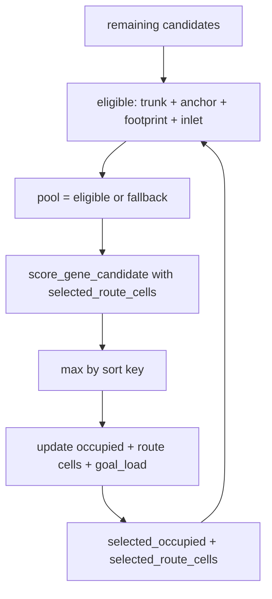

# Phase I Commit Survivability (Tier 1) — Design Spec

**Status:** Approved 2026-05-22 (implemented)  
**Owner:** solver-runtime-pipeline  
**Date:** 2026-05-22  
**Scope:** **B** — Full Tier 1 (mirror + selection score + commit probe budget parity)  
**Track:** C (commit survivability) — **not** capacity-96, not rim packing, not GA  
**Related:**
- [`2026-05-22-shared-transport-inlet-design.md`](2026-05-22-shared-transport-inlet-design.md) (Phase I mirror deferred test)
- [`2026-05-22-deferred-commit-retry-design.md`](2026-05-22-deferred-commit-retry-design.md) (already shipped; complementary)
- [`phase_i_candidate_selection.md`](../../../documents/Algorithm/solver_runtime/phase_i_candidate_selection.md)
- [`phase_j_incremental_commit.md`](../../../documents/Algorithm/solver_runtime/phase_j_incremental_commit.md)
- [`asteroid_lab_05_genome_fitness.md`](../../../documents/Algorithm/asteroid_lab_05_genome_fitness.md) (predictive penalties only)

## Problem (Run #11)

```text
rim 81 → dedupe 57 → normal 64 → select 24
  → footprint skip 6
  → commit 20 + probe_fail 4 (deferred retry 0/4)
validation_passed: true
confirmed: 20 / target: 96 (capacity — out of scope)
```

Pipeline **contract (A)** is closed. The gap is **commit survivability (B)** within the selection budget: **24 ordered → 20 confirmed**, with **4× `route_probe_failed`** at commit reprobe (not inlet skips on the reference run).

Tier 1 does **not** aim for 96 miners. Success = move **confirmed toward 24** when footprints allow, without weakening validation or inlet/trunk rules.

## Success criteria (Tier-1-GATE)

| Gate | Requirement |
|------|-------------|
| T1 | `validation_passed` stays true on reference asteroid |
| T2 | `occupied_cell_conflict == 0`, final `inlet_on_shared_transport == 0` (unchanged commit rules) |
| T3 | `len(ordered_candidate_ids) == 24` when pool + footprint budget allow (unchanged selection cap) |
| T4 | `confirmed_count` ≥ **22** on reference run (stretch: **24**) |
| T5 | `commit_route_probe_failed_count` (final) ≤ **2** (stretch: **0**) |
| T6 | `test_selector_skips_stub_on_accumulated_transport_cells` green |
| T7 | `run_success` may remain false (96 target unchanged) |

**Non-goals:** Gate C / dedupe policy, GeneTemplate DB mix, rim packing, `target_miner_bundle_count` clamp, GA, wiring `CommitSurvivabilityMetrics` into fitness/selection, second deferred retry round.

## Approved approach (single PR)

Three coordinated changes in Phase I + pipeline wiring:

1. **Hard filter** — Phase I mirror of shared-transport inlet (closes deferred spec test).
2. **Soft score** — Predictive shared-path / corridor survivability penalties during greedy pick (deprioritize order-dependent reprobe losers).
3. **Probe budget parity** — Commit reprobe uses the same `route_probe_max_expansions` as Phase H generation.

Deferred commit retry (Phase J) remains as-is; Tier 1 reduces probe failures **before** retry rather than replacing retry.

## Architecture

```text
Phase H (generate)
  route_probe_max_expansions = config.route_probe_max_expansions
        │
        ▼
Phase I (select) ── NEW: accumulated planned route cells
  │   hard: fixed_output_transport ∉ selected_route_cells
  │   soft: shared_path_pressure + existing score terms
        │
        ▼
Phase J (commit) ── WIRE: max_probe_expansions = config.route_probe_max_expansions
  reprobe + deferred retry (unchanged)
```

### Shared path normalization (contract)

Commit and selection must use the **same** planned route cell set. Extract commit’s `_normalize_probe_path` into a shared module:

```text
django_apps/asteroid_lab/optimization/route_path_normalization.py
  normalize_probe_path(candidate, path) -> tuple[Coord, ...]
```

**Planned route cells for a candidate (selection proxy):**

```python
frozenset(normalize_probe_path(c, c.route_probe_result.path))
```

This matches Phase J post-reprobe normalization before `reserved_cells` / `committed_route_cells` update. v0 does **not** add separate `reserved_cells` on `GeneCandidate`; path union is the pragmatic proxy from [`shared-transport-inlet`](2026-05-22-shared-transport-inlet-design.md).

**Accumulated set during greedy loop:**

```python
selected_route_cells: set[Coord]  # union of planned cells for ordered picks
```

Updated after each pick (same point as `selected_occupied`).

## Component 1 — Phase I inlet + route mirror

**File:** `candidate_selector.py`

When building `eligible`, add alongside footprint filter:

```text
c.fixed_output_transport ∉ selected_route_cells
```

- Same-kind route path overlap on non-stub cells remains **allowed** (no broad `equipment & route` rejection at selection).
- Stub on accumulated transport is **excluded**, not merely penalized.

**Diagnostics:** extend `SelectionDiagnostics`:

```python
selection_skipped_inlet_on_shared_transport_count: int = 0
```

Increment when a candidate in `remaining` is skipped **only** because `fixed_output_transport ∈ selected_route_cells` while trunk, anchor slot, and footprint checks would pass (mirror counting style of duplicate-anchor diagnostic).

**Pipeline summary:** add `selection_skipped_inlet_on_shared_transport_count` next to existing selection keys in `solver_runtime_pipeline._anchor_diversity_metrics` or selection summary builder.

**Test:** `test_selector_skips_stub_on_accumulated_transport_cells` in `test_candidate_selector.py` — two candidates, first establishes trunk cell in planned path, second’s `fixed_output_transport` equals that cell → second not in `ordered_candidate_ids`; first remains.

Mark deferred row in `2026-05-22-shared-transport-inlet-design.md` testing table as **superseded by this spec** (implementation plan owns green check).

## Component 2 — Selection survivability score

**File:** `candidate_score.py`

Extend scoring with **predictive** terms only (Phase H probe snapshot — never commit reprobe results).

### New inputs

```python
def score_gene_candidate(
    candidate: GeneCandidate,
    *,
    inp: OptimizationInput,
    goal_assigned_platforms: Mapping[GoalLoadKey, int],
    selected_route_cells: frozenset[Coord] = frozenset(),
) -> CandidateScoreBreakdown:
```

`select_gene_candidates_greedy` passes `frozenset(selected_route_cells)` on each iteration.

### Penalties (v0 Tier 1)

Reuse `compute_conservative_fragility_penalties` from `fitness_contracts.py` with **`PenaltyMode.CONSERVATIVE`** fixed for Tier 1 (no new run-config knob):

| Term | Source | v0 Tier 1 |
|------|--------|-----------|
| `shared_path_pressure_penalty` | `α * \|path_cells ∩ selected_route_cells\|` | **Active** — `path_cells = frozenset(normalize_probe_path(...))` |
| `route_fragility_penalty` | `β * narrow_segment_count` | **0** — `narrow_segment_count = 0` until RouteClass segment data exists on `GeneCandidate` |

**Constants** (new in `candidate_score.py`, tuned for Phase I scale):

```python
SHARED_PATH_PRESSURE_WEIGHT = 2.0   # α
ROUTE_FRAGILITY_WEIGHT = 5.0        # β (multiplies 0 in v0)
```

Subtract both from `total` (same sign convention as existing penalties).

Extend `CandidateScoreBreakdown` with:

```python
shared_path_pressure_penalty: float
route_fragility_penalty: float
```

Existing `_corridor_pressure_penalty` (protected corridor cells from `inp`) **stays separate** — it penalizes protected overlap, not peer candidate path overlap.

### Forbidden

- Reading `CommitSurvivabilityMetrics` or commit outcomes into `score_gene_candidate`.
- Using `CommitConflictReason` strings as score inputs.
- Penalizing same-kind trunk sharing on non-stub path cells (only stub inlet is hard-filtered).

### Tests

| Test | Asserts |
|------|---------|
| `test_score_penalizes_shared_path_overlap_with_selected` | Same throughput/goals; candidate with more overlap with `selected_route_cells` has lower `total` |
| `test_selector_prefers_lower_shared_path_pressure` | Greedy order picks lower-overlap candidate when scores otherwise close (deterministic ids) |

Optional: golden update only if selection order changes on existing fixtures — expect narrow test-only coverage first.

## Component 3 — Commit probe budget parity

**File:** `solver_runtime_pipeline.py`

After `config = generation_config_from_run_config(run_config)` (or equivalent), pass:

```python
commit_selected_candidates(
    commit_plan,
    candidates_by_id,
    inp=inp,
    max_probe_expansions=config.route_probe_max_expansions,
)
```

Default remains **256** when run config omits override — but commit and generation now share the **same** resolved config object path.

**Test:** `test_pipeline_passes_generation_probe_budget_to_commit` in `test_solver_runtime_pipeline.py` — patch `commit_selected_candidates`, run pipeline stub/minimal, assert `max_probe_expansions` equals config used for `generate_gene_candidates`.

## Data flow (one greedy iteration)



**Sort key unchanged:** `(breakdown.total, -route_probe_result.cost, candidate_id)`.

## Error handling

- Empty `route_probe_result.path` → `normalize_probe_path` returns empty; candidate contributes no route cells until selected (inlet check still applies to `fixed_output_transport`).
- If all remaining fail inlet filter but trunk/footprint would pass → greedy may `break` or fall through to `pool = remaining` per existing footprint saturation behavior; **do not** weaken inlet rule in fallback pool. If fallback would admit inlet violators, **exclude inlet violators from fallback** (explicit rule: inlet is never relaxed in `pool = remaining`).

## Contract / enum changes

| Item | Change |
|------|--------|
| `SelectionDiagnostics` | +`selection_skipped_inlet_on_shared_transport_count` |
| `CandidateScoreBreakdown` | +`shared_path_pressure_penalty`, +`route_fragility_penalty` |
| `CommitConflictReason` | none |
| `solver_summary` | +`selection_skipped_inlet_on_shared_transport_count` |

## Doc sync (implementation plan task)

- [`phase_i_candidate_selection.md`](../../../documents/Algorithm/solver_runtime/phase_i_candidate_selection.md) — document inlet hard-filter + shared-path score terms + breakdown fields.
- [`2026-05-22-shared-transport-inlet-design.md`](2026-05-22-shared-transport-inlet-design.md) — mark Phase I mirror test as owned by this spec.
- [`README.md`](../../../documents/Algorithm/solver_runtime/README.md) — one-line under open decisions / post-Run#11 if needed.

## Verification

```bash
python -m pytest tests/unit/asteroid_lab/test_candidate_selector.py tests/unit/asteroid_lab/test_solver_runtime_pipeline.py
python -m pytest tests/unit/asteroid_lab/test_incremental_commit.py
python -m ruff check django_apps/asteroid_lab/optimization/candidate_selector.py django_apps/asteroid_lab/optimization/candidate_score.py django_apps/asteroid_lab/optimization/route_path_normalization.py django_apps/asteroid_lab/services/solver_runtime_pipeline.py
```

Manual: re-run reference asteroid Solver → inspect `confirmed_count`, `commit_route_probe_failed_count`, `selection_skipped_inlet_on_shared_transport_count`.

## Implementation order (for writing-plans)

1. Extract `normalize_probe_path` + unit test parity with commit behavior.
2. Red: `test_selector_skips_stub_on_accumulated_transport_cells`.
3. Green: inlet hard-filter + diagnostics + summary wire.
4. Red: score/selector preference tests for shared-path pressure.
5. Green: `score_gene_candidate` extensions + selector pass-through.
6. Red: pipeline probe budget test.
7. Green: `solver_runtime_pipeline` wiring.
8. Doc sync + manual Tier-1-GATE on reference map.

## Risks

| Risk | Mitigation |
|------|------------|
| Over-penalizing trunk merges lowers throughput picks | Conservative α; keep throughput weight dominant; gate on reference run |
| Mirror false positives if path proxy ≠ commit path | Shared `normalize_probe_path`; same function in J and I |
| Probe budget parity hides order failures | T5 still tracks probe_fail count; score + mirror address order, not budget alone |
| `assumption:` Run #11 failures are mostly shared-corridor order effects | If T4 fails after Tier 1, Tier 2 Gate C / patterns next — not inlet rollback |

## Follow-up (Tier 1.1 — approved)

Reference run after Tier 1 implementation: **no change** (`confirmed_count` 20, `commit_route_probe_failed_count` 4). Next track: **[`2026-05-22-commit-order-probe-fragile-first-design.md`](2026-05-22-commit-order-probe-fragile-first-design.md)** — C′ commit order only (`probe_fragile_first`); selection score scale deferred.

## Follow-up (Tier 1.2b — implemented 2026-05-22)

When `selection_skipped_inlet_on_shared_transport_count` stayed **0** but commit still saw `inlet_on_shared_transport`, the gap was **normalized tail vs full generation path**. Phase I inlet mirror now accumulates **`selection_mirror_route_cells`** = all coords in `route_probe_result.path` (see `route_path_normalization.py`). Scoring still uses `planned_route_cells` (normalized tail only).

## Follow-up (reprobe drift — approved 2026-05-22)

Reference still **21 confirmed / 2 probe_fail / 1 inlet** after T1.2b. Next track: **[`2026-05-22-reprobe-drift-shadow-domain-design.md`](2026-05-22-reprobe-drift-shadow-domain-design.md)** — Phase I′ shadow domain parity; RD-GATE requires **24 selected, 24 confirmed, 0 probe_fail, 0 inlet** on reference (not ≤1 / ≥23).

## Alternatives rejected

| Alternative | Why not |
|-------------|---------|
| Mirror-only (scope A) | Leaves Run #11’s 4× probe_fail unaddressed |
| Soft penalty instead of hard inlet filter | Violates shared-transport v0; blocks inward feeders |
| Feed commit metrics into selection | Forbidden shortcut (observed ≠ predictive) |
| Second deferred retry round | Complexity; Tier 1 first |
