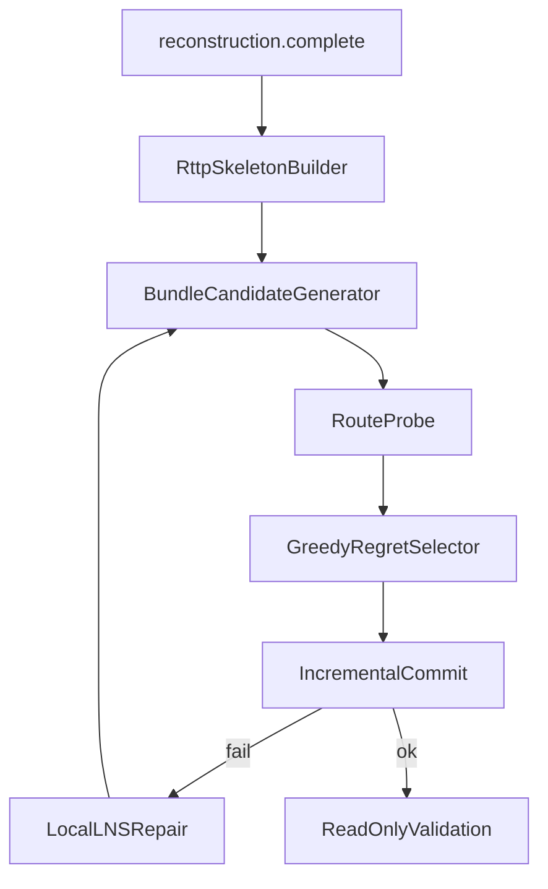

# RTTP Hybrid C — Layout Optimization Design Spec

**Status:** Approved 2026-05-22 (architecture review — Hybrid C)  
**Owner:** asteroid-lab / solver-runtime-pipeline  
**Track:** Post–strip-solver **new optimization layer** (rebuild, not patch)  
**Prerequisite:** [`2026-05-22-strip-solver-keep-recon-complete-design.md`](2026-05-22-strip-solver-keep-recon-complete-design.md) gates satisfied (`reconstruction.complete` only today; optimization reintroduced under this spec)

**Related (CANON / ACTIVE):**

- [`documents/Algorithm/asteroid_lab_00_overview.md`](../../../documents/Algorithm/asteroid_lab_00_overview.md)
- [`documents/Algorithm/asteroid_lab_01_optimization_input.md`](../../../documents/Algorithm/asteroid_lab_01_optimization_input.md)
- [`documents/Algorithm/asteroid_lab_02_pattern_library.md`](../../../documents/Algorithm/asteroid_lab_02_pattern_library.md)
- [`documents/Algorithm/asteroid_lab_03_candidate_generator.md`](../../../documents/Algorithm/asteroid_lab_03_candidate_generator.md)
- [`documents/Algorithm/asteroid_lab_07_incremental_commit.md`](../../../documents/Algorithm/asteroid_lab_07_incremental_commit.md)
- [`documents/game_rules/shapez2_asteroid_space_transport_throughput.md`](../../../documents/game_rules/shapez2_asteroid_space_transport_throughput.md)
- Inlet v0 (still valid when optimization returns): [`2026-05-22-shared-transport-inlet-design.md`](2026-05-22-shared-transport-inlet-design.md) — CANCELLED header but rules retained here

**Supersedes as optimization direction (do not implement monolith):**

- Ad-hoc “full RTTP tetris solver” in one module
- T3 as a single `BundlePattern` gene
- ARCHIVED solver-runtime Phase C–M bodies as copy-paste reintroduction without layering below

---

## Problem

After strip-solver, the Lab path ends at **`reconstruction.complete`**. Users still need **high-throughput miner layouts** on irregular asteroid maps where:

- Interior mineable area is valuable but **1-floor long belt paths** are expensive and fragile.
- **Space Belt Lift** (`SpaceBelt_Lift1Up*`, etc.) allows routing **up to a trunk lane** even when the platform floor is locally surrounded.
- A **ring / spine trunk** on the rim (or near-boundary) collects many outlets without repeating full 2D path search per bundle.

**Ring–Trunk Template Packing (RTTP)** captures this intent. Implementing it as one optimizer risks violating Lab invariants (probe-before-pool, bundle genes, no greedy rim install, inlet-on-shared-transport, commit re-probe).

## Goal

Reintroduce optimization as **Hybrid C**: four contract layers with a **v0.1** scope that ships ring/lift skeleton + linear bundle packing, and defers **T3 MacroBundle** to v1.

```text
reconstruction.complete
  → RTTP Skeleton (ring / port / lift / lane goals)
  → Bundle candidates (linear T1/T2, interior allowed)
  → cheap route probe per candidate
  → selection (greedy-regret primary; evolution auxiliary)
  → incremental commit (re-probe) + LNS repair on failure
  → read-only validation
```

## Non-goals (v0.1)

| Item | Rationale |
|------|-----------|
| T3 = 3 miners in one `BundlePattern` | Breaks extractor-1 footprint, inlet, commit reservation |
| Triple / Y merger auto-placement | Merger topology not in v0 pattern library |
| Full 2-floor A* / JPS on every commit | v0.1 uses **lift column + trunk mask**, not complete multi-layer pathfinding |
| CP-SAT / MILP | CPU budget; greedy-regret + LNS sufficient for v0.1 |
| Route repair inside validation | ADR-003 / Phase 8 read-only |
| Outer-rim greedy “install as we scan” | Overview §4 forbidden |
| Replay / metrics as algorithm input | Overview §1 forbidden |

---

## Approved architecture: Hybrid C (four layers)

### Layer 1 — RTTP Skeleton

**Purpose:** Plan **shared transport infrastructure** before bundle genes compete for space.

**Inputs:** `OptimizationInput` (from reconstruction adapter), `TransportKind`, optional `existing_trunk_cells` / `existing_transport_cells`.

**Outputs:** `RttpSkeleton` (frozen DTO):

| Field | Meaning |
|-------|---------|
| `ring_cells` | Server X/Y cells reserved for outer ring or C-spine / one-side spine |
| `ring_ports` | Ordered attach points `(coord, preferred_dir)` for outlet→trunk |
| `lift_columns` | `(platform_coord, lift_coord, target_lane)` — 1F stub → lift → 2F lane |
| `trunk_mask_cells` | 2F (or logical trunk layer) cells already reserved / committed |
| `capacity_goals` | Count of saturated belt/pipe targets (12 shape platforms / belt, 72 fluid / pipe per CANON throughput doc) |
| `inner_cells` | Mineable interior candidates for packing (excludes ring + protected) |
| `skeleton_id` | Deterministic hash for replay/debug only (not algorithm input from replay) |

**Ring options (v0.1):** evaluate **full ring**, **C-spine**, **one-side spine** on boundary-offset cells.

**Selection score (v0.1):**

```text
skeleton_score =
    w_inner * |inner_cells|
  + w_port * port_accessibility(ring_ports, external_void)
  - w_ring * |ring_cells|
```

Pick max `skeleton_score`. Tie-break: `skeleton_id` lexicographic (determinism).

**Does not place miners.** Only reserves topology intent consumed by probe domain builder.

### Layer 2 — Bundle Candidate

**Purpose:** Generate **provisional** `BundleCandidate` instances; nothing is committed.

**Patterns (v0.1):** reuse Phase 2 **linear** library only — “T1” = extractor-only or +1 ext footprint band; “T2” = +2 ext — mapped to existing `BundlePattern` IDs, **not** new multi-extractor templates.

**Placement policy (v0.1):** extend `ExtractorPlacementPolicy`:

```python
class ExtractorPlacementPolicy(Enum):
    RIM_ONLY = "rim_only"           # default for regression tests
    INTERIOR_AND_RIM = "interior_and_rim"  # RTTP v0.1 default when skeleton present
```

Anchor coord must ∈ `rim_cells ∪ inner_cells` per policy; still **no greedy install loop**.

**Footprint:** `occupied_cells` bitset (or `frozenset[Coord]`) for equipment only; `output_stub` excluded from occupied set per Phase 2.

**Mandatory pipeline (unchanged):**

```text
generate → local geometry validate → route probe → reachable → normal pool
```

**Probe start:** `output_stub` absolute Server coord; domain includes `trunk_mask_cells`, `lift_columns` as traversable/reserved per policy. **Probe goals (v0.1):** `probe_goal_coords(inp, skeleton)` = adapter `route_goals` ∪ `skeleton.ring_ports` coords.

### Layer 3 — Selection

**Purpose:** Choose an ordered subset of candidates for commit.

**Primary (v0.1):** **greedy-regret** on normal pool:

```text
regret(c) = base_score(c) - second_best_score(same equivalence class or overlapping slot)
priority(c) = base_score(c) + λ_regret * regret(c) - inlet_fragility(c) - fragmentation(c)
```

**Auxiliary:** evolution / GA may reorder or mutate **genome = ordered bundle list**, not cell-level state. GA is **not** required for v0.1 MVP.

**`base_score` (v0.1):**

```text
base_score =
    1000 * throughput_factor
  + 200 * rim_port_alignment(ring_ports, output_dir)
  - 30 * probe_cost
  - 200 * fragmentation_penalty
```

Use **`throughput_factor`** ∈ {4,8,12,16} only ([`asteroid_lab_02`](../../../documents/Algorithm/asteroid_lab_02_pattern_library.md)). Do not score “16 mining nodes” as cell count.

**`inlet_fragility`:** penalty if `fixed_output_transport` is likely to land on `committed_route_cells` or dense `trunk_mask_cells` (predictive; observed metrics stay out of solver input per Phase 10B).

**Dedupe:** keep `CandidateEquivalenceKey` before regret sort.

### Layer 4 — Commit / Repair

**Purpose:** Materialize chosen bundles; prove routes at commit time.

**Commit (Phase 7 contract):**

- Order = genome `commit_order` (not candidate generation order).
- **Re-probe** latest `route_domain` per candidate before confirm.
- On success: merge reservations into `trunk_mask` / `committed_route_cells`; promote path cells for same `transport_kind`.
- **Inlet rule:** reject if `fixed_output_transport ∈ committed_route_cells` → `CommitConflictReason.INLET_ON_SHARED_TRANSPORT` (enum).

**Repair (v0.1 LNS, not validation):** on commit failure or partial genome:

```text
remove conflicting bundles in local window (radius R cells)
re-run Layer 2 candidate gen on freed footprint (bounded budget)
re-select with regret (bounded steps)
retry commit
```

Stop on time budget or no improvement. Do not mutate validation outcomes.

**Validation:** assert-only; no route edits.

---

## v1 — MacroBundle T3 (spec only in v0.1)

**T3 is not a `BundlePattern`.** It is a **`MacroBundle`**:

```text
MacroBundleT3
  ├─ bundle A  (extractor + extensions, own occupied_cells)
  ├─ bundle B
  ├─ bundle C
  ├─ shared_lift_stub_plan
  └─ shared_ring_port_intent (from skeleton)
```

**Commit rules for macro:**

- Each child bundle keeps **disjoint** `occupied_cells`.
- Shared lift/trunk cells are **route reservation**, not equipment footprint.
- One **primary** `fixed_output_transport` per child; lift trunk merges on Layer 2/4 only.
- Macro enters selection as a **single genome slot** with internal fixed relative offsets (v1).

v0.1 **must not** implement MacroBundle; document IDs and reserved enum values only if needed for forward compatibility.

---

## Layer / lane abstraction (v0.1 minimum)

Reconstruction today treats **x,y** as primary; layer is optional on cells. RTTP v0.1 **requires** a route domain that distinguishes:

| Concept | v0.1 representation |
|---------|---------------------|
| Platform floor | `layer=0` or `None` — equipment + output stub only |
| Trunk lane | `layer=1` logical lane id `0..11` on `trunk_mask_cells` |
| Lift edge | directed edge `(platform_coord → lift_coord → lane_entry)` |

**Forbidden:** collapsing lift to “free teleport” on the 2D grid without reserving lift cell and lane entry.

**Probe (v0.1):** stub → lift column (fixed cost) → trunk mask BFS to nearest `ring_port` / `RouteGoal`. No full merger graph.

---

## Data flow



---

## Map classes (test order)

| Class | Description | v0.1 priority |
|-------|-------------|---------------|
| **Greenfield** | `existing_transport_cells` empty, trunk/protected empty | P0 tests |
| **Existing trunk** | `existing_trunk_cells` from reconstruction | P1 after greenfield gates |

Both use the same four layers; skeleton builder **seeds** from `existing_trunk_cells` on P1 maps.

---

## Invariant checklist (must hold when implemented)

| Invariant | Source |
|-----------|--------|
| Server X/Y only after reconstruction | `asteroid_lab_01`, 12L |
| No replay/metrics as input | Overview §1 |
| Gene = bundle, not cell | Overview §2 |
| Probe before normal pool | Overview §3, Phase 3 |
| No greedy rim install | Overview §4 |
| Provisional until trunk connected | Overview principle |
| `throughput_factor` naming | Phase 2 |
| Commit re-probe | Phase 7 |
| Inlet on shared transport forbidden | shared-transport-inlet rules |
| Validation read-only | Phase 8, ADR-003 |
| StrEnum for `issue_code`, `CommitConflictReason`, etc. | asteroid-lab-invariants |

---

## Implementation gates (before merge of optimization code)

| Gate | Requirement |
|------|-------------|
| **RTTP-G1** | `RttpSkeleton` built deterministically from same `OptimizationInput` + config |
| **RTTP-G2** | Skeleton does not write equipment to layout |
| **RTTP-G3** | `INTERIOR_AND_RIM` generates only probed reachable normal candidates |
| **RTTP-G4** | Greedy-regret order ≠ rim scan order; `commit_order` explicit |
| **RTTP-G5** | Lift + trunk mask reflected in probe domain (test: surrounded platform still reachable via lift) |
| **RTTP-G6** | Inlet conflict rejects commit with enum, not free string |
| **RTTP-G7** | LNS runs only after commit failure; validation unchanged |
| **RTTP-G8** | Greenfield golden: N bundles committed; **v0.1** = repeated `run_rttp_pipeline` deterministic (replay on/off deferred v0.2) |

---

## v0.1 deliverables (documentation + code)

1. `optimization/` package reintroduced under `django_apps/asteroid_lab/optimization/` (or renamed `layout_optimization/`) with four subpackages matching layers.
2. Adapter: `optimization_input_from_reconstruction` restored **without** importing deleted shadow/RD modules.
3. Unit tests per gate above under `tests/unit/asteroid_lab/`.
4. Phase docs `asteroid_lab_10` Sequence 2–7 checkboxes updated when each gate lands.

## v1 deliverables (out of v0.1 PR scope)

- `MacroBundleT3` compiler
- Dense interior tetris packing (regret on macro slots)
- Merger nodes on trunk (optional)
- JPS on trunk layer if profiling warrants

---

## Open decisions (resolved for v0.1)

| ID | Decision |
|----|----------|
| OD-RTTP-1 | Optimization direction = **Hybrid C** (not monolith) |
| OD-RTTP-2 | T3 = **MacroBundle v1**, not `BundlePattern` |
| OD-RTTP-3 | Default placement with skeleton = **`INTERIOR_AND_RIM`** |
| OD-RTTP-4 | 2F routing = **lift column + trunk mask**, not full multi-layer A* |
| OD-RTTP-5 | Test order: **greenfield P0**, existing trunk **P1** |

---

## Risks

- **Layer abstraction undertested:** if lift edges are optional in snapshots, probe may silently 1F-only → gate RTTP-G5 mandatory.
- **Skeleton–goal mismatch:** Phase C capacity goals from ARCHIVED doc must be re-derived from CANON throughput ratios, not `mineable/5` alone.
- **Strip-solver race:** do not land optimization until reconstruction has zero `optimization` imports (strip GATE-1).

---

## Next step

After spec approval: invoke **writing-plans** skill → `docs/superpowers/plans/2026-05-22-rttp-hybrid-c-layout.md` with vertical slices (skeleton → adapter → candidates → selection → commit → LNS).
