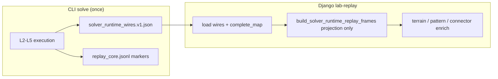
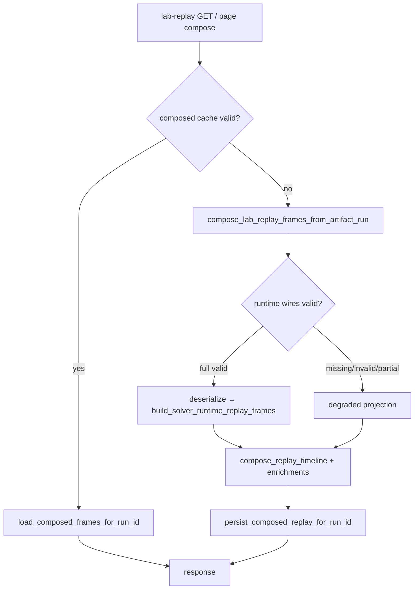

# Solver Runtime Wires — Replay Projection Design

**Status:** DESIGN APPROVED — implementation pending  
**Date:** 2026-06-10  
**Related:** SHA-64, Issue #176 lab-replay compose profiling  
**Supersedes:** Django in-process L2–L5 re-execution during viewer compose (`artifact_runtime_replay_compose.py`; remove during implementation — see plan slice 1)

---

## 1. Problem

Lab `lab-replay/` first load was taking **30–50 seconds** because Django viewer compose re-ran the full L2→L5 solver stack on every cache miss. SHA-64 removed that path and restored O(n) `replay_core.jsonl` mapping, which fixed latency but produced **terrain-only frames** (no miner/belt/pattern overlays).

**Requirement C:** Timeline must show **incremental per-layer overlays** (e.g. L3 window miner accumulation) **and** the **final layout** on the last frame.

**Implementation choice (phase 1):** Approach **A** — CLI persists solver output wires; Django **projects** wires into replay frames via the existing assembler. Requirement C is satisfied by wire projection, not by `replay_core.jsonl overlay_delta v2`.

---

## 2. Goals and non-goals

### Goals

- First `lab-replay/` compose **&lt; 5 s** for typical runs (~37 frames).
- **`algorithm_rerun_count == 0`** on every compose path (invariant).
- Incremental overlays + final layout from persisted solver outputs.
- BA-4 / CLI-first boundary: core writes deterministic outputs; Django enriches only.
- Legacy artifacts without wires degrade safely (terrain-only, no solver rerun).

### Non-goals (phase 1)

- CLI solve-time `replay_timeline_frames.jsonl` (Approach B / phase 2).
- `replay_core.jsonl` schema v2 with per-frame overlay deltas (Approach C).
- Migrating old artifacts to add wires without re-solve.
- Changing L3/L4/L5 algorithm behavior.

---

## 3. Architecture (§1 — approved)

```text
Phase 1 = A.

Solver/CLI persists solver_runtime_wires.v1.json after L2–L5 execution.
Django lab-replay loads complete_map + runtime wires.
Django only projects wires into replay frames and applies UI enrichment.
Django must not re-run execute_layer_02 / run_layer_03 / run_layer_04 / run_layer_05.
Replay assembler remains the timeline authority.
Runtime wire is output-only and replay-projection-only, not algorithm input.
```



### Boundary rules

| Layer | Responsibility |
|-------|----------------|
| Core (CLI) | Algorithm execution + serialize solver output wires |
| Django | Deserialize wires → assembler projection → UI enrichment |
| Forbidden | Django calling `execute_layer_*` / `run_layer_*` during compose |

**Normative contract:**

> Runtime wire is a persisted solver output contract.  
> It is valid input for replay projection only.  
> It is forbidden as input for placement, routing, validation, recovery, or optimization decisions.

Django compose must not call solver layer execution functions. It may only deserialize persisted runtime wires and call replay projection/assembly helpers.

---

## 4. Artifact: `solver_runtime_wires.v1.json` (§2 — approved with amendments)

### 4.1 Path (artifact-relative)

```text
<artifact_root>/output/solver_runtime_wires.v1.json

manifest.paths["solver_runtime_wires"] → "output/solver_runtime_wires.v1.json"
```

Not a repo-global `output/` path. Each run has its own artifact root.

### 4.2 Envelope

```jsonc
{
  "schema_version": "solver_runtime_wires_v1",
  "wire_kind": "solver_runtime_projection",
  "core_build_id": "<from manifest>",
  "run_key": "<validated run_key>",
  "written_at_utc": "ISO-8601",

  "transport_summary": {
    "requested_resource_kind": "shape",
    "effective_transport_kind": "shape_belt"
  },

  "complete_map_ref": {
    "manifest_path_key": "layer01_complete_map",
    "content_hash": "<sha256 from manifest.content_hashes>"
  },

  "layers": { /* §4.4–4.7 */ },

  "projection_contract": {
    "allowed_uses": ["replay_projection_only"],
    "forbidden_uses": [
      "algorithm_input",
      "placement_decision",
      "routing_decision",
      "validation_repair",
      "solver_resume",
      "optimization_input"
    ]
  }
}
```

`transport_summary` is diagnostic only. L2/L5 wire fields are source of truth for transport semantics.

### 4.3 Complete map identity

- Wire does **not** duplicate `complete_map` body.
- Before projection: `complete_map_ref.content_hash` MUST equal `manifest.content_hashes["output/layer01_complete_map.json"]`.
- **Mismatch semantics (fail-closed for wire, viewer may still 200):**
  - Runtime-wire projection **rejects the wire body** (discard wire).
  - **No solver rerun.**
  - If `layer01_complete_map.json` is valid and renderable, viewer MAY return HTTP 200 with **complete-map terrain-only** degraded frames.

### 4.4 Layer outcome enum

```text
completed | partial_budget | skipped | failed
```

Use `skip_reason` / `failure_reason` separately from `outcome`.

```jsonc
{
  "outcome": "partial_budget",
  "skip_reason": null,
  "failure_reason": null
}
```

`partial_budget` = layer stopped early but partial persisted outputs exist (not `skipped_budget`).

### 4.5 L2 — `layers.layer_02_exterior_transport`

Reuse existing `exterior_connector_plan.v2` from `exterior_connector_plan_to_metrics_dict`.

```jsonc
"layer_02_exterior_transport": {
  "layer_slug": "layer_02_exterior_transport",
  "outcome": "completed",
  "exterior_connector_plan": { /* v2 wire */ }
}
```

### 4.6 L3 — `layers.layer_03_rim_greedy_placement`

```jsonc
"layer_03_rim_greedy_placement": {
  "layer_slug": "layer_03_rim_greedy_placement",
  "outcome": "completed",
  "wire_version": "integrated_rim_greedy_result_v1",
  "winning_variant_id": "m0e",
  "metrics": { /* committed_placement_count, pass2_score, ... */ },
  "committed_placements": [
    {
      "commit_index": 0,
      "placement_id": "p-001",
      "variant_id": "m0e",
      "anchor": {"x": 1, "y": 2},
      "output_dir": "E",
      "seed_id": "m0e",
      "miner_cells": [{"x": 1, "y": 2}],
      "extension_cells": [{"x": 2, "y": 2}],
      "m_output_stub": {"x": 3, "y": 2},
      "throughput_factor": 4,
      "projection_hints": {
        "route_probe_path": [{"x": 4, "y": 2}]
      }
    }
  ]
}
```

**Ordering:** `committed_placements` MUST be sorted by `commit_index` ascending. If array order and `commit_index` disagree, compose rejects wire fail-closed (terrain-only degraded).

**`projection_hints`:** Visual-only. MUST NOT be consumed by routing or validation.

### 4.7 L4 — `layers.layer_04_inner_pattern_fill`

**Source of truth:** `placements`.  
`interior_occupied_cells` is a denormalized projection cache and MUST equal the occupied coord set derived from `placements`. Mismatch → wire rejected fail-closed.

```jsonc
"layer_04_inner_pattern_fill": {
  "layer_slug": "layer_04_inner_pattern_fill",
  "outcome": "completed",
  "wire_version": "layer04_inner_fill_result_v1",
  "placements": [ /* source of truth */ ],
  "interior_occupied_cells": [ /* denormalized cache */ ],
  "routeable_inner_groups": [ /* L5 parity */ ],
  "metrics": { /* ... */ }
}
```

### 4.8 L5 — `layers.layer_05_transport_routing`

Reuse `layer05_route_plan_v1` structure inside `route_plan`.

```jsonc
"layer_05_transport_routing": {
  "layer_slug": "layer_05_transport_routing",
  "outcome": "completed",
  "route_plan": {
    "version": "layer05_route_plan_v1",
    "transport_tiles": [ /* ... */ ]
  }
}
```

### 4.9 Serde ownership

| Component | Location |
|-----------|----------|
| Write (CLI) | After L2–L5 in `run_stack.py` / `asteroid_solve.py` |
| Serde | `src/shapez2_factory/adapters/asteroid_lab/runtime_wires/` |
| Read + project | `django_apps/asteroid_lab/services/artifact_replay_viewer_compose.py` |

**Write timing (normative):** Wire MUST be written only after layer outputs are finalized for the artifact manifest. If validation later mutates or rejects layer outputs, the wire MUST NOT be persisted as valid. The wire content hashes recorded in `manifest.content_hashes` MUST match the same finalized solver outputs that `solver_summary.json` and `layer01_complete_map.json` reference.

---

## 5. Compose data flow and UX (§3 — approved with amendments)

### 5.1 Common pipeline



**Invariant:** `algorithm_rerun_count == 0` on all paths.

### 5.2 Case 1 — Valid wires → full projection

**Preconditions**

- Wire file exists at artifact-relative path.
- `schema_version == solver_runtime_wires_v1`.
- `complete_map_ref` hash matches manifest.
- L3 `commit_index` order valid; L4 placements/occupied set consistent.

**Flow**

1. `read_verified_artifact_manifest`
2. Load `layer01_complete_map.json`
3. Load `solver_runtime_wires.v1.json`
4. Validate envelope + per-layer guards
5. Deserialize → DTOs (core adapter)
6. `build_solver_runtime_replay_frames(...)` — projection only
7. `compose_replay_timeline` + enrichments
8. Persist cache with `replay_source: artifact_runtime_wire_projection`

**Success metrics**

```jsonc
"replay_track_metrics": {
  "diagnostic_reason": null,
  "diagnostic_severity": "none",
  "replay_projection_mode": "runtime_wires_v1",
  "algorithm_rerun_count": 0
}
```

**Performance SLO (first load)**

```text
wire_deserialize_ms        < 200
frame_projection_ms        < 2000
enrichment_ms              < 2000
total_first_lab_replay_ms  < 5000
algorithm_rerun_count      == 0
```

### 5.3 Case 2 — Missing / invalid wires → degraded UX

**Never solver rerun.**

| Condition | `diagnostic_reason` | `diagnostic_severity` | Projection |
|-----------|---------------------|----------------------|------------|
| Wire file missing (legacy) | `missing_runtime_wires` | warning | degraded |
| Unknown wire `schema_version` | `runtime_wire_schema_unknown` | error | degraded |
| `complete_map_ref` hash mismatch | `runtime_wire_complete_map_mismatch` | error | wire discarded; terrain if map valid |
| L3 order / `commit_index` invalid | `runtime_wire_l3_order_invalid` | error | degraded |
| L4 placements vs occupied mismatch | `runtime_wire_l4_placement_mismatch` | error | degraded |
| Layer `outcome: failed` | `runtime_wire_layer_failed` | error | partial up to failed layer |
| Layer `outcome: skipped` | `runtime_wire_layer_skipped` | warning | partial up to skipped layer |

**Degraded source priority**

```text
1. complete_map + replay_core layer markers (if replay_core exists and readable)
2. complete_map-only terrain frame (if replay_core missing or unreadable)
3. Hard error only if complete_map itself is missing/unreadable
```

`replay_core.jsonl` is **not required** for degraded mode.

**Partial budget (per layer)**

| Layer | `partial_budget` projection |
|-------|----------------------------|
| L3 | Miner overlay through persisted `committed_placements` only |
| L4 | Pattern/fill overlay through persisted `placements` only |
| L5 | Transport overlay through persisted `routes` / `transport_tiles` only |
| Any | Record `diagnostic_reason: runtime_wire_layer_partial_budget`, severity **warning**; no solver rerun |

**HTTP:** Viewer endpoint returns **200** with degraded frames when `complete_map` is renderable.

**UI:** Existing `lab-replay-truncation-hud` shows `diagnostic: <reason>`. Optional operator copy:

- `missing_runtime_wires` — Legacy run; terrain only. Re-solve for full replay.
- `runtime_wire_complete_map_mismatch` — Wire/map mismatch; terrain only.
- `runtime_wire_layer_partial_budget` — Budget stopped layer early; partial layout shown.

### 5.4 Case 3 — Stale cache → invalidate / re-project only

**Stale triggers (cache miss)**

- `inspector.replay_source == artifact_replay_core` AND L3 frame has empty `overlay_cells`
- `replay_source != artifact_runtime_wire_projection` AND wires file now exists
- `lab_replay_cache_schema_version` outdated
- Cached `wire_schema_version` != artifact wire `schema_version` → **cache miss**

**After cache miss due to schema version mismatch**

```text
if artifact wire schema is supported → re-project from artifact wires
if artifact wire schema is unknown/unsupported → degraded terrain-only
  (diagnostic: runtime_wire_schema_unknown)
```

Cache schema mismatch ≠ artifact schema unknown; treat separately.

**Cache summary fields (schema version 3)**

```jsonc
{
  "lab_replay_cache_schema_version": 3,
  "replay_projection_mode": "runtime_wires_v1",
  "wire_schema_version": "solver_runtime_wires_v1",
  "wire_content_hash": "<sha256>"
}
```

Second `lab-replay/` for same run → cache hit (fast path). Composed DB cache is not source of truth.

### 5.5 `replay_core.jsonl` role

| Artifact | Role |
|----------|------|
| `solver_runtime_wires.v1.json` | Projection input (solver output) |
| `replay_core.jsonl` | Observability / cross-check; degraded fallback markers only |
| Assembler output | **Timeline authority** |
| Composed DB cache | Lazy-load fast path |

---

## 6. Architecture gates

### 6.1 Import gate

`test_artifact_compose_services_do_not_import_solver_execution_run_modules` — no imports from `shapez2_factory.application.asteroid_lab.layers.*.run` in `artifact_*compose*.py`.

### 6.2 Execution gate (required)

`test_lab_replay_projection_never_executes_layer_functions`

- Monkeypatch `execute_layer_02`, `run_layer_03`, `run_layer_04`, `run_layer_05` to raise.
- Compose from valid wires fixture → succeeds, overlays present, `algorithm_rerun_count == 0`.
- Compose with missing wires → terrain-only + `missing_runtime_wires`, layer functions never called.

Import gate alone is insufficient (lazy import / indirection).

---

## 7. Self-review checklist

- [x] Valid wires path produces overlay + final layout
- [x] Missing wires → terrain-only degraded, no solver rerun
- [x] Invalid wires → wire body discarded; complete_map-only terrain when map valid
- [x] Stale cache → invalidate/re-project only
- [x] `replay_core` is not timeline authority
- [x] Composed DB cache is fast path only
- [x] Execution gate catches actual layer function calls
- [x] Import gate + execution gate both specified

---

## 8. Implementation plan (next step)

Invoke **writing-plans** skill to produce a phased implementation plan:

1. Core wire serde + CLI write path
2. Django wire read + projection compose
3. Cache schema v3 + stale detection
4. Degraded UX + diagnostic severity
5. Architecture + integration tests
6. Manual verification on real artifact run

**Linear tracking:** SHA-64 (compose), new issue for wire artifact (or extend SHA-64 scope).

---

## 9. Approved summary

```text
Approved architecture:
solver_runtime_wires.v1.json is an artifact-relative, persisted solver-output wire.
It is replay-projection-only.
Django may deserialize it and pass reconstructed DTOs into replay assembler/projection helpers.
Django must not execute solver layer functions.
Complete map identity is verified by manifest path + content hash before projection.
Mismatch, unknown schema, or stale wire state fails closed without rerun.
Legacy artifacts without wires degrade to terrain-only replay.
Incremental overlay + final layout (requirement C) is satisfied via wire projection (approach A, phase 1).
```
