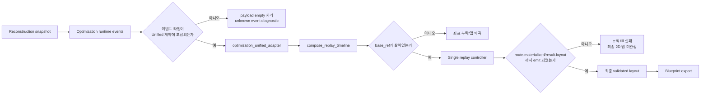

# 리플레이 버그 집중 분석 보고서

> Role: Runtime Replay Debug Architect  
> **Note (2026-05-23 doc sweep):** 좌표 관련 §는 PR-F 이전 가정(dense server)을 포함할 수 있음. 현재 정본: island-local only — [`asteroid_lab_00_overview.md`](asteroid_lab_00_overview.md), [`docs/superpowers/specs/2026-05-23-coordinate-tagged-frames-design.md`](../../docs/superpowers/specs/2026-05-23-coordinate-tagged-frames-design.md).

## Executive Summary

업로드된 `Algorithm.zip`은 실행 가능한 코드보다 **계약 문서와 구현 계획 문서**에 가깝지만, 그 문서들만으로도 현재 리플레이가 “제대로 안 되는” 가장 유력한 구조적 원인은 꽤 선명하게 드러납니다. 핵심은 **이벤트 타입 계약 불일치**, **dual-track에서 replay timeline으로의 마이그레이션 미완료**, 그리고 **누적 상태를 최종 2D 맵으로 고정하는 `route.materialized`/`result.layout` 계층의 공백**입니다. 특히 런타임 쪽 문서는 아직 `optimization_replay` 별도 트랙과 strict payload 검증을 전제로 하는 반면, 제품 정본 문서는 하나의 `lab_replay_frames_json` 단일 타임라인을 권위로 삼고 있어, 실제 실행 시에는 “프레임이 비거나 일부만 보이는 현상”, “누적 fill 실패”, “최종 결과 맵/코드 부재”가 자연스럽게 발생할 수 있습니다. 또한 Shapez 2는 공식적으로 블루프린트 저장·로드·내보내기·공유를 지원하지만, 커뮤니티 codec/spec를 보면 블루프린트 identifier는 **버전 의존적**이며, 오래된 형식이 새 버전에서 그대로 동작한다고 보장되지 않으므로 `SHAPEZ2-4-...=$`를 하드코딩하면 코드 불일치가 재발할 위험이 큽니다. citeturn3view0turn4view0turn3view2turn6view0

## 분석 근거와 전제

이번 분석은 **업로드된 `Algorithm.zip` 내부 문서**를 1차 근거로 삼았고, 바깥 세계 정보는 **Shapez 2의 블루프린트 export/identifier 관련 사실 확인**에만 보조적으로 사용했습니다. 실제 저장소 코드, 실행 로그, 실패 payload, 테스트 출력, 운영 환경 값은 제공되지 않았기 때문에, 아래 판정은 “문서상 확정된 구조적 충돌”과 “그 충돌이 실제 버그로 이어질 가능성이 높은 추정”으로 구분해 읽는 것이 정확합니다.

다음 표는 이번 보고서의 근거와 신뢰도 평가입니다.

| 근거 | 내용 | 자체평가 |
|---|---|---|
| 업로드 문서 `asteroid_lab_09_replay_timeline.md` | 제품 리플레이 정본이 **single replay timeline**이며, `lab_replay_frames_json`가 권위라고 선언 | 높음 |
| 업로드 문서 `solver_runtime/phase_m_persist_replay_ui.md`, `solver_runtime/01_entry_point.md` | 런타임 출력이 아직 `optimization_replay` 별도 트랙을 전제로 서술됨 | 높음 |
| 업로드 문서 `asteroid_lab_12_runtime_replay_wiring.md` | unknown event, malformed payload, truncation contract 위반 시 **empty payload**로 떨어뜨리는 strict 정책이 명시됨 | 높음 |
| 업로드 문서 `asteroid_lab_01_optimization_input.md`, `asteroid_lab_00_overview.md` | 좌표 정본이 **Server X/Y dense**이며 `raw↔server` 변환 재호출 금지, 특히 `x==0` 경계가 반복 강조됨 | 높음 |
| 업로드 문서 전반 | 최종 SHAPEZ 코드 생성기는 명시되지 않고, decode 쪽 흔적만 존재 | 중간 |
| Shapez 2 공식 사이트 | Blueprint Library가 save/load/export/share를 지원 | 높음 citeturn3view0 |
| Shapez Vortex codec/convert/spec | blueprint identifier 인코딩/디코딩 가능, 포맷은 버전 의존적이며 구버전 호환성이 보장되지 않음 | 중간~높음 citeturn4view0turn3view2turn6view0 |

요청 항목 기준으로 현재 확보된 입력/환경 정보는 아래와 같습니다. 명시되지 않은 값은 모두 **“미지정”**으로 표기했습니다.

| 항목 | 현재 파악값 | 상태 |
|---|---|---|
| 리플레이 기능 설명 | reconstruction된 소행성 위에 extractor/expander/transport가 누적되어 최종 2D 맵을 형성해야 함 | 사용자 요구 + 문서 정합 |
| 재구성된 소행성 모델 형태 | **미지정** | 미지정 |
| 좌표계 | **Server X/Y dense coord** | 문서상 명시 |
| 해상도 | **미지정** | 미지정 |
| extractor/expander 규칙 | extractor + 0~3 extension, linear 패턴, throughput factor 4/8/12/16 | 문서상 일부 명시 |
| 초기 시드 | deterministic seed invariant는 명시, 실제 시드 값은 **미지정** | 일부 명시 |
| commit 순서 | 생성 순 기본 금지, `commit_order` 권장 | 문서상 일부 명시 |
| 기대 출력 포맷 | 최종 2D replay map은 명시, SHAPEZ 코드 export 자체는 내부 문서에 **미구현/미지정** | 일부 미지정 |
| 소프트웨어 버전 | 문서 기준일 2026-05-19, Solver Runtime v0 문맥 | 일부 명시 |
| 의존 라이브러리 버전 | **미지정** | 미지정 |
| 플랫폼 OS | **미지정** | 미지정 |
| 병렬 처리 여부 | **미지정** | 미지정 |
| 프런트엔드 렌더러/테스트 러너 | 일부 JS 파일명만 명시, 실제 도구 버전은 **미지정** | 미지정 |
| 대상 Shapez 2 게임 버전 | 내부 문서 기준 **미지정**; 커뮤니티 도구 페이지에는 Game Version 1095 표기 사례 존재 | 외부 보조 참고 citeturn4view0turn6view0 |

또 한 가지 중요한 전제가 있습니다. Shapez 2는 공식적으로 blueprint library의 저장·로드·내보내기·공유를 지원하지만, 커뮤니티 codec/spec는 blueprint identifier가 JSON을 gzip 후 base64로 인코딩하는 **버전 의존 규격**이라고 설명합니다. 따라서 최종 출력이 `SHAPEZ2-4-...=$`인지, `SHAPEZ2-<다른 버전>-...$`인지 여부는 **대상 게임 빌드에 따라 검증되어야 하며**, 하드코딩은 위험합니다. citeturn3view0turn4view0turn3view2turn6view0

## 현행 구조와 재현 시나리오

문서만 놓고 보면, 현재 구조는 아래처럼 흘러가야 맞습니다.



그런데 업로드 문서들끼리만 비교해도 다음 네 가지 모순이 동시에 보입니다.

| 영역 | 문서상 정본/요구 | 동시에 존재하는 다른 문서 서술 | 실제 증상으로 이어지는 방식 |
|---|---|---|---|
| 페이로드 권위 | `asteroid_lab_09_replay_timeline.md`의 9E는 **제품 replay = `lab_replay_frames_json`**, `optimization_replay` 제거라고 명시 | `solver_runtime/01_entry_point.md`는 응답에 `optimization_replay` 포함, `phase_m_persist_replay_ui.md`도 `optimization replay track + layout preview`를 출력으로 서술 | 프런트/백엔드가 서로 다른 payload key를 보거나, 두 권위가 공존해 동기화 실패 |
| 이벤트 타입 계약 | unified 문서의 `ReplayEventType` 예시는 16개 이벤트만 열거 | 같은 unified 문서의 9C phase mapping은 21개 optimization event를 전제, `phase_m`은 최소 15개 필수 runtime event를 기록하라고 요구 | strict parser가 “unknown event_type”로 payload 전체를 empty 처리할 수 있음 |
| 누적 상태 표현 | unified 계약은 모든 프레임이 2D-renderable이어야 하며 최종 layout까지 보여야 함 | 9F `Commit frame materialization`, 9G `Validation/result keyframes`는 완료 표시가 없음 | overlay는 보이지만 누적 상태가 final map으로 굳지 않아 “fill이 안 되는” 현상 발생 |
| truncation | 9D는 `MAX_LAB_REPLAY_TIMELINE_FRAMES` 초과 시 **head truncate** 규칙을 가짐 | `ReplayMapView`는 `base_ref` 참조 키프레임을 허용 | 잘린 앞부분에 기반 snapshot이 있으면 이후 frame이 base를 잃고 비거나 왜곡될 수 있음 |

가능한 증상을 사용자 요구 항목 기준으로 점검하면 아래와 같습니다.

| 가능한 증상 | 문서상으로 설명 가능한 원인 | 판정 |
|---|---|---|
| 재현 실패 | `optimization_replay` vs `lab_replay_frames_json` 권위 충돌, unknown event strict drop | 매우 유력 |
| 좌표 누락 | `route.materialized`/`result.layout` 부재, head truncate 후 `base_ref` 손실, per-frame cell limit | 매우 유력 |
| 중복 채움 | delta를 누적 render state에 두 번 적용하거나, projection을 두 번 거치는 경우 | 유력 |
| 맵 왜곡 | `server_x==0` 경계 오해, raw↔server 재변환, display/export projection 혼선 | 유력 |
| SHAPEZ 코드 불일치 | replay overlay를 export 원본으로 사용, blueprint version segment 하드코딩, final materialized layout과 export source 불일치 | 매우 유력 |

문서만으로도 바로 재현 가능한 최소 사례는 아래 둘입니다. 첫 번째는 **이벤트 타입 불일치로 전체 트랙이 empty 처리되는 경우**, 두 번째는 **누적 상태가 final snapshot으로 굳지 않아 fill이 사라지는 경우**입니다.

```python
# 최소 재현 스크립트 A: unknown event_type 때문에 replay 전체가 빈 트랙으로 떨어지는 경우
KNOWN_REPLAY_EVENT_TYPES = {
    "optimization.input_loaded",
    "pattern.generated",
    "candidate.generated",
    "candidate.rejected",
    "route_probe.succeeded",
    "route_probe.failed",
    "genome.generated",
    "genome.evaluated",
    "generation.completed",
    "best_genome.selected",
    "route.commit_attempted",
    "route.committed",
    "route.rolled_back",
    "validation.completed",
    "validation.failed",
    "result.layout",
}

runtime_frames = [
    {"frame_index": 0, "event_type": "optimization.input_loaded", "map_view": {"full_cells": [(0, 0)]}},
    {"frame_index": 1, "event_type": "capacity.plan_created", "map_view": {"overlay_cells": [(0, 1)]}},  # unified enum 예시에 없음
    {"frame_index": 2, "event_type": "route_goal.generated", "map_view": {"overlay_cells": [(1, 1)]}},   # unified enum 예시에 없음
]

def strict_deserialize(frames):
    for frame in frames:
        if frame["event_type"] not in KNOWN_REPLAY_EVENT_TYPES:
            return [], {"optimization_replay_diagnostic_reason": "unsupported_or_unknown_event_type"}
    return frames, {}

print(strict_deserialize(runtime_frames))
# 기대: 일부라도 보여야 함
# 실제: 빈 트랙 + diagnostic
```

```python
# 최소 재현 스크립트 B: 누적 state 없이 현재 frame만 그릴 때 fill이 사라지는 경우
frames = [
    {
        "frame_index": 0,
        "event_type": "reconstruction.completed",
        "map_view": {"full_cells": [(0,0), (1,0), (0,1), (1,1)], "cell_delta": [], "overlay_cells": []}
    },
    {
        "frame_index": 1,
        "event_type": "candidate.generated",
        "map_view": {"full_cells": [], "cell_delta": [], "overlay_cells": [(2,0), (2,1)]}
    },
    {
        "frame_index": 2,
        "event_type": "route.committed",
        "map_view": {"full_cells": [], "cell_delta": [("add",(2,0)), ("add",(3,0))], "overlay_cells": []}
    },
    # BUG: route.materialized / result.layout 가 없음
]

# 잘못된 렌더러: 매 프레임 현재 map_view만 그림
def broken_render(frame):
    return {
        "full": set(frame["map_view"]["full_cells"]),
        "overlay": set(frame["map_view"]["overlay_cells"]),
        "delta": set(frame["map_view"]["cell_delta"]),
    }

for frame in frames:
    print(frame["frame_index"], broken_render(frame))

# 기대:
# frame 2 이후에는 reconstruction + extractor/expander + transport가 누적된 최종 2D 맵이 보여야 함
# 실제:
# frame 2는 delta만 있고 base가 없어서 눈에 안 보이거나 일부만 보일 수 있음
```

테스트 입력 예시는 아래처럼 최소화하는 것이 좋습니다. 실제 구현에 맞게 필드명은 조정하면 되지만, **좌표 공간**, **규칙 파라미터**, **기대 출력**은 반드시 분리해서 넣어야 합니다.

```json
{
  "asteroid_model": {
    "coord_space": "server_xy_dense",
    "resolution": "미지정",
    "shape": "2x2 solid test asteroid",
    "cells": [[0,0], [1,0], [0,1], [1,1]]
  },
  "rules": {
    "extractor_pattern": "linear",
    "max_extensions": 3,
    "throughput_factor": 8
  },
  "seed": 42,
  "commit_order": [0],
  "expected_output": {
    "final_2d_map_required": true,
    "shapez_blueprint_identifier": "SHAPEZ2-<version>-...$"
  }
}
```

## 원인 우선순위 분석

아래는 제가 가장 유력하다고 판단한 원인 목록입니다. “높음”은 문서 간 충돌이 직접적이라서 거의 구조적 확정에 가깝고, “중간”은 실제 코드/로그가 없어서 최종 확정까진 못 가는 경우입니다.

| 우선순위 | 원인 | 세부 내용 | 근거 | 정확도 |
|---|---|---|---|---|
| P0 | **이벤트 taxonomy 불일치** | unified `ReplayEventType` 예시에 없는 `capacity.plan_created`, `route_goal.generated`, `candidate_pool.completed`, `candidate_selection.completed`, `route.materialized` 등이 런타임 필수 이벤트로 서술됨 | `asteroid_lab_09_replay_timeline.md`와 `solver_runtime/phase_m_persist_replay_ui.md`, `asteroid_lab_12_runtime_replay_wiring.md`의 strict unknown-event empty 정책 | 높음 |
| P0 | **unified migration 미완료** | 제품 정본은 단일 `lab_replay_frames_json`인데, 엔트리/Phase M은 아직 `optimization_replay` 별도 트랙을 반환하는 구조를 유지 | `asteroid_lab_09_replay_timeline.md` 9E vs `solver_runtime/01_entry_point.md`, `solver_runtime/phase_m_persist_replay_ui.md` | 높음 |
| P1 | **누적 fill을 finalize하는 frame 부재** | `candidate.generated`는 overlay 성격이고, 실제 누적 상태는 `route.committed`/`route.materialized`/`result.layout`로 굳어야 하는데 9F·9G가 비완료 상태 | unified 문서의 9F/9G 상태와 frame contract | 높음 |
| P1 | **head truncate가 keyframe을 끊을 가능성** | `ReplayMapView.base_ref`를 허용하는데 9D는 head truncate만 명시하고 surviving frame rebase/pin 전략이 없음 | `asteroid_lab_09_replay_timeline.md`의 `ReplayMapView`/9D | 중간~높음 |
| P1 | **좌표 경계 오염** | `server_x==0`은 유효 좌표인데, replay/display/export 경계에서 raw↔server 변환을 다시 호출하면 누락·왜곡·중복이 발생할 수 있음 | `asteroid_lab_00_overview.md`, `asteroid_lab_01_optimization_input.md`, unified 문서의 projection ambiguity | 중간 |
| P2 | **SHAPEZ 코드 export source 불일치** | replay payload는 output-only artifact인데, 이를 그대로 blueprint export source로 쓰면 overlay/annotation이 섞이거나 누적 상태가 불완전할 수 있음 | output-only invariant + 내부 문서에 export generator 부재 | 중간 |
| P2 | **identifier version 하드코딩 위험** | 내부 초안은 `SHAPEZ2-4-` 전제를 암시하지만, 커뮤니티 spec은 version segment가 버전 의존이라고 설명하고 converter는 호환성 비보장을 경고 | 커뮤니티 spec/codec/converter | 중간 citeturn3view2turn4view0turn6view0 |
| P3 | **frame/cell 상한에 따른 조용한 누락** | optimization frame당 128 cells, unified 500 frames 등 상한이 있어 복잡한 asteroid/layout에서는 일부 셀이나 frame이 잘릴 수 있음 | 내부 replay limits 및 scalability 문서 | 중간 |

이 중 가장 결정적인 두 원인은 사실상 한 세트입니다.  
첫째, **런타임이 내보내는 이벤트 집합과 unified adapter가 기대하는 이벤트 집합이 다릅니다.**  
둘째, **프런트로 나가는 최종 payload 권위가 하나로 수렴되지 않았습니다.**

이 두 가지가 동시에 있으면 실제 현상은 대개 다음처럼 보입니다.

1. 런타임이 replay frame을 만든다.  
2. strict validator가 unknown event 혹은 shape mismatch를 만난다.  
3. 페이지 컨텍스트는 안전하게 empty payload로 대체한다.  
4. UI는 “리플레이가 비어 있거나 일부만 있는 것처럼” 보인다.  
5. 별도 트랙이 남아 있으면 맵은 reconstruction까지만 권위 있게 그리고, optimization은 HUD/overlay로만 스쳐 지나간다.  
6. 그래서 extractor/expander set이 asteroid 위에 **누적 채움**되는 최종 replay 2D map이 완성되지 않는다.  
7. export source도 final materialized layout이 아니라 replay나 preview에 기대면 SHAPEZ 코드까지 틀어질 수 있다.

## 수정안과 코드 패치 제안

수정은 “한 방에 다 갈아엎기”보다, **권위 경로를 먼저 고정하고**, 그 위에 **누적 state와 export를 붙이는 순서**가 가장 안전합니다. 적용 우선순위는 아래 표와 같습니다.

| 적용 순서 | 수정안 | 기대 효과 | 복잡도/성능 영향 | 정확성 영향 |
|---|---|---|---|---|
| 1 | event enum/coverage 정합화 | empty payload, dropped frame 즉시 감소 | O(1) 수준, 영향 미미 | 매우 큼 |
| 2 | 단일 payload 권위화 (`lab_replay_frames_json`) | UI/SSR/POST 간 드리프트 제거 | 합성 단계 O(F), 미미 | 매우 큼 |
| 3 | `route.materialized` + `result.layout` 보강 | 누적 fill, 최종 2D 맵 복구 | state map O(C), 마지막 snapshot O(C) | 매우 큼 |
| 4 | truncation rebase/keyframe pin | large replay에서 왜곡/blank 방지 | truncate 시 O(C) 추가 | 큼 |
| 5 | coordinate-space 분리 | 좌표 누락/중복/왜곡 축소 | 상수 오버헤드 | 큼 |
| 6 | blueprint export를 final layout 기반으로 분리 | SHAPEZ 코드 불일치 방지 | 마지막 1회 gzip/base64, O(C) | 매우 큼 |

아래 diff는 실제 저장소 코드를 직접 본 것이 아니라, **문서에 나온 파일명과 계약을 기준으로 한 패치 방향 제안**입니다.

```diff
diff --git a/django_apps/asteroid_lab/replay/unified_types.py b/django_apps/asteroid_lab/replay/unified_types.py
@@
 class ReplayEventType(StrEnum):
     OPTIMIZATION_INPUT_LOADED = "optimization.input_loaded"
+    CAPACITY_PLAN_CREATED = "capacity.plan_created"
+    ROUTE_GOAL_GENERATED = "route_goal.generated"
     PATTERN_GENERATED = "pattern.generated"
     CANDIDATE_GENERATED = "candidate.generated"
     CANDIDATE_REJECTED = "candidate.rejected"
+    CANDIDATE_POOL_COMPLETED = "candidate_pool.completed"
+    CANDIDATE_SELECTION_COMPLETED = "candidate_selection.completed"
     ROUTE_PROBE_SUCCEEDED = "route_probe.succeeded"
     ROUTE_PROBE_FAILED = "route_probe.failed"
     GENOME_GENERATED = "genome.generated"
     GENOME_EVALUATED = "genome.evaluated"
     GENERATION_COMPLETED = "generation.completed"
     BEST_GENOME_SELECTED = "best_genome.selected"
     ROUTE_COMMIT_ATTEMPTED = "route.commit_attempted"
     ROUTE_COMMITTED = "route.committed"
+    ROUTE_MATERIALIZED = "route.materialized"
     ROUTE_ROLLED_BACK = "route.rolled_back"
     VALIDATION_COMPLETED = "validation.completed"
     VALIDATION_FAILED = "validation.failed"
     RESULT_LAYOUT = "result.layout"
```

이 패치는 가장 우선입니다. 이유는 간단합니다. 현재 문서 구조만 보면 **런타임 emit 집합과 unified consume 집합이 달라서** validator가 payload 자체를 버릴 수 있기 때문입니다. 이 부분은 성능 영향이 사실상 없고, 정확성 개선은 매우 큽니다.

```diff
diff --git a/django_apps/web/services/asteroid_lab_page_context.py b/django_apps/web/services/asteroid_lab_page_context.py
@@
- context["optimization_replay"] = build_optimization_replay_track_payload(persisted_frames)
+ lab_frames = load_lab_replay_frames(...)
+ optimization_frames = load_persisted_optimization_frames(...)
+ unified_frames = compose_replay_timeline(
+     lab_frames=lab_frames,
+     optimization_frames=optimization_frames,
+ )
+ context["lab_replay_frames_json"] = serialize_unified_frames(unified_frames)
+ context["replay_track_metrics"] = build_unified_replay_metrics(unified_frames)
+ context.pop("optimization_replay", None)
```

이 패치는 product contract를 runtime/page context와 강제로 맞추는 단계입니다. 문서 정본이 이미 “`optimization_replay` 제거”라고 말하고 있으므로, 실제 코드도 같은 권위 경로를 가져야 합니다. 프런트엔드에는 single controller만 남기고, 기존 optimization HUD는 `replay_track_metrics`의 보조 정보로 내리는 편이 맞습니다.

```diff
diff --git a/django_apps/asteroid_lab/services/runtime_replay_recorder.py b/django_apps/asteroid_lab/services/runtime_replay_recorder.py
@@
 state = ReplayState.from_reconstruction(reconstruction_cells)

 for event in runtime_events:
     if event.type in OVERLAY_ONLY_EVENTS:
         emit_overlay_frame(event, base_ref=state.snapshot_ref)
         continue

     if event.type in {ReplayEventType.ROUTE_COMMITTED, ReplayEventType.ROUTE_MATERIALIZED}:
         deltas = materialize_transport_deltas(event)
         state.apply_deltas(deltas)
         emit_delta_frame(
             event_type=event.type,
             base_ref=state.snapshot_ref,
             cell_delta=deltas,
         )
         continue

 if validation_result.passed:
+    emit_snapshot_frame(
+        event_type=ReplayEventType.RESULT_LAYOUT,
+        phase=ReplayPhase.RESULT,
+        full_cells=state.to_full_cells(),
+        inspector={"validation_passed": True},
+    )
```

이 패치는 사용자가 기대한 “extractor/expander 세트들이 누적치로 asteroid 좌표를 filling”하는 요구를 만족시키는 핵심입니다. `candidate.generated`와 `route_probe.*`는 원칙적으로 overlay여도 되지만, **최종 committed/materialized 결과**는 반드시 누적 상태를 반영한 delta 혹은 snapshot으로 굳어야 합니다. 그렇지 않으면 스크러버를 끝까지 당겨도 최종 2D 맵이 완성되지 않습니다.

```diff
diff --git a/django_apps/asteroid_lab/replay/timeline_composer.py b/django_apps/asteroid_lab/replay/timeline_composer.py
@@
- if len(frames) > MAX_LAB_REPLAY_TIMELINE_FRAMES:
-     frames = frames[-MAX_LAB_REPLAY_TIMELINE_FRAMES:]
-     mark_truncated(frames[-1], dropped_frame_count=...)
+ if len(frames) > MAX_LAB_REPLAY_TIMELINE_FRAMES:
+     frames = retain_required_keyframes_and_tail(
+         frames,
+         limit=MAX_LAB_REPLAY_TIMELINE_FRAMES,
+     )
+     frames = rebase_surviving_frames(frames)
+     mark_truncated(frames[-1], dropped_frame_count=...)
```

이 수정은 large replay에서 중요합니다. 현재 문서대로라면 단순 head truncate가 가능한데, 살아남은 frame들이 `base_ref`로 잘려 나간 snapshot을 가리키면 render가 무너집니다. 그래서 **retain-required-keyframes** 또는 **synthetic rebase snapshot**이 필요합니다. 메모리는 약간 늘지만, 정확성 회복 효과가 훨씬 큽니다.

```diff
diff --git a/django_apps/asteroid_lab/replay/projection_context.py b/django_apps/asteroid_lab/replay/projection_context.py
@@
- raw_x, raw_y = server_to_raw(coord)
- display_x, display_y = project_raw_to_display(raw_x, raw_y)
+ display_x, display_y = server_to_display(coord)

diff --git a/django_apps/asteroid_lab/export/blueprint_export.py b/django_apps/asteroid_lab/export/blueprint_export.py
@@
- export_cells = current_replay_frame.map_view.overlay_cells
+ export_cells = final_materialized_layout.cells
+ blueprint_json = build_blueprint_json(export_cells, target_game_version)
+ identifier = encode_blueprint_identifier(blueprint_json, target_game_version)
```

이 수정은 좌표 왜곡과 SHAPEZ 코드 불일치를 같이 잡습니다. 핵심 원칙은 둘입니다.

첫째, **replay render용 좌표 변환**과 **export용 좌표 변환**을 분리해야 합니다.  
둘째, **export는 replay frame에서 만들면 안 되고**, 같은 solver 결과물에서 나온 **final materialized layout**에서 만들어야 합니다.

이것은 unified 문서가 강조한 “replay is output-only” 원칙과도 잘 맞습니다. 즉, `final_layout -> {replay, blueprint_code}`의 **병렬 산출**은 맞지만, `replay -> blueprint_code`의 **종속 산출**은 피해야 합니다.

마지막으로, identifier 생성기는 버전 segment를 하드코딩하지 말고 **대상 게임 빌드 기반으로 resolve**하도록 두는 것이 안전합니다. Shapez 2 공식 사이트는 blueprint export/share 기능 존재를 확인해 주지만, identifier의 구체 포맷은 공식 공개 문서보다 커뮤니티 codec/spec가 더 자세히 다루고 있고, converter는 구버전 호환성이 보장되지 않는다고 경고합니다. 그러므로 `SHAPEZ2-4-...=$`를 고정 문자열로 박는 것보다 `resolve_blueprint_code_version(target_game_version)` 같은 함수로 뽑는 편이 맞습니다. citeturn3view0turn4view0turn3view2turn6view0

## 회귀 테스트, 리스크, 결론과 추가 필요 정보

회귀 테스트는 기존 문서에 나온 pytest 계열 명명 규칙을 최대한 따르면서, 이번 버그를 정확히 겨냥한 계약 테스트를 추가하는 것이 좋습니다.

| 테스트 이름 제안 | 목적 | 자동화 방법 |
|---|---|---|
| `test_replay_event_taxonomy_matches_runtime_emitter` | runtime emitter와 unified enum이 완전히 일치하는지 검증 | `pytest` |
| `test_unknown_event_does_not_drop_all_valid_frames` | unknown 1개 때문에 전체 replay가 empty가 되지 않도록 방어 | `pytest` |
| `test_unified_payload_is_authoritative` | POST와 page context가 `lab_replay_frames_json`만 권위로 쓰는지 검증 | `pytest` + integration |
| `test_route_materialized_accumulates_into_final_map` | `route.materialized`가 실제 누적 state에 반영되는지 검증 | `pytest` |
| `test_result_layout_snapshot_matches_materialized_layout` | 최종 snapshot과 materialized layout이 동일한지 검증 | `pytest` |
| `test_replay_head_truncate_rebases_base_ref` | truncate 후 surviving frame이 깨지지 않는지 검증 | `pytest` |
| `test_server_x_zero_roundtrip_display_and_export` | `x==0` 경계에서 누락/왜곡이 없는지 검증 | `pytest` |
| `test_same_seed_replay_on_off_identical_final_layout` | replay on/off가 결과 layout을 바꾸지 않는지 검증 | `pytest` |
| `test_blueprint_export_uses_final_layout_not_overlay` | overlay/annotation이 export에 섞이지 않는지 검증 | `pytest` |
| `test_blueprint_identifier_version_is_resolved_not_hardcoded` | 대상 게임 버전별 identifier segment 결정 로직 검증 | `pytest` |
| `test_lab_js_single_controller_replay_smoke` | 프런트에서 dual controller가 남아 있지 않은지 검증 | 기존 smoke test 또는 Playwright |
| `test_replay_large_payload_truncation_visibility` | large payload에서 silent corruption 없이 metrics만 노출되는지 검증 | integration |

테스트 프레임워크는 **백엔드는 기존 `pytest` 유지**, 프런트는 현재 스택이 미지정이므로 **기존 smoke harness 유지 + 필요 시 Playwright 추가**가 무난합니다. 좌표 경계와 frame sequence는 **고정 fixture + property-based test(Hypothesis)** 조합이 특히 효과적입니다. frame 순서, reindex, delta 적용, base_ref rebase는 결정적 reproducibility가 중요하므로 snapshot fixture도 병행하는 편이 좋습니다.

예상 리스크와 완화책은 아래와 같습니다.

| 리스크 | 영향 | 완화책 |
|---|---|---|
| `optimization_replay` 제거가 레거시 UI를 깨뜨림 | 기존 패널/스크립트 오류 | 한 릴리스 동안 adapter shim 유지 후 제거 |
| event taxonomy 확장 후 coverage 누락 재발 | 일부 frame silent drop | emitter ↔ enum ↔ phase map 동등성 테스트를 CI 필수화 |
| final snapshot 추가로 메모리 증가 | large replay payload 확대 | 마지막 결과 snapshot 1개만 full_cells, 중간은 delta 유지 |
| head truncate rebase 구현이 복잡 | replay composer 버그 가능성 | synthetic keyframe 생성 방식으로 단순화 |
| export version resolution 오판 | SHAPEZ 코드 import 실패 | target game version을 명시 입력으로 받고, 미지정 시 export 차단 |
| replay를 export source로 오용 | overlay/annotation 혼입 | `final_materialized_layout` 타입만 exporter 입력으로 허용 |
| 좌표 타입 분리가 광범위한 변경 유발 | 초기 리팩터링 비용 | replay/export 경계부터 도입하고 이후 점진 확대 |

제 결론은 명확합니다. 현재 버그의 “첫 번째 원인”은 **이벤트/페이로드 계약이 서로 다른 문서 상태를 동시에 끌고 가는 것**이고, “두 번째 원인”은 **누적 상태를 최종 snapshot으로 닫는 단계가 빠져 있는 것**입니다. 즉, 이 문제는 단순 렌더링 버그라기보다 **계약 불일치 + 마이그레이션 미완료 + finalization 공백**의 복합 문제로 보는 편이 맞습니다. 따라서 가장 빠른 복구 경로는 **이벤트 정합화 → 단일 payload 권위화 → `route.materialized`/`result.layout` 확정 → export를 final layout에서 생성**하는 순서입니다. Shapez 2 자체는 blueprint export/share를 공식 지원하며, 커뮤니티 codec/spec는 식별자 인코딩 경로를 제공하지만 버전 의존성이 있으므로, 최종 `SHAPEZ2-4-...=$` 출력은 반드시 **대상 게임 버전과 함께 검증**해야 합니다. citeturn3view0turn4view0turn3view2turn6view0

| 추가로 필요한 정보 | 왜 필요한가 | 없을 때 한계 | 현재 상태 |
|---|---|---|---|
| 실제 실패한 `SolverRun.config_json` 샘플 | payload key, frame shape, diagnostic reason 직접 확인 | 문서 추정에 머무름 | 미지정 |
| `lab_replay_frames_json` 또는 `optimization_replay_frames` 실제 JSON 1건 | unknown event, frame 누락, truncation 계약 위반 확인 | root cause 확정 불가 | 미지정 |
| 실패 시 서버 로그 / Sentry / traceback | deserialize 실패 지점과 예외명 확인 | 원인 우선순위만 제시 가능 | 미지정 |
| 프런트 DevTools 콘솔 로그 / Network 응답 | SSR/POST payload key mismatch 확인 | UI 쪽 원인 확정 불가 | 미지정 |
| 대상 Shapez 2 게임 버전 | identifier version segment 결정 | `SHAPEZ2-4-...=$` 고정 가능 여부 판단 불가 | 미지정 |
| 실제 입력 asteroid 모델 샘플 1개 | 좌표계/해상도/left-edge(`x==0`) 재현 | coordinate bug 검증 한계 | 미지정 |
| extractor/expander 규칙 파라미터 전체 | overlay와 final materialization이 맞는지 확인 | replay와 final map 차이 분석 제한 | 미지정 |
| seed / commit order / parallel 여부 | deterministic 회귀 테스트 구성 | 재현 일관성 부족 | 미지정 |
| OS / Python / Django / JS 런타임 버전 | 환경 의존 버그 배제 | 플랫폼별 차이 판정 불가 | 미지정 |
| 실제 코드 저장소의 관련 파일 | 패치 diff를 추정이 아닌 실 patch로 전환 | 설계 수준 제안에 머무름 | 미지정 |