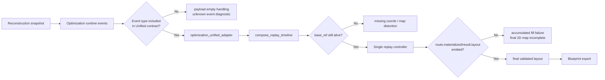

# Replay Bug Focused Analysis Report

> Role: Runtime Replay Debug Architect  
> **Note (2026-05-23 doc sweep):** Coordinate-related § may include pre-PR-F assumptions (dense server). Current canonical: island-local only — [`asteroid_lab_00_overview.md`](asteroid_lab_00_overview.md), [`docs/superpowers/specs/2026-05-23-coordinate-tagged-frames-design.md`](../../docs/superpowers/specs/2026-05-23-coordinate-tagged-frames-design.md).

## Executive Summary

The uploaded `Algorithm.zip` is closer to **contract and implementation plan documents** than runnable code, but those documents alone reveal fairly clearly the most likely structural causes of replay "not working properly." The core issues are **event type contract mismatch**, **incomplete migration from dual-track to replay timeline**, and a **gap in the `route.materialized`/`result.layout` layer that fixes accumulated state into a final 2D map**. In particular, runtime docs still assume a separate `optimization_replay` track and strict payload validation, while the product canonical document treats a single `lab_replay_frames_json` timeline as authoritative — so at runtime "empty or partial frames", "accumulated fill failure", and "missing final result map/code" can occur naturally. Shapez 2 officially supports blueprint save·load·export·share, but community codec/spec show blueprint identifiers are **version-dependent** and older formats are not guaranteed to work in new versions, so hardcoding `SHAPEZ2-4-...=$` carries high risk of recurring code mismatch.

## Analysis basis and assumptions

This analysis uses **documents inside the uploaded `Algorithm.zip`** as primary evidence; external information was used only to **verify Shapez 2 blueprint export/identifier facts**. Actual repo code, execution logs, failure payloads, test output, and production environment values were not provided, so judgments below should be read as distinguishing "structural conflicts fixed in documentation" from "high-likelihood estimates that those conflicts become actual bugs."

The table below evaluates evidence and confidence for this report.

| Evidence | Content | Self-assessment |
|---|---|---|
| Uploaded doc `asteroid_lab_09_replay_timeline.md` | Product replay canonical is **single replay timeline**; declares `lab_replay_frames_json` authoritative | High |
| Uploaded docs `solver_runtime/phase_m_persist_replay_ui.md`, `solver_runtime/01_entry_point.md` | Runtime output still described assuming separate `optimization_replay` track | High |
| Uploaded doc `asteroid_lab_12_runtime_replay_wiring.md` | Strict policy: unknown event, malformed payload, truncation contract violation → **empty payload** | High |
| Uploaded docs `asteroid_lab_01_optimization_input.md`, `asteroid_lab_00_overview.md` | Coordinate canonical is **Server X/Y dense**; `raw↔server` re-conversion forbidden; `x==0` boundary repeatedly emphasized | High |
| Uploaded docs overall | Final SHAPEZ code generator not specified; only decode-side traces | Medium |
| Shapez 2 official site | Blueprint Library supports save/load/export/share | High |
| Shapez Vortex codec/convert/spec | Blueprint identifier encode/decode possible; format version-dependent; old version compatibility not guaranteed | Medium–High |

Input/environment information secured against request items:

| Item | Current value | Status |
|---|---|---|
| Replay feature description | extractor/expander/transport must accumulate on reconstructed asteroid to form final 2D map | User requirement + doc alignment |
| Reconstructed asteroid model form | **unspecified** | unspecified |
| Coordinate system | **Server X/Y dense coord** | stated in docs |
| Resolution | **unspecified** | unspecified |
| extractor/expander rules | extractor + 0~3 extension, linear pattern, throughput factor 4/8/12/16 | partially stated in docs |
| Initial seed | deterministic seed invariant stated; actual seed value **unspecified** | partially stated |
| commit order | generation order default forbidden; `commit_order` recommended | partially stated in docs |
| Expected output format | final 2D replay map stated; SHAPEZ code export itself **not implemented/unspecified** in internal docs | partially unspecified |
| Software version | doc baseline 2026-05-19, Solver Runtime v0 context | partially stated |
| Dependency library versions | **unspecified** | unspecified |
| Platform OS | **unspecified** | unspecified |
| Parallel processing | **unspecified** | unspecified |
| Frontend renderer/test runner | some JS filenames only; actual tool versions **unspecified** | unspecified |
| Target Shapez 2 game version | **unspecified** in internal docs; community tool pages show Game Version 1095 example | external reference |

Another important assumption: Shapez 2 officially supports blueprint library save·load·export·share, but community codec/spec describe blueprint identifiers as a **version-dependent spec** encoding JSON via gzip then base64. Therefore whether final output is `SHAPEZ2-4-...=$` or `SHAPEZ2-<other version>-...$` must be **verified against target game build**; hardcoding is risky.

## Current structure and reproduction scenarios

From documentation alone, flow should be:



Comparing uploaded documents alone reveals four contradictions simultaneously:

| Area | Doc canonical/requirement | Other doc descriptions coexisting | How it leads to actual symptoms |
|---|---|---|---|
| Payload authority | `asteroid_lab_09_replay_timeline.md` 9E: **product replay = `lab_replay_frames_json`**, remove `optimization_replay` | `solver_runtime/01_entry_point.md` includes `optimization_replay` in response; `phase_m_persist_replay_ui.md` describes `optimization replay track + layout preview` as output | Frontend/backend see different payload keys or two authorities coexist → sync failure |
| Event type contract | unified doc `ReplayEventType` example lists only 16 events | same unified doc 9C phase mapping assumes 21 optimization events; `phase_m` requires recording at least 15 mandatory runtime events | strict parser may empty entire payload on "unknown event_type" |
| Accumulated state representation | unified contract requires all frames 2D-renderable through final layout | 9F `Commit frame materialization`, 9G `Validation/result keyframes` show no completion | overlay visible but accumulated state does not solidify to final map → "fill not working" |
| truncation | 9D has **head truncate** rule when exceeding `MAX_LAB_REPLAY_TIMELINE_FRAMES` | `ReplayMapView` allows `base_ref` reference keyframes | if base snapshot was in truncated head, later frames lose base → empty or distorted |

Checking possible symptoms against user requirements:

| Possible symptom | Doc-explainable cause | Assessment |
|---|---|---|
| Reproduction failure | `optimization_replay` vs `lab_replay_frames_json` authority conflict, unknown event strict drop | Very likely |
| Missing coordinates | absent `route.materialized`/`result.layout`, `base_ref` loss after head truncate, per-frame cell limit | Very likely |
| Duplicate fill | delta applied twice to accumulated render state, or projection applied twice | Likely |
| Map distortion | `server_x==0` boundary misunderstanding, raw↔server re-conversion, display/export projection confusion | Likely |
| SHAPEZ code mismatch | using replay overlay as export source, hardcoded blueprint version segment, export source ≠ final materialized layout | Very likely |

Two minimal reproduction cases from docs alone: first, **entire track empty due to event type mismatch**; second, **fill disappears because accumulated state does not solidify to final snapshot**.

```python
# Minimal reproduction script A: entire replay falls to empty track due to unknown event_type
KNOWN_REPLAY_EVENT_TYPES = {
    "optimization.input_loaded",
    "pattern.generated",
    "candidate.generated",
    "candidate.rejected",
    "route_probe.succeeded",
    "route_probe.failed",
    "genome.generated",
    "genome.evaluated",
    "generation.completed",
    "best_genome.selected",
    "route.commit_attempted",
    "route.committed",
    "route.rolled_back",
    "validation.completed",
    "validation.failed",
    "result.layout",
}

runtime_frames = [
    {"frame_index": 0, "event_type": "optimization.input_loaded", "map_view": {"full_cells": [(0, 0)]}},
    {"frame_index": 1, "event_type": "capacity.plan_created", "map_view": {"overlay_cells": [(0, 1)]}},  # not in unified enum example
    {"frame_index": 2, "event_type": "route_goal.generated", "map_view": {"overlay_cells": [(1, 1)]}},   # not in unified enum example
]

def strict_deserialize(frames):
    for frame in frames:
        if frame["event_type"] not in KNOWN_REPLAY_EVENT_TYPES:
            return [], {"optimization_replay_diagnostic_reason": "unsupported_or_unknown_event_type"}
    return frames, {}

print(strict_deserialize(runtime_frames))
# Expected: at least some frames should show
# Actual: empty track + diagnostic
```

```python
# Minimal reproduction script B: fill disappears when rendering current frame only without accumulated state
frames = [
    {
        "frame_index": 0,
        "event_type": "reconstruction.completed",
        "map_view": {"full_cells": [(0,0), (1,0), (0,1), (1,1)], "cell_delta": [], "overlay_cells": []}
    },
    {
        "frame_index": 1,
        "event_type": "candidate.generated",
        "map_view": {"full_cells": [], "cell_delta": [], "overlay_cells": [(2,0), (2,1)]}
    },
    {
        "frame_index": 2,
        "event_type": "route.committed",
        "map_view": {"full_cells": [], "cell_delta": [("add",(2,0)), ("add",(3,0))], "overlay_cells": []}
    },
    # BUG: route.materialized / result.layout missing
]

# Broken renderer: draws only current map_view each frame
def broken_render(frame):
    return {
        "full": set(frame["map_view"]["full_cells"]),
        "overlay": set(frame["map_view"]["overlay_cells"]),
        "delta": set(frame["map_view"]["cell_delta"]),
    }

for frame in frames:
    print(frame["frame_index"], broken_render(frame))

# Expected:
# After frame 2, final 2D map with reconstruction + extractor/expander + transport accumulated should show
# Actual:
# Frame 2 has delta only, no base — invisible or partially visible
```

Test input example minimized as below. Adjust field names to actual implementation but **coordinate space**, **rule parameters**, **expected output** must be separated.

```json
{
  "asteroid_model": {
    "coord_space": "server_xy_dense",
    "resolution": "unspecified",
    "shape": "2x2 solid test asteroid",
    "cells": [[0,0], [1,0], [0,1], [1,1]]
  },
  "rules": {
    "extractor_pattern": "linear",
    "max_extensions": 3,
    "throughput_factor": 8
  },
  "seed": 42,
  "commit_order": [0],
  "expected_output": {
    "final_2d_map_required": true,
    "shapez_blueprint_identifier": "SHAPEZ2-<version>-...$"
  }
}
```

## Root cause priority analysis

Most likely causes below. "High" means doc conflicts are direct — near structural certainty; "Medium" means no actual code/logs for final confirmation.

| Priority | Cause | Details | Evidence | Accuracy |
|---|---|---|---|---|
| P0 | **Event taxonomy mismatch** | `capacity.plan_created`, `route_goal.generated`, `candidate_pool.completed`, `candidate_selection.completed`, `route.materialized`, etc. described as mandatory runtime events but absent from unified `ReplayEventType` example | `asteroid_lab_09_replay_timeline.md` and `solver_runtime/phase_m_persist_replay_ui.md`, `asteroid_lab_12_runtime_replay_wiring.md` strict unknown-event empty policy | High |
| P0 | **Unified migration incomplete** | Product canonical is single `lab_replay_frames_json` but entry/Phase M still returns separate `optimization_replay` track | `asteroid_lab_09_replay_timeline.md` 9E vs `solver_runtime/01_entry_point.md`, `solver_runtime/phase_m_persist_replay_ui.md` | High |
| P1 | **Missing frame to finalize accumulated fill** | `candidate.generated` is overlay nature; accumulated state should solidify via `route.committed`/`route.materialized`/`result.layout` but 9F·9G incomplete | unified doc 9F/9G status and frame contract | High |
| P1 | **Head truncate may break keyframes** | `ReplayMapView.base_ref` allowed but 9D specifies head truncate only with no surviving frame rebase/pin strategy | `asteroid_lab_09_replay_timeline.md` `ReplayMapView`/9D | Medium–High |
| P1 | **Coordinate boundary pollution** | `server_x==0` is valid; raw↔server re-conversion at replay/display/export boundary can cause missing·distortion·duplication | `asteroid_lab_00_overview.md`, `asteroid_lab_01_optimization_input.md`, unified doc projection ambiguity | Medium |
| P2 | **SHAPEZ code export source mismatch** | replay payload is output-only artifact; using as blueprint export source can mix overlay/annotation or leave accumulated state incomplete | output-only invariant + no export generator in internal docs | Medium |
| P2 | **Identifier version hardcoding risk** | internal draft implies `SHAPEZ2-4-` assumption but community spec says version segment is version-dependent and converter warns no old compatibility | community spec/codec/converter | Medium |
| P3 | **Silent omission from frame/cell limits** | limits such as 128 cells per optimization frame, 500 unified frames can truncate cells or frames on complex asteroid/layout | internal replay limits and scalability docs | Medium |

The two most decisive causes are effectively one set:  
First, **runtime emit event set differs from unified adapter expected set.**  
Second, **final payload authority to frontend has not converged to one path.**

When both coexist, actual symptoms usually look like:

1. Runtime creates replay frames.  
2. Strict validator hits unknown event or shape mismatch.  
3. Page context safely substitutes empty payload.  
4. UI looks like "replay empty or partial".  
5. If separate track remains, map draws reconstruction authoritatively; optimization passes as HUD/overlay only.  
6. So final replay 2D map with extractor/expander sets **accumulated fill** on asteroid never completes.  
7. If export source expects replay or preview instead of final materialized layout, SHAPEZ code can be wrong too.

## Fix proposals and code patch suggestions

Fixes are safest in order: **fix authority path first**, then attach **accumulated state and export**. Priority table:

| Order | Fix | Expected effect | Complexity/performance | Accuracy impact |
|---|---|---|---|---|
| 1 | event enum/coverage alignment | immediate reduction of empty payload, dropped frames | O(1), negligible | Very large |
| 2 | single payload authority (`lab_replay_frames_json`) | remove UI/SSR/POST drift | compose O(F), negligible | Very large |
| 3 | `route.materialized` + `result.layout` reinforcement | restore accumulated fill, final 2D map | state map O(C), last snapshot O(C) | Very large |
| 4 | truncation rebase/keyframe pin | prevent distortion/blank on large replay | O(C) extra on truncate | Large |
| 5 | coordinate-space separation | reduce missing/duplicate/distortion | constant overhead | Large |
| 6 | separate blueprint export from final layout | prevent SHAPEZ code mismatch | one gzip/base64 at end, O(C) | Very large |

Diffs below are **patch direction proposals based on filenames and contracts in docs**, not from direct repo inspection.

```diff
diff --git a/django_apps/asteroid_lab/replay/unified_types.py b/django_apps/asteroid_lab/replay/unified_types.py
@@
 class ReplayEventType(StrEnum):
     OPTIMIZATION_INPUT_LOADED = "optimization.input_loaded"
+    CAPACITY_PLAN_CREATED = "capacity.plan_created"
+    ROUTE_GOAL_GENERATED = "route_goal.generated"
     PATTERN_GENERATED = "pattern.generated"
     CANDIDATE_GENERATED = "candidate.generated"
     CANDIDATE_REJECTED = "candidate.rejected"
+    CANDIDATE_POOL_COMPLETED = "candidate_pool.completed"
+    CANDIDATE_SELECTION_COMPLETED = "candidate_selection.completed"
     ROUTE_PROBE_SUCCEEDED = "route_probe.succeeded"
     ROUTE_PROBE_FAILED = "route_probe.failed"
     GENOME_GENERATED = "genome.generated"
     GENOME_EVALUATED = "genome.evaluated"
     GENERATION_COMPLETED = "generation.completed"
     BEST_GENOME_SELECTED = "best_genome.selected"
     ROUTE_COMMIT_ATTEMPTED = "route.commit_attempted"
     ROUTE_COMMITTED = "route.committed"
+    ROUTE_MATERIALIZED = "route.materialized"
     ROUTE_ROLLED_BACK = "route.rolled_back"
     VALIDATION_COMPLETED = "validation.completed"
     VALIDATION_FAILED = "validation.failed"
     RESULT_LAYOUT = "result.layout"
```

This patch is highest priority: doc structure shows **runtime emit set ≠ unified consume set** so validator can discard entire payload. Performance impact negligible; accuracy improvement very large.

```diff
diff --git a/django_apps/web/services/asteroid_lab_page_context.py b/django_apps/web/services/asteroid_lab_page_context.py
@@
- context["optimization_replay"] = build_optimization_replay_track_payload(persisted_frames)
+ lab_frames = load_lab_replay_frames(...)
+ optimization_frames = load_persisted_optimization_frames(...)
+ unified_frames = compose_replay_timeline(
+     lab_frames=lab_frames,
+     optimization_frames=optimization_frames,
+ )
+ context["lab_replay_frames_json"] = serialize_unified_frames(unified_frames)
+ context["replay_track_metrics"] = build_unified_replay_metrics(unified_frames)
+ context.pop("optimization_replay", None)
```

Forces product contract onto runtime/page context. Doc canonical already says "remove `optimization_replay`"; code must use same authority path. Keep single controller on frontend; demote existing optimization HUD to auxiliary info from `replay_track_metrics`.

```diff
diff --git a/django_apps/asteroid_lab/services/runtime_replay_recorder.py b/django_apps/asteroid_lab/services/runtime_replay_recorder.py
@@
 state = ReplayState.from_reconstruction(reconstruction_cells)

 for event in runtime_events:
     if event.type in OVERLAY_ONLY_EVENTS:
         emit_overlay_frame(event, base_ref=state.snapshot_ref)
         continue

     if event.type in {ReplayEventType.ROUTE_COMMITTED, ReplayEventType.ROUTE_MATERIALIZED}:
         deltas = materialize_transport_deltas(event)
         state.apply_deltas(deltas)
         emit_delta_frame(
             event_type=event.type,
             base_ref=state.snapshot_ref,
             cell_delta=deltas,
         )
         continue

 if validation_result.passed:
+    emit_snapshot_frame(
+        event_type=ReplayEventType.RESULT_LAYOUT,
+        phase=ReplayPhase.RESULT,
+        full_cells=state.to_full_cells(),
+        inspector={"validation_passed": True},
+    )
```

Core fix for user expectation that "extractor/expander sets fill asteroid coordinates cumulatively." `candidate.generated` and `route_probe.*` may remain overlay, but **final committed/materialized results** must solidify as delta or snapshot reflecting accumulated state. Otherwise scrubbing to end never completes final 2D map.

```diff
diff --git a/django_apps/asteroid_lab/replay/timeline_composer.py b/django_apps/asteroid_lab/replay/timeline_composer.py
@@
- if len(frames) > MAX_LAB_REPLAY_TIMELINE_FRAMES:
-     frames = frames[-MAX_LAB_REPLAY_TIMELINE_FRAMES:]
-     mark_truncated(frames[-1], dropped_frame_count=...)
+ if len(frames) > MAX_LAB_REPLAY_TIMELINE_FRAMES:
+     frames = retain_required_keyframes_and_tail(
+         frames,
+         limit=MAX_LAB_REPLAY_TIMELINE_FRAMES,
+     )
+     frames = rebase_surviving_frames(frames)
+     mark_truncated(frames[-1], dropped_frame_count=...)
```

Important for large replay. Simple head truncate per current docs can break render when surviving frames point at truncated snapshot via `base_ref`. Need **retain-required-keyframes** or **synthetic rebase snapshot**. Slightly more memory; much larger accuracy recovery.

```diff
diff --git a/django_apps/asteroid_lab/replay/projection_context.py b/django_apps/asteroid_lab/replay/projection_context.py
@@
- raw_x, raw_y = server_to_raw(coord)
- display_x, display_y = project_raw_to_display(raw_x, raw_y)
+ display_x, display_y = server_to_display(coord)

diff --git a/django_apps/asteroid_lab/export/blueprint_export.py b/django_apps/asteroid_lab/export/blueprint_export.py
@@
- export_cells = current_replay_frame.map_view.overlay_cells
+ export_cells = final_materialized_layout.cells
+ blueprint_json = build_blueprint_json(export_cells, target_game_version)
+ identifier = encode_blueprint_identifier(blueprint_json, target_game_version)
```

Fixes coordinate distortion and SHAPEZ code mismatch together. Two principles:

First, separate **replay render coordinate transform** from **export coordinate transform**.  
Second, **export must not come from replay frame**; build from **final materialized layout** from same solver result.

Aligns with unified doc "replay is output-only": `final_layout -> {replay, blueprint_code}` **parallel output** is fine; avoid `replay -> blueprint_code` **dependent output**.

Finally, identifier generator should **resolve from target game build**, not hardcode version segment. Shapez 2 official site confirms blueprint export/share; identifier format detailed more in community codec/spec than official public docs; converter warns old compatibility not guaranteed. Prefer `resolve_blueprint_code_version(target_game_version)` over fixed `SHAPEZ2-4-...=$`.

## Regression tests, risks, conclusion, and additional information needed

Add contract tests targeting this bug following pytest naming in existing docs.

| Proposed test name | Purpose | Automation |
|---|---|---|
| `test_replay_event_taxonomy_matches_runtime_emitter` | verify runtime emitter and unified enum fully match | `pytest` |
| `test_unknown_event_does_not_drop_all_valid_frames` | defend against entire replay empty due to one unknown | `pytest` |
| `test_unified_payload_is_authoritative` | verify POST and page context use only `lab_replay_frames_json` as authority | `pytest` + integration |
| `test_route_materialized_accumulates_into_final_map` | verify `route.materialized` reflects accumulated state | `pytest` |
| `test_result_layout_snapshot_matches_materialized_layout` | verify final snapshot equals materialized layout | `pytest` |
| `test_replay_head_truncate_rebases_base_ref` | verify surviving frames not broken after truncate | `pytest` |
| `test_server_x_zero_roundtrip_display_and_export` | verify no missing/distortion at `x==0` boundary | `pytest` |
| `test_same_seed_replay_on_off_identical_final_layout` | verify replay on/off does not change result layout | `pytest` |
| `test_blueprint_export_uses_final_layout_not_overlay` | verify overlay/annotation not mixed into export | `pytest` |
| `test_blueprint_identifier_version_is_resolved_not_hardcoded` | verify identifier segment logic per target game version | `pytest` |
| `test_lab_js_single_controller_replay_smoke` | verify no dual controller left on frontend | existing smoke test or Playwright |
| `test_replay_large_payload_truncation_visibility` | verify large payload exposes metrics only, no silent corruption | integration |

**Backend: keep existing `pytest`**; frontend stack unspecified so **keep existing smoke harness + add Playwright if needed**. Coordinate boundaries and frame sequence especially effective with **fixed fixture + property-based test (Hypothesis)**. Frame order, reindex, delta apply, base_ref rebase need deterministic reproducibility — use snapshot fixtures in parallel.

Expected risks and mitigations:

| Risk | Impact | Mitigation |
|---|---|---|
| Removing `optimization_replay` breaks legacy UI | existing panel/script errors | adapter shim one release then remove |
| Event taxonomy extension with coverage gaps | some frames silent drop | CI-required emitter ↔ enum ↔ phase map equivalence tests |
| Final snapshot increases memory | large replay payload growth | only last result snapshot full_cells; middle frames delta |
| Head truncate rebase complexity | replay composer bug risk | simplify via synthetic keyframe generation |
| Export version resolution misjudgment | SHAPEZ code import failure | explicit target game version input; block export if unspecified |
| Misusing replay as export source | overlay/annotation mixing | allow only `final_materialized_layout` type as exporter input |
| Coordinate type separation causes broad changes | initial refactor cost | start at replay/export boundary then expand gradually |

Conclusion is clear. First cause of current bug is **event/payload contracts pulling different doc states simultaneously**; second is **missing step closing accumulated state into final snapshot**. This is **contract mismatch + incomplete migration + finalization gap**, not a simple rendering bug. Fastest recovery: **event alignment → single payload authority → fix `route.materialized`/`result.layout` → export from final layout**. Shapez 2 officially supports blueprint export/share; community codec/spec provide identifier encoding but with version dependency — final `SHAPEZ2-4-...=$` output must be **verified with target game version**.

| Additional information needed | Why needed | Limit without it | Current status |
|---|---|---|---|
| Actual failed `SolverRun.config_json` sample | direct check of payload key, frame shape, diagnostic reason | stays at doc estimate | unspecified |
| Actual JSON of `lab_replay_frames_json` or `optimization_replay_frames` | confirm unknown event, frame omission, truncation contract violation | cannot fix root cause | unspecified |
| Server log / Sentry / traceback on failure | confirm deserialize failure point and exception name | can only suggest cause priority | unspecified |
| Frontend DevTools console log / Network response | confirm SSR/POST payload key mismatch | cannot fix UI-side cause | unspecified |
| Target Shapez 2 game version | decide identifier version segment | cannot judge `SHAPEZ2-4-...=$` fixation | unspecified |
| Actual input asteroid model sample | reproduce coordinate system/resolution/left-edge (`x==0`) | limited coordinate bug verification | unspecified |
| Full extractor/expander rule parameters | confirm overlay vs final materialization | limited replay vs final map analysis | unspecified |
| seed / commit order / parallel flag | build deterministic regression tests | insufficient reproduction consistency | unspecified |
| OS / Python / Django / JS runtime versions | exclude environment-dependent bugs | cannot judge platform differences | unspecified |
| Related files in actual code repo | turn patch diff from estimate to real patch | stays at design-level proposal | unspecified |
