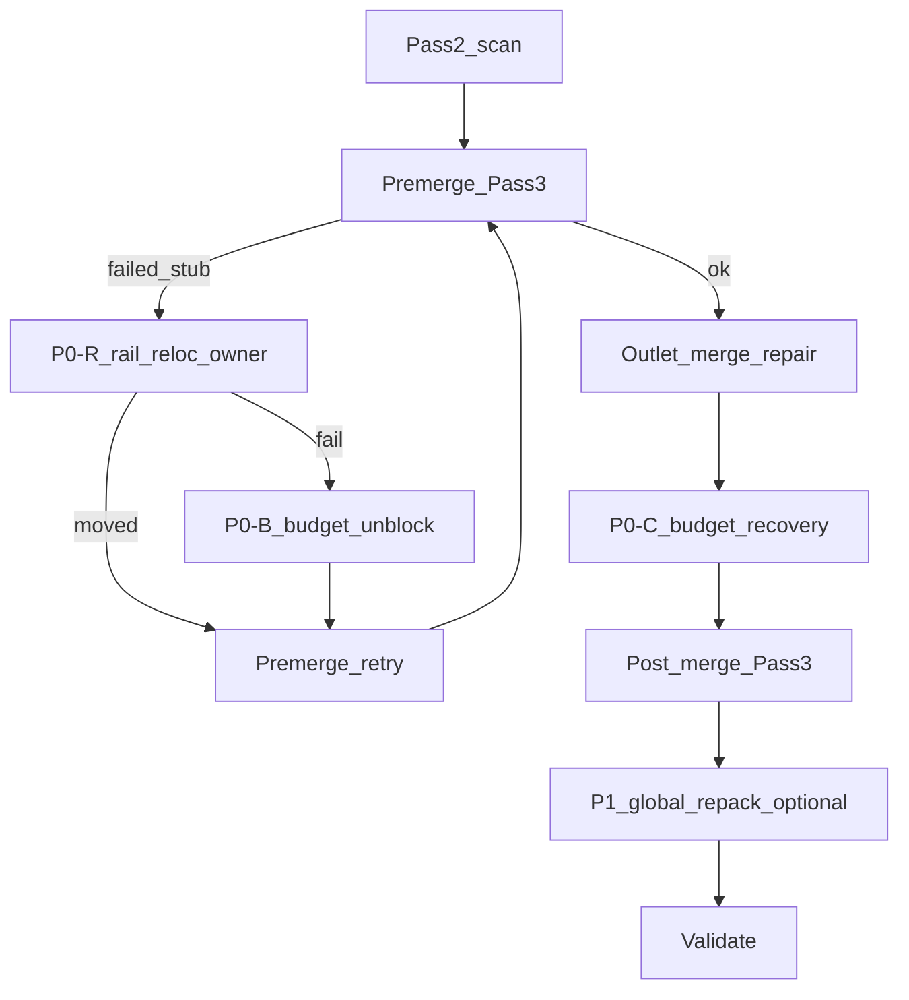

# mining layout stub 봉쇄·복구 플랜 (2026-05-09)

## 승인 요약

계획 방향은 **승인 가능** 수준이다. 아래 한 줄을 정본으로 한다.

**Pass4 전체 rail-side repack은 P1 선택 기능으로 두되, failed_stub owner bundle의 rail-side relocation은 P0 recovery 경로에 포함한다.**

이 구분으로 **봉쇄 stub → budget block → disconnected 반환** 연쇄를 직접 줄인다.

---

## 문제 정의 (로그·코드 정합)

- 완전 봉쇄 stub, 고정 라운드 unblock 한계, 배치 시점 `occupied`와 최종 지형 불일치가 핵심 실패 원인.
- `merge_demolition_budget_block` / `single_cap`은 **현재 워크스페이스에 없을 수 있음** — 로그와 코드가 어긋나면 분석이 흔들리므로 **단일 구현 + trace 이름 통일**을 Phase 0에서 고정한다.

---

## P0 / P1 역할 분리

| 단계 | 이름 | 범위 |
|------|------|------|
| **P0** | 봉쇄 방지 + targeted unblock + merge 예산 복구 | 트리 확정 후 escape, 예산 기반 unblock, budget block 후 재시도 |
| **P0-R** | failed_stub rail-side relocation | **전역 Pass4가 아님** — premerge 실패 시 owner bundle만 pipe 인접으로 재배치 후 Pass3 재시도 |
| **P1** | global rail-side repack | weak bundle 스캔·gain 스코어·커밋 상한 — 선택적 최적화 |

---

## 구현 순서 (검토안 반영)

### Phase 0 — 로그/코드 정합성 고정

- trace 이름 통일 (`merge_demolition_budget_block`, `single_cap` 등 로그에 있는 키와 코드 일치).
- `solver_service`에 예산 차단 분기가 없으면 **단일 구현으로 추가**하고 동일 run에서 재현 가능하게 한다.

### Phase 1 — P0 안정화

1. **P0-A — 배치 후 escape (`buildings_after`)**
   - 트리 확정 후 `occupied ∪ tree_cells ∪ {extractor}` 기준으로 outlet stub 재검증.
   - **`stub_escape_degree == 0`이면 하드 리젝트.**
   - **이웃이 다른 `fixed_stub`인 경우만으로는 탈출구로 세지 않는다** — 통과 예외일 수는 있으나 route_tree 연결 보장은 아님 ([`pass3_transport.py`](../../../django_apps/shapez_asteroid/services/asteroid_mining_layout/pass3_transport.py)의 fixed_stubs 설계와 정합).
   - **P2 (placement 상류)**: `count_stub_escape` frozen 규칙 정합·`_place_scan_pass` 트리 경로 게이트 — [`placement_stub_escape_gate_p2_2026-05-09.md`](placement_stub_escape_gate_p2_2026-05-09.md).

2. **P0-B — premerge unblock을 “라운드 수”가 아니라 예산 기준**
   - 고정 `MAX_PREMERGE_UNBLOCK_RETRIES = 3` 폐지 방향.
   - 권장 상수(튜닝 가능):
     - `MAX_PREMERGE_UNBLOCK_REMOVED_BUNDLES = 8`
     - `MAX_PREMERGE_UNBLOCK_REMOVED_CELLS = 24`
     - `MAX_BUNDLES_PER_FAILED_STUB = 2` (k-bundle 조합 상한)
   - failed_stub 주변 **k=1..2 bundle 조합 시뮬레이션**.
   - **소유자 번들도** 제거 또는 재배치 후보에 포함 (기존 로직이 `own_extractor`만 스킵하면 복구가 막힐 수 있음).

3. **P0-C — merge repair 예산 초과 후 복구 루프**
   - 흐름: `demolition budget 초과 → repair 미적용 → repair path 주변 safe unblock 후보 → premerge Pass3 재시도 → 실패 시 구조화 실패`.
   - 반환 reason 예: `demolition_budget_blocked_no_safe_unblock`.
   - **금지**: budget block 후 아무 것도 안 하고 validate로 떨어져 `return_not_connected`만 내는 경로.

### Phase 2 — P0-R failed_stub rail-side relocation (최소 recovery)

- 위치: `_try_remove_blocking_bundle_near_failed_stub()` **앞 또는 내부**에서 먼저 시도하는 것이 타당.
- 의사 흐름:
  1. premerge Pass3 실패 → `failed_stub`의 owner extractor 확인.
  2. owner bundle을 **기존 transport에 인접한 mineable cell**로 재배치 시도 (같은 resource constraint).
  3. outlet이 **기존 transport에 직접 붙는 후보만** 허용.
  4. `select_extension_tree_relaxed` 재사용.
  5. 성공 시 **즉시 premerge Pass3 retry**.
  6. 실패 시 기존 **k-bundle unblock / 번들 제거** fallback.

### Phase 3 — P1 global Pass4 (선택)

- weak bundle detector, transport-adjacent 후보 generator, relocation gain scoring, 커밋 수 제한.
- final Pass3 후 연결성 검증.
- trace: `pass4_rail_repack` candidate / committed / summary.

---

## 파이프라인 개요 (mermaid)



(premerge 루프는 실제 코드에서는 `while`/재진입으로 표현.)

---

## 변경 예상 파일

- [`placement.py`](../../../django_apps/shapez_asteroid/services/asteroid_mining_layout/placement.py) — `buildings_after` escape, fixed_stub 처리.
- [`solver_service.py`](../../../django_apps/shapez_asteroid/services/asteroid_mining_layout/solver_service.py) — P0-B/C/R, 예산 상수.
- (신규 가능) rail-side 헬퍼 모듈 — P0-R와 P1 공용 조각 분리 시 레이어 규칙 준수.
- [`tests/unit/shapez_asteroid/test_asteroid_mining_layout.py`](../../../tests/unit/shapez_asteroid/test_asteroid_mining_layout.py).

---

## 검증

- `python -m pytest tests/unit/shapez_asteroid/test_asteroid_mining_layout.py`
- 동일 입력 NDJSON에서 Phase 0 이후 trace 키가 코드와 1:1 대응되는지 확인.

---

## 최종 체크리스트

```text
Phase 0
[ ] trace 이름 통일
[ ] merge budget / single_cap 단일 구현 또는 존재 확인

Phase 1 (P0)
[ ] 트리 확정 후 buildings_after 기준 outlet escape
[ ] stub_escape_degree == 0 hard reject
[ ] fixed_stub만으로 escape 인정 금지 (연결 보장 없음)
[ ] premerge unblock: 제거 비용 budget 기준 (라운드 수 1차 기준 아님)
[ ] failed_stub 주변 k-bundle 조합
[ ] 소유자 bundle 제거/재배치 후보 포함
[ ] demolition budget block 후 safe unblock + premerge 재시도 또는 structured failure

Phase 2 (P0-R)
[ ] failed_stub owner rail-side relocation 최소 구현
[ ] 성공 시 Pass3 retry, 실패 시 unblock/remove fallback

Phase 3 (P1)
[ ] global rail-side repack 선택 기능
```

---

## 한계·주의

- API/UI가 solver 실패 reason을 소비한다면 구조화 필드 추가는 **최소 필드**만.
- P1 전역 repack은 gain·커밋 상한 없으면 폭주 위험.
