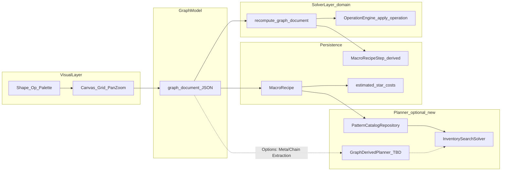

# Recipe Graph Editor — Step-by-step development plan (2026-05-04)

This document Recipe is a roadmap to gradually expand Graph Editor to Lucidchart-level canvas UX, DB persistence (complexity·steps), and solver integration. The existing `graph_document` · recalculation pipeline is **maintained and expanded**. Refer to [plan_recipe_graph_editor_2026-05-04.md](plan_recipe_graph_editor_2026-05-04.md) for the product definition and [recipe_graph_editor_progress_2026-05-04.md](recipe_graph_editor_progress_2026-05-04.md) for the implementation snapshot. review.

**Premise (rebuild or not)**: `MacroRecipe.graph_document` JSON and `recompute_graph_document` are **extended without being completely discarded**. The inventory solver/macro action generator **does not currently traverse the `graph_document` node directly**; “The ability to use the graph as a search space” was added as a **new application port**.

---

## Solver-Graph Relationship (Decision Making)

| mode | Description | Status |
|------|------|------|
| **A. Visual specifications** | Graphs are for definition, documentation, pattern lab, and step derivation. Optimization is `strategy_code`·primitive chain·inventory state space. | **Short-term basic adoption (2026-05-04)** — Implementation and documentation are based on this assumption. |
| **B. Graph Guided Plan** | Extract primitive list in linear topo order → reflected in cost/macro meta. | Follow-up (modules and verification can be added in Phase 4). |
| **C. Graph Weighted Navigation** | Edge/node cost/separate planner. | Separate research phase (not yet launched). |

When a person changes A/B/C, [recipe_graph_editor_progress_2026-05-04.md](recipe_graph_editor_progress_2026-05-04.md) updates this document table and code comments together.

---

## graph_document schema version policy

- Constant: `RECIPE_GRAPH_SCHEMA_VERSION` in [`django_apps/shapez_solver/services/recipe_graph_constants.py`](../../../../django_apps/shapez_solver/services/recipe_graph_constants.py).
- **Compatibility change** (node/edge field addition, selection field): **Raise** `schema_version`, and enter new field default values ​​in `validate_graph_document`. If existing DB JSON can be absorbed through **normalization during verification** rather than a migration script, do so.
- **Incompatible changes** (change field meaning/add required fields): Upload `schema_version`, and for older versions, an explicit error in `validate` or a separate adapter (migration guide in `documents/` if necessary).
- Set of engine operations: `RECIPE_GRAPH_ENGINE_OPERATIONS` — New `OperationType` added as a **bundle of commits** with engine·`apply_operation`·constants·test.

---

## Phase 0 — Baseline fixation

- This plan, schema policy, and A/B/C table (above) are set as **approval standard documents**.

## Phase 1 — Lucidchart Sensory UX (staff)

- Palette·Grid·Drop creation: [`macro_pattern_staff.js`](../../../../django_apps/web/static/web/js/macro_pattern_staff.js), Extends [`macro_pattern_staff_graph.mjs`](../../../../django_apps/web/static/web/js/macro_pattern_staff_graph.mjs), [`graph_mount.js`](../../../../django_apps/web/static/web/js/solver_timeline/graph_mount.js).
- Multi-output: Maintain existing `input_count`/`output_count` markup.

## Phase 2 — Graph meta/cost (DB/derived)

- `MacroRecipe` `estimated_*` and graph matching, recalculation response `graph_cost_hint`, etc. (Implementation is service·view).

## Phase 3 — Verification/Quality

- Enhanced [`recipe_graph_recipe_validation.py`](../../../../django_apps/shapez_solver/services/recipe_graph_recipe_validation.py), unit tests.

## Phase 4 — Solver integration

- **Mode A**: Expectation documentation/code comments (documents already seen + `macro_action_generator`, etc.).
- **Mode B/C**: Subsequent implementation according to the roadmap in this document.

## Phase 5 — Integration

- Progress documentation/harness (`pytest`/`ruff`/`mypy`/`black --check`).

---

## Goals Architecture (Summary)

---

## Risk/Mitigation

| Risk | Mitigation |
|--------|------|
| Solver expectations and graph roles mismatch | Maintain the above decision table |
| front large work | Palette → Drop → Grid Order Modularization |
| schema explosion | version bump + incremental field |

---

## reference

- [AGENTS.md](../../../../AGENTS.md) — `documents/` Korean convention.
- [.cursor/rules/root.mdc](../../../../.cursor/rules/root.mdc) — Authorization gate.
