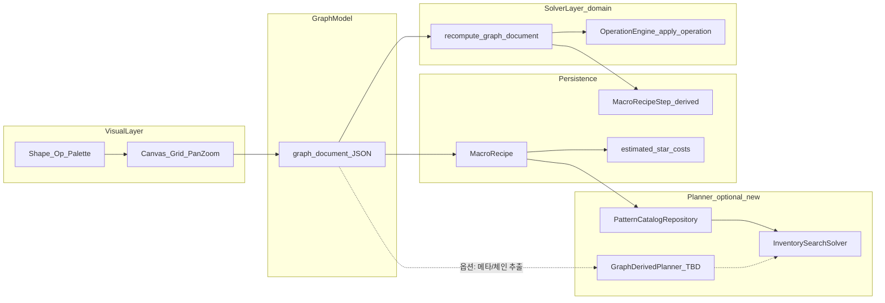

# Recipe Graph Editor — 단계별 개발 계획서 (2026-05-04)

본 문서는 Recipe Graph Editor를 Lucidchart 수준의 캔버스 UX, DB 영속성(complexity·steps), 솔버 연동까지 단계적으로 확장하기 위한 로드맵이다. 기존 `graph_document`·재계산 파이프라인은 **유지·확장**한다. 제품 정의는 [plan_recipe_graph_editor_2026-05-04.md](plan_recipe_graph_editor_2026-05-04.md)를, 구현 스냅샷은 [recipe_graph_editor_progress_2026-05-04.md](recipe_graph_editor_progress_2026-05-04.md)를 본다.

**전제(리빌드 여부)**: `MacroRecipe.graph_document` JSON과 `recompute_graph_document`는 **전면 폐기 없이 확장**한다. 인벤토리 솔버·매크로 액션 생성기는 **현재 `graph_document` 노드를 직접 순회하지 않는다**; “그래프를 검색 공간으로 쓰는 기능”은 **신규 애플리케이션 포트**로 추가한다.

---

## 솔버–그래프 관계 (의사결정)

| 모드 | 설명 | 상태 |
|------|------|------|
| **A. 시각 스펙** | 그래프는 정의·문서화·Pattern Lab·스텝 파생용. 최적화는 `strategy_code`·primitive 체인·인벤토리 상태 공간. | **단기 기본 채택(2026-05-04)** — 구현·문서는 이 가정을 전제로 한다. |
| **B. 그래프 유도 플랜** | 선형 토포 순서로 primitive 리스트 추출 → 비용/매크로 메타에 반영. | 후속(Phase 4에서 모듈·검증 추가 가능). |
| **C. 그래프 가중 탐색** | 엣지/노드 비용·별도 플래너. | 별도 리서치·페이즈(미착수). |

사람이 A/B/C를 변경하면 [recipe_graph_editor_progress_2026-05-04.md](recipe_graph_editor_progress_2026-05-04.md) 본 문서 표와 코드 주석을 함께 갱신한다.

---

## graph_document 스키마 버전 정책

- 상수: [`django_apps/shapez_solver/services/recipe_graph_constants.py`](../../../../django_apps/shapez_solver/services/recipe_graph_constants.py) 의 `RECIPE_GRAPH_SCHEMA_VERSION`.
- **호환 변경**(노드·엣지 필드 추가, 선택 필드): `schema_version`을 **올리고**, `validate_graph_document`에서 신규 필드 기본값을 넣는다. 기존 DB JSON은 마이그레이션 스크립트가 아니라 **검증 시 정규화**로 흡수할 수 있으면 그렇게 한다.
- **비호환 변경**(필드 의미 변경·필수 필드 추가): `schema_version` 올리고, 옛 버전은 `validate`에서 명시적 오류 또는 별도 어댑터(필요 시 `documents/`에 마이그레이션 가이드).
- 엔진 연산 집합: `RECIPE_GRAPH_ENGINE_OPERATIONS` — 신규 `OperationType`은 엔진·`apply_operation`·상수·테스트를 **한 커밋 묶음**으로 추가한다.

---

## Phase 0 — 기준선 고정

- 본 계획서·스키마 정책·A/B/C 표(상)를 **승인 기준 문서**로 둔다.

## Phase 1 — Lucidchart 감각 UX (스태프)

- 팔레트·그리드·드롭 생성: [`macro_pattern_staff.js`](../../../../django_apps/web/static/web/js/macro_pattern_staff.js), [`macro_pattern_staff_graph.mjs`](../../../../django_apps/web/static/web/js/macro_pattern_staff_graph.mjs), [`graph_mount.js`](../../../../django_apps/web/static/web/js/solver_timeline/graph_mount.js) 확장.
- 멀티 출력: 기존 `input_count`/`output_count` 마크업 유지.

## Phase 2 — 그래프 메타·비용 (DB·파생)

- `MacroRecipe` `estimated_*`와 그래프 정합, 재계산 응답 `graph_cost_hint` 등(구현은 서비스·뷰).

## Phase 3 — 검증·품질

- [`recipe_graph_recipe_validation.py`](../../../../django_apps/shapez_solver/services/recipe_graph_recipe_validation.py) 강화, 단위 테스트.

## Phase 4 — 솔버 연동

- **모드 A**: 기대치 문서·코드 주석(이미 본 문서 + `macro_action_generator` 등).
- **모드 B/C**: 본 문서의 로드맵대로 후속 구현.

## Phase 5 — 통합

- 진행 문서·하네스(`pytest`/`ruff`/`mypy`/`black --check`).

---

## 목표 아키텍처(요약)

---

## 리스크·완화

| 리스크 | 완화 |
|--------|------|
| 솔버 기대와 그래프 역할 불일치 | 위 의사결정 표 유지 |
| 프론트 대형 작업 | 팔레트 → 드롭 → 그리드 순 모듈화 |
| 스키마 폭발 | 버전 bump + 점진 필드 |

---

## 참조

- [AGENTS.md](../../../../AGENTS.md) — `documents/` 한국어 규칙.
- [.cursor/rules/root.mdc](../../../../.cursor/rules/root.mdc) — 승인 게이트.
