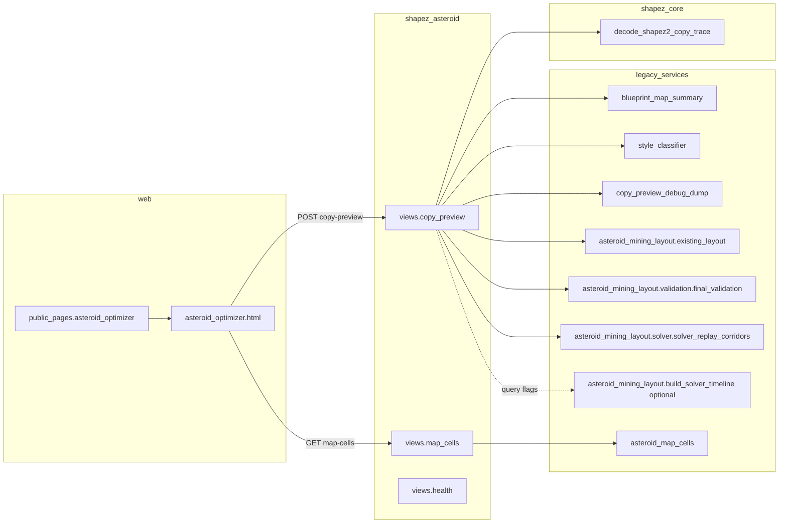

# Asteroid 레거시 preview / reconstruction 스택 감사 보고서

**유형**: REPORT (정본 아님)  
**작성일**: 2026-05-14  
**범위**: `django_apps/shapez_asteroid` 웹·API가 솔버 v1 엔트리와 분리된 뒤에도 동작하는 이유, 레거시 서비스 파일 의존성, v2 이전 순서.

**정본 참고 (알고리즘·파이프라인)**: `documents/Algorithm/mining_solver_cursor_sessions/` — 특히 `01_project_overview.md`, `02_pipeline_control_flow.md`, `03_data_schema_dto.md`, `04_step0_decode.md`, `05_step1_reconstruction.md`, `14_step10_replay_ui.md`.

---

## 1. 왜 asteroid HTML이 “v1 솔버 분리” 이후에도 동작하는가

- **페이지 진입**: `django_apps/web/views/public_pages.py`의 `asteroid_optimizer`가 `web/asteroid_optimizer.html`을 렌더링하고, `shapez_asteroid:copy_preview`·`shapez_asteroid:map_cells` 등 API URL을 컨텍스트/템플릿에 넣는다.
- **API 마운트**: `config/urls.py`에서 `path("api/asteroid/", include("django_apps.shapez_asteroid.urls"))`로 별도 앱 URL이 붙어 있다.
- **copy-preview 본체**: `django_apps/shapez_asteroid/views.py`의 `copy_preview`가
  - `shapez_core`의 `decode_shapez2_copy_trace`로 디코드하고,
  - **`blueprint_map_summary.build_map_timeline`**으로 맵 타임라인을 만들며,
  - `style_catalog`·`existing_layout_analysis` 등을 JSON으로 돌려준다.
- **솔버 v1과의 관계**: 기본 응답만으로도 `build_map_timeline` + 레이아웃 분석이면 UI가 동작한다. `include_solver_overlay` / `include_solver_replay` 쿼리가 켜지면 **지연 import**로 `asteroid_mining_layout.build_solver_timeline`을 추가 호출한다.
- **요약**: “메인 솔버 엔트리를 끊었다”와 “웹 preview가 쓰는 `views` + `blueprint_map_summary` + (옵션) `asteroid_mining_layout` 하위 모듈”은 **다른 경로**다. HTML은 이 API 스택에 직접 매달려 있다.

---

## 2. URL·뷰에서 서비스 파일까지 의존 그래프



**엔드포인트 요약**

| URL 패턴 | 뷰 | 핵심 서비스 |
|-----------|-----|-------------|
| `web:asteroid` | `public_pages.asteroid_optimizer` | 템플릿만 (API URL 주입) |
| `api/asteroid/copy-preview/` | `views.copy_preview` | `blueprint_map_summary`, `style_classifier`, (옵션) `asteroid_mining_layout`, `existing_layout`, `final_validation`, `solver_replay_corridors` |
| `api/asteroid/map-cells/` | `views.map_cells` | `asteroid_map_cells` (Django 모델) |
| `api/asteroid/health/` | `views.health` | 없음 |

---

## 3. 파일별 분류표

검색 기준: `rg`로 `django_apps`, `tests`, `scripts` 내 import·문자열 참조 조사 (2026-05-14 스냅샷).

**공통 규칙 (감사 전제)**:

- 로그·replay·NDJSON·`solver_summary`는 **알고리즘 입력으로 취급하지 않는다** (표시·디버그 계층).
- `ExistingLayoutAnalysis`는 **읽기 전용** 분석으로 유지한다.
- `mineable_placement_cells` 등 **배치 가능 영역 추론**은 **reconstruction 단계**에서만 허용 (`05_step1_reconstruction.md` 정렬).

| 파일 | 누가 import/사용 | URL·뷰·API | 역할 혼합 | Django models/settings | v1 `asteroid_mining_layout` import | 디버그·파일 I/O | v2 대체 | 분류 | 삭제 위험 |
|------|------------------|------------|-----------|------------------------|-----------------------------------|------------------|---------|------|-----------|
| `blueprint_entry_parsing.py` | `blueprint_map_summary`만 | 간접(copy-preview) | decode 헬퍼 | 아니오 | 아니오 | 없음 | v2 decode에 흡수 | REIMPLEMENT_IN_V2 | LOW |
| `blueprint_map_summary.py` | `views.copy_preview`; `asteroid_mining_layout`·`_old.deactivate` 내 다수; `scripts/debug/t7_verify_step4_ndjson_telemetry.py` | copy-preview 핵심 | **mixed** (UI timeline + v1 파이프라인 공용) | 아니오 | 간접(동일 패키지가 이 모듈을 끌어다 씀) | 없음 | v2 `decode` / `analysis` 경계 | KEEP_UNTIL_V2_REPLACEMENT → REIMPLEMENT_IN_V2 | HIGH |
| `asteroid_map_cells.py` | `views.map_cells` | map-cells API | DB 월드 그리드 (preview 보조) | **예** (`apps.get_model`) | 아니오 | DB 읽기 | 계약 유지 시 adapter 또는 유지 | KEEP_UNTIL_V2_REPLACEMENT | MEDIUM |
| `asteroid_patch_interior.py` | `blueprint_map_summary` (및 레거시 `asteroid_reconstruction`가 patch를 사용하도록 설계됨) | 간접 | reconstruction: 패치 내부 셀 | 아니오 | 아니오 | 없음 | v2 `reconstruction` | REIMPLEMENT_IN_V2 | MEDIUM |
| `asteroid_reconstruction.py` (서비스 루트) | `extraction/reachability.py` | 간접(추출 파이프라인) | STEP1 마스크·`mineable_placement_cells` | 아니오 | 아니오 | 없음 | v2 `asteroid_mining_layout_v2/reconstruction/`와 통합 | REIMPLEMENT_IN_V2 | MEDIUM–HIGH |
| `style_classifier.py` | `blueprint_map_summary`, `views`, **v2** `asteroid_mining_layout_v2/decode/existing_layout_analysis.py` | copy-preview | UI 카탈로그 + 레이아웃 라벨 | 아니오 | 아니오 | 없음 | preview 계층으로 이동 권장 | KEEP_UNTIL_V2_REPLACEMENT / REIMPLEMENT_IN_V2 (분리) | MEDIUM |
| `copy_preview_debug_dump.py` | `views.copy_preview` (`SHAPEZ_COPY_DEBUG_DIR` 설정 시) | copy-preview | 디버그 덤프 | `settings` | 아니오 | **쓰기** `copy_preview_*` | 옵션 유지 가능 | DEBUG_DELETE_CANDIDATE 또는 유지 | LOW |
| `asteroid_mining_layout.zip` | 레포 문자열 **0건** | 없음 | 아카이브 추정 | — | — | — | 수동 확인 | UNKNOWN_MANUAL_REVIEW / ARCHIVE_DELETE_CANDIDATE | LOW–UNKNOWN |

### 3.1 Git·워크스페이스 이상 징후 (감사 시 발견)

- **`git ls-files django_apps/shapez_asteroid/services/asteroid_mining_layout.zip`**: 추적 파일 **없음** (레포 내 다른 zip은 `tests/unit/shapez_asteroid.zip`만 확인됨).
- **`asteroid_patch_interior.py` / `asteroid_reconstruction.py`**: 현재 브랜치 인덱스에는 **`.old` 확장자 파일만** 추적되고, **`.py` 본편은 추적되지 않음**. 그러나 `blueprint_map_summary.py`는 여전히 `django_apps.shapez_asteroid.services.asteroid_patch_interior`를 import한다.
- **권장 조치**: v2 이전 전에 **이름 복구 또는 import 경로 정리**를 하여, `copy_preview`가 import 단계에서 실패하지 않도록 할 것. 참고용으로 동일 로직은 `asteroid_patch_interior.py.old`, `asteroid_reconstruction.py.old`에 남아 있다.

---

## 4. v2에서 재구현·이전할 파일

우선순위는 **웹이 직접 타는 경로**부터.

1. **`blueprint_map_summary.py`** — decode + timeline + mining map 요약을 v2 `decode` / `analysis`(또는 preview 전용 adapter)로 이전.
2. **`blueprint_entry_parsing.py`** — v2 decode 모듈에 통합.
3. **`asteroid_patch_interior.py`** — v2 `reconstruction`과 단일 정본화 (`compute_patch_interior_cells` 계약 유지 여부 명시).
4. **서비스 루트 `asteroid_reconstruction.py`** — `extraction/reachability.py`가 기대하는 `AsteroidReconstruction`·`is_exterior_coord` 등을 v2 reconstruction과 맞추거나 thin-wrapper로 전환.
5. **`style_classifier.py`** — UI 전용 타일 카탈로그는 preview/adapters, 레이아웃 enum은 domain과 분리 검토 (현재 v2 `existing_layout_analysis`가 동일 모듈을 import — 경계 혼선).

---

## 5. 교체 완료 후 삭제 후보

| 대상 | 조건 |
|------|------|
| `copy_preview_debug_dump.py` | v2 preview 경로에서 동등 디버그가 불필요하거나 settings 플래그만 남길 때 |
| `asteroid_mining_layout.zip` | `git ls-files`·실파일 모두 없고, 아카이브 내용이 소스와 중복임이 확인된 뒤 |
| 레거시 `.py` (patch / reconstruction 루트) | v2 구현 + `extraction`·`blueprint_map_summary` 전환 후 **import 0건** |

**삭제하지 말 것 (당장)**: `asteroid_map_cells.py` — DB API 계약이 웹에 노출됨.

---

## 6. 마이그레이션 순서 (삭제는 마지막)

사용자 합의 시퀀스와 동일하게 유지한다.

1. **레거시 preview 스택 격리** — `views.copy_preview`가 참조하는 모듈 목록을 adapter 뒤로 모은다.
2. **v2 preview / decode / reconstruction adapter 작성** — payload 필드를 한 곳에서 조립.
3. **HTML·뷰를 v2 경로로 전환** — 템플릿의 data URL·JS가 기대하는 JSON 키를 계약으로 고정.
4. **테스트 통과** — 아래 §7.
5. **레거시 삭제** — `rg`로 참조 0건 확인 후.

---

## 7. 삭제 전 필수 테스트

1. **import 스모크**: `copy_preview` 로드 시 `asteroid_patch_interior` 등 누락 모듈이 없는지.
2. **기존**: `tests/unit/web/test_asteroid_optimizer_page.py` (URL·메타 배선).
3. **추가 권장**:
   - `copy_preview` POST 최소 페이로드에 대한 JSON 키 스냅샷 (`include_solver_overlay` / `include_solver_replay` off·on 분리).
   - `map_cells` bbox 오류 코드 (`asteroid_map_cells.parse_bbox`).
   - `tests/unit/shapez_asteroid_v2/` 전체 및 reconstruction 계약 테스트.
4. **삭제 게이트 (사용자 기준 정렬)**:
   - `rg`로 해당 심볼·모듈 참조 0건
   - HTML/API가 v2 preview adapter만 사용
   - v2 reconstruction 테스트·copy preview 회귀·shapez_asteroid 관련 pytest 통과

---

## 8. 플랜 B: `copy_preview` → v2 preview adapter (설계 초안)

**목표**: `django_apps/shapez_asteroid/views.py`는 HTTP·settings·JSON 응답만 담당하고, **디코드 이후의 조립**은 `asteroid_mining_layout_v2` 경계의 **preview adapter**(또는 `application` 포트 구현체)로 이동한다.

### 8.1 입력

- 원시 HTTP: `code` 문자열(JSON body), 쿼리 `include_solver_overlay`, `include_solver_replay`.
- 디코드 결과: `decode_shapez2_copy_trace` 성공 시 `dict` (blueprint 트리).

### 8.2 출력 (현 `copy_preview` payload와 호환을 1차 목표로)

| 키 | 출처 (현재) | v2 이전 시 |
|----|-------------|------------|
| `ok`, `error`, `error_code` | 뷰 | 뷰 유지 |
| `map_timeline`, `mining_map`, `summary` | `build_map_timeline` | adapter가 v2 decode/analysis 결과를 동일 스키마로 매핑하거나, **버전 필드**(`preview_schema_version`)를 두고 단계적 전환 |
| `style_catalog` | `asteroid_map_style_catalog()` | preview 모듈(또는 정적 JSON 생성) |
| `existing_layout_analysis` | `asteroid_mining_layout.existing_layout` | **`asteroid_mining_layout_v2.decode.existing_layout_analysis`** 단일 권위 |
| `solver_replay`, `solver_timeline`, `mining_layout_runtime_flags` | 옵션 `build_solver_timeline` | v2 solver/replay 산출물로 교체 시 계약 문서(`14_step10_replay_ui.md`)에 맞춤 |
| `solver_summary` 병합 필드 | `_merge_*` 헬퍼 | “표시 전용”임을 docstring·REPORT에 명시 유지 |

### 8.3 레이어 규칙

- **Domain**: 솔버 입력으로 쓰이는 DTO만; NDJSON·replay는 adapter에서 domain 밖으로 유지.
- **Adapter**: Django settings 읽기, `dump_copy_preview_debug` 호출 여부 결정.
- **금지**: `ExistingLayoutAnalysis`가 replay 이벤트를 읽도록 확장하지 않는다.

### 8.4 단계적 전환

1. adapter 내부에서 v2 `copy_decode_adapter` + v2 `existing_layout_analysis`만 우선 전환, timeline은 임시로 레거시 호출.
2. timeline·merge를 v2 `analysis`로 이전.
3. `include_solver_*`를 v2 solver 빌드로 연결.
4. 레거시 모듈 제거.

### 8.5 v2 copy-preview `map_timeline` appendix (2026-05-14 이후)

- `copy-preview` 응답의 `map_timeline`은 **`v2_preview_map_timeline`만** 사용한다(v1 `build_map_timeline` 없음).
- v2 프레임은 각각 **전체 `mining_map` 스냅샷**(delta 없음)이다. 재구성 3프레임(`v2_recon_*`) 뒤에 미구현 마일스톤용 **8개 플레이스홀더**(`v2_pass1_*` … `v2_final_layout`)를 붙이며, 각 플레이스홀더 `summary`에 `preview_placeholder: true`가 있다(맵은 마지막 재구성 스냅샷 복제). 배리어가 없으면 재구성 없이 **플레이스홀더 8개만**(빈 `mining_map`).
- 응답 최상위 `mining_map`·`summary`는 **통합 타임라인의 마지막 프레임**과 동일하게 맞춘다(`preview_schema_version` 2).
- `include_solver_overlay` / `include_solver_replay`를 켰지만 v1 `asteroid_mining_layout` 패키지가 없으면 **HTTP 503이 아니라 `ok: true`**이며 `solver_layout_package_unavailable: true`로 표시하고 `solver_replay`·`solver_timeline`은 생략한다(v2 맵·타임라인은 그대로).

---

## 9. 이후 진행 상황

- 본 문서는 **감사·계획** 산출물이며, 구현·삭제는 별도 승인·PR에서 수행한다.
- **즉시 권장**: §3.1의 **누락된 tracked `asteroid_patch_interior.py` / `asteroid_reconstruction.py`**를 팀 기준으로 복구하거나 import를 `.old` 내용으로 되돌리는 핫픽스(정책 결정 필요).
- **검증 (2026-05-14, 로컬)**: `python -m pytest tests/unit/shapez_asteroid_v2/ -q`는 통과. `tests/unit/web/test_asteroid_optimizer_page.py`는 **`django_apps.shapez_asteroid.views` 로드 시 `asteroid_mining_layout` 패키지 부재**로 `ModuleNotFoundError` 발생(불완전 체크아웃·브랜치 상태와 일치). 전체 웹 스모크는 패키지 복구 후 재실행 권장.

---

## 부록: 검증에 사용한 명령 (재현)

```text
rg "blueprint_entry_parsing|blueprint_map_summary|asteroid_map_cells|asteroid_patch_interior|asteroid_reconstruction|copy_preview_debug_dump|style_classifier" django_apps tests scripts
rg "from django_apps.shapez_asteroid.services" django_apps tests
git ls-files "**/asteroid_mining_layout.zip"
git ls-files django_apps/shapez_asteroid/services/asteroid_patch_interior.py django_apps/shapez_asteroid/services/asteroid_reconstruction.py
```
