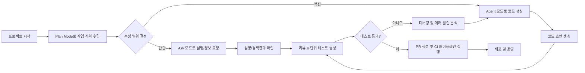
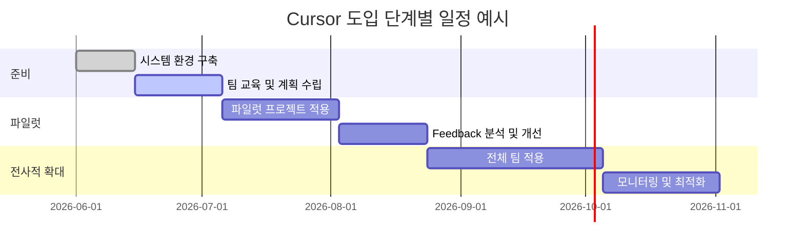

Role: AI 개발 환경 전문가

---

## 요약  
Cursor AI IDE는 **AI 에이전트 기반 개발 환경**으로, 프로젝트 초기 설정에서부터 코드 작성·리팩터링, 디버깅, 테스트, 배포까지 전반적인 개발 워크플로우를 지원합니다. 사용자는 **Agent 모드**(Cursor가 복수 파일 변경, 터미널 명령 실행, 코드베이스 전체 컨텍스트 이해)와 **Ask 모드**(정보 검색·설명 요청) 등을 조합하여 효율적으로 개발을 진행할 수 있습니다. AI 도우미를 활용하는 과정에서는 **프롬프트 설계, 모델 선택, 프롬프트 튜닝** 등의 기술이 필요하며, LLM의 오답(환각) 방지와 **보안/개인정보 보호**에도 주의를 기울여야 합니다. 도구 통합 측면에서는 Git과 CI/CD(예: GitHub Actions, CircleCI 등), 코드 린터·형식 도구, 클라우드 서비스 연동이 필수적이며, Cursor의 **MCP**(Model Context Protocol) 기능으로 CI 로그·테스트 결과를 AI가 직접 참조하도록 구성할 수 있습니다. 이 보고서는 Cursor 기반 개발의 **엔드투엔드 워크플로우 단계** 및 **의사결정 포인트**, 요구 역량, 통합 도구, 모범 사례, 역할·프로젝트별 워크플로우 예시, 도입 체크리스트, 학습 로드맵, 보안·컴플라이언스 사항 등을 상세히 분석합니다.  

---

## 1. Cursor 기반 개발 워크플로우

**프로젝트 초기 설정:** 새 프로젝트를 생성하고 Git 리포지토리와 연결한 뒤, `.cursor/rules` 파일에 **커서 규칙**(프로젝트별 코드 스타일·명령·패턴 등)과 팀 공유 규칙을 작성하여 Cursor 에이전트의 작업 범위와 지침을 정의합니다. 프로젝트 코드베이스를 색인화해 빠른 검색 및 맥락 제공 기능을 준비합니다. 에디터로는 **Cursor IDE**(VSCode 기반 독립 환경) 또는 CLI 버전을 사용하며, 코드 에디터 외에 Slack, GitHub 등의 협업 도구와 연동할 수 있습니다.

**기획(Plan) 단계:** 본격 코딩 전 **Plan Mode**를 통해 에이전트에게 작업 계획을 작성하도록 합니다. Plan Mode를 켜면 에이전트가 요구사항을 분석해 관련 파일을 찾고, 추가 질문을 통해 요구사항을 명확히 하며, 상세 구현 계획(파일 경로와 단계 포함)을 수립한 뒤 검토를 요청합니다. 이 계획 문서는 `.cursor/plans/` 아래에 Markdown으로 저장해 팀 문서로 활용할 수 있으며, 이후 작업 중단 시 재개나 다른 에이전트에게 컨텍스트 제공에 유용합니다. 간단한 수정 작업이나 이미 익숙한 기능은 계획 단계 없이 바로 에이전트에게 맡길 수 있습니다.

**코드 작성:** 에이전트 모드에서 구체적 작업(기능 구현, 리팩터링 등)을 지시하거나, 어시스트 모드(Ask)를 통해 설명·구문 생성 등을 요청합니다. 예를 들어, “새 사용자 등록 API를 구현하고 입력 검증을 추가하라”는 프롬프트로 에이전트에게 코드를 작성하게 하고, 필요 시 Ask 모드로 “왜 이 방식으로 구현했나?” 등의 설명을 요청하여 AI 오답을 검출합니다. 무거운 데이터 작업이나 반복적 단순 작업(예: 코드 스캐폴딩, 자동화 스크립트 작성)에는 AI를 적극 활용하고, 보안·인증 관련 핵심 로직은 생성 후 반드시 수동 검토합니다.

**디버깅 및 테스트:** 코드 생성 후에는 **자동화된 테스트 케이스** 생성을 에이전트에게 요청하고 직접 실행합니다. 예를 들어, API 개발 시 “모든 엔드포인트를 테스트해주는 코드를 작성하라”는 식으로 AI에게 유닛/통합 테스트 스크립트를 생성하게 할 수 있습니다. 발생한 오류는 에러 메시지를 Cursor에 피드백하여 수정하거나, 복잡한 문제는 더 큰 모델(예: Claude 3.7 Max)로 디버깅 요약을 생성해 손쉽게 원인을 파악합니다. 일반적으로 반복적인 오류는 로그를 남기고, 단계별로 작은 단위(feature)별 테스트를 거치며 개발합니다.

**협업과 코드 리뷰:** 작성된 코드는 Git을 통해 PR로 관리하고, Cursor의 코드 리뷰 기능을 활용하거나 AI에게 리뷰를 요청합니다. Cursor는 Slack, GitHub 등 외부 도구와 통합되어 팀원과 지식 공유가 가능합니다. 팀 규칙 파일을 Git에 커밋하여 공유하고, 새로운 버그 발견 시 규칙을 업데이트하거나 `@cursor` 태그를 통해 에이전트에게 규칙 수정을 요청할 수 있습니다. **프롬프트 스킬**(SKILL.md)과 **훅**(Hooks) 기능을 설정하여 반복 작업(예: 테스트 통과까지 반복 실행)을 자동화할 수도 있습니다.

**배포 및 CI/CD:** Cursor는 **CI/CD 파이프라인**과의 연동을 지원합니다. 예를 들어, CircleCI MCP 서버 구성으로 Cursor가 파이프라인 로그와 테스트 결과에 접근하도록 설정하면, 빌드 실패 시 AI가 즉시 원인을 분석하여 해결책을 제안할 수 있습니다. GitHub Actions나 Jenkins 등의 도구와도 통합하여, Cursor를 통해 빌드 명령 생성을 자동화하고, 승인이 필요한 경우 사용자에게 알립니다. 실시간 모니터링 도구와 연계하여 운영 상황을 관찰하고, 문제가 생기면 AI에게 로그 기반으로 원인 분석을 하도록 할 수 있습니다. 

**의사결정 포인트:** Cursor 사용 중 작업 난이도나 보안 위험도를 고려하여 인간 검토를 병행합니다. 예를 들어 결제 처리, 인증 로직과 같이 민감한 부분은 AI가 작성한 코드를 **완전 수동 점검**해야 합니다. 또한, 요구사항이 불명확하면 AI에게 추상적 지시 대신 구체적이고 작은 단위로 요청해야 합니다. 긴 대화로 에이전트가 집중력을 잃으면 새 대화를 시작하고, 이전 문맥은 `@Past Chats` 기능으로 참조합니다.

---

## 2. 요구 기술 및 역량

**프로그래밍 언어/프레임워크:** 일반적인 개발 역량은 필수적입니다. 예를 들어 웹 개발에서는 JavaScript/TypeScript(React, Next.js 등)와 Python/Node.js(Express, FastAPI 등)가 사용되며, Android/iOS, ML 프로젝트 등 각 도메인에 맞는 언어·라이브러리 활용 능력이 필요합니다. 또한 Git 및 버전 관리, Docker·컨테이너 기술, AWS/GCP 같은 클라우드 이해 등 전통적 DevOps 지식도 요구됩니다.

**프롬프트 엔지니어링:** AI에게 지시를 효과적으로 전달하기 위한 **프롬프트 작성 기술**이 중요합니다. 작업 목표와 제약조건을 명확히 서술하고, 필요한 컨텍스트(관련 코드, 예시)를 포함해야 합니다. 예를 들어 `@file` 또는 `@folder` 지시어로 특정 파일/폴더를 참조하거나, 상세한 설명과 예시를 제시하여 모델이 정확히 이해하도록 돕습니다. 프롬프트 **튜닝** 기술(시스템 프롬프트 조정, 안정성 제약 추가 등)을 통해 모델이 추측하지 않고 제공된 도구만 사용하도록 안내해야 합니다.

**모델 선택 및 체이닝:** Task에 적합한 모델을 선택하는 역량이 필요합니다. 예를 들어 창의적 설계나 복잡한 문제 해결에는 Anthropic Claude 시리즈, 코딩 완성은 GPT-4 등이 활용될 수 있습니다. 여러 모델을 함께 쓰는 체이닝 전략(예: 오류 분석은 대형 모델, 코드 작성은 코딩 특화 모델)을 구사할 수 있어야 합니다. 작업을 큰 목표로 나눈 뒤, 하위 작업별로 대형 에이전트를 배정하여 병렬·분산 처리하는 패턴도 효과적입니다.

**프롬프트 템플릿과 평가:** 자주 쓰는 작업에는 **프롬프트 템플릿**을 만들어두면 생산성을 높일 수 있습니다. 예를 들어 “Express.js 회원가입 API 작성”과 같은 형태로 템플릿을 작성한 후, 프로젝트별 상황에 맞게 수정해서 사용합니다. 템플릿을 평가할 때는 **명확성/구체성, 컨텍스트 포함 여부, 안전성**을 기준으로 점검합니다. 좋은 프롬프트는 의도가 분명하고, 필요한 정보가 충실히 포함되며, 민감 정보 노출이나 잘못된 동작을 유도하지 않습니다(예시 평가 표 참조).

**Prompt 안전성 & 오류 검증:** AI는 환각(hallucination) 오류를 일으킬 수 있으므로, 생성된 코드는 반드시 리뷰합니다. AI가 제안한 설계를 “왜 이렇게 했는지” 묻거나, 제3모델(예: GPT-4o)을 활용해 검증 요약을 생성하게 할 수 있습니다. 보안·규제 요구사항을 잘못 구현하지 않았는지, 취약점은 없는지 주의합니다. 예를 들어 Namanyay는 API 키나 결제 처리 로직을 AI가 실수하지 않도록 휴먼 체크를 강조합니다.

**보안 및 데이터 처리:** Cursor 사용 시 **개인정보·코드 기밀 보호**가 중요합니다. Cursor는 **프라이버시 모드**를 제공하여 사용자의 코드가 학습에 활용되지 않도록 설정할 수 있으며, SOC 2 타입2 컴플라이언스를 준비 중입니다. 민감 데이터(예: 패스워드, API 토큰)는 AI와 절대 공유하지 않도록 하며, 필요한 경우 로컬에서 격리된 환경에서 작업합니다. 또한 Cursor 세션 및 결과물은 내부 코드 검증 절차를 거쳐야 합니다.

**관측(Observability):** Cursor 에이전트 작업과 CI/CD 파이프라인을 모니터링할 수 있는 역량이 필요합니다. 예를 들어 CircleCI MCP 설정을 통해 빌드 결과를 AI에 노출하고, AI의 제안을 평가하는 로그를 남깁니다. 실행된 AI 명령과 변경 내용을 기록으로 관리하고, 필요시 롤백하는 절차를 마련합니다.

<table>
<thead>
<tr><th>역할</th><th>주요 스킬/도구</th><th>Cursor 관련 역량</th></tr>
</thead>
<tbody>
<tr><td>프론트엔드 개발자</td><td>JavaScript/TypeScript, React/Vue, UI 컴포넌트 라이브러리, CSS 프레임워크</td><td>UI 프로토타이핑(예: Lovable) 후 Cursor로 컴포넌트 생성·개선; Storybook/테스트 작성; CSS/코딩 스타일 규칙 관리</td></tr>
<tr><td>백엔드 개발자</td><td>Python/Node.js/Java, Express/Django/FastAPI, SQL/NoSQL DB, REST/GraphQL</td><td>Cursor로 API/모델 스켈레톤 생성; DB 마이그레이션 스크립트 작성; CI/CD 파이프라인 자동화; Cursor 규칙에 보안/입력 검증 패턴 포함</td></tr>
<tr><td>머신러닝 엔지니어</td><td>Python, PyTorch/TensorFlow, 데이터 전처리(NumPy, Pandas), MLflow/ML 파이프라인</td><td>데이터 로딩/전처리 코드, 모델 학습 스크립트 생성; 하이퍼파라미터 최적화 코드 지원; 결과 시각화와 문서 자동 생성</td></tr>
<tr><td>SRE/DevOps</td><td>Bash/Python, Terraform/Kubernetes, Docker, CI/CD 툴 (Jenkins, CircleCI), 모니터링(Prometheus)</td><td>인프라 코드(IaC) 작성·검증; Cursor로 배포 스크립트 생성 및 오류 자동 수정; 로그 분석 및 서비스 구성</td></tr>
<tr><td>QA/테스터</td><td>테스트 프레임워크(Jest, PyTest, Selenium), CI 도구, 버그 추적 시스템</td><td>Cursor로 테스트 케이스·테스트 데이터 생성; BDD/통합 테스트 시나리오 작성; 테스트 결과 분석과 리포트 자동화</td></tr>
</tbody>
</table>

---

## 3. 도구 및 통합

**편집기/IDE:** Cursor는 VSCode 기반의 **Cursor IDE**를 기본 제공하며, 동일한 기능을 터미널(CLI)이나 Slack에서도 사용할 수 있습니다. 기존 VSCode/JetBrains 사용자라면, Cursor가 자체 IDE이지만 유사 환경이므로 비교적 익숙하게 사용할 수 있습니다.  

**린터/포매터:** 코드 품질 유지를 위해 ESLint(자바스크립트), Flake8·Black(파이썬), Prettier(웹) 등의 린터/포매터를 사용합니다. Cursor 에이전트는 린터 출력을 활용하여 수정하므로, 린터 설정을 잘 구성해두면 AI의 코드 작성 퀄리티를 높일 수 있습니다. 

**패키지 매니저:** JavaScript 프로젝트는 npm/Yarn, Python 프로젝트는 pip/PyPI 등을 사용하며, Cursor 규칙에 빌드/테스트 명령(예: `npm run build`, `pytest`)을 정의해 두면 AI가 해당 명령으로 빌드를 실행하도록 안내할 수 있습니다.

**버전 관리:** Git/GitHub(또는 GitLab)과 통합됩니다. Cursor 내에서 `@Branch` 도구를 이용해 현재 브랜치 정보나 커밋을 에이전트에 전달할 수 있습니다. 팀 사용 시 GitHub 리포지토리에 `.cursor/rules`와 계획문서 등을 커밋하여 공유하며, PR 생성·검토 과정에서 AI를 활용해 자동 리뷰나 PR 생성도 가능합니다.

**CI/CD 통합:** Jenkins, GitHub Actions, GitLab CI, CircleCI 등 주요 CI/CD 플랫폼과 연동할 수 있습니다. 예를 들어, CircleCI의 **MCP 서버**를 구성하면, Cursor가 빌드 로그와 테스트 결과를 직접 읽어서 파이프라인 실패 원인을 분석하거나 Config 검증을 수행합니다. `~/.cursor/mcp.json`에 CI 서비스 토큰과 서버 설정을 추가하면 Cursor 내에서 바로 파이프라인을 관리할 수 있습니다. 또한 Cursor는 머천코드 실행으로 빌드/배포 명령을 자동 생성하고, 필요시 Slack 알림 등으로 품질 게이트 결과를 공유할 수 있습니다. 

**클라우드 및 인프라:** AWS, GCP, Azure 등의 클라우드 리소스 관리에도 Cursor를 활용할 수 있습니다. 인프라 설정 파일(CloudFormation, Terraform, Kubernetes YAML 등)을 작성하고 검토할 때 AI를 사용하며, 필요 시 SSH/CLI 명령도 실행합니다. 예를 들어, Cursor 에이전트에게 “Terraform으로 EC2 인스턴스 생성”을 요청하면 템플릿을 생성·적용할 수 있습니다. 또한 컨테이너 레지스트리(DockerHub, ECR)와 연결하여 자동 이미지 빌드 스크립트를 마련할 수 있습니다.  

**모니터링/로깅:** Datadog, Grafana, Splunk 같은 모니터링 시스템과 연계하여 AI에게 시스템 지표를 요약하거나 로그에서 이상 징후를 추출하도록 활용합니다. 예를 들어 “최근 1시간 동안 오류 로그에서 빈발하는 패턴을 알려달라”고 지시하면 Cursor가 로그 파일을 열어 분석할 수 있습니다. 

**테스트 도구:** Jest, Mocha, PyTest 등 유닛 테스트 프레임워크부터, Selenium/Cypress 등의 E2E 테스트 툴까지 다양한 테스트 도구를 사용합니다. Cursor는 테스트 코드 생성을 지원하므로, 예를 들어 “React 컴포넌트 X의 주요 기능을 검사하는 테스트를 작성하라”는 식으로 사용하면 됩니다. TDD 접근법으로 기능 개발 후 바로 테스트를 요청하는 워크플로우가 권장됩니다.

<table>
<thead><tr><th>도구 분류</th><th>예시 도구/플랫폼</th><th>Cursor 통합 방안</th></tr></thead>
<tbody>
<tr><td>IDE/에디터</td><td>Cursor IDE, VSCode, JetBrains</td><td>Cursor 자체 IDE 사용(플러그인 불필요). CLI/터미널 명령도 지원.</td></tr>
<tr><td>버전 관리</td><td>Git, GitHub/GitLab</td><td>레포지토리 연결, 커밋 내 AI 명령어 공유(`@Branch` 사용)</td></tr>
<tr><td>CI/CD</td><td>Jenkins, GitHub Actions, CircleCI</td><td>MCP 프로토콜로 로그/테스트 결과 연결; Cursor로 파이프라인 스크립트 생성</td></tr>
<tr><td>클라우드</td><td>AWS, GCP, Azure</td><td>AI에게 인프라 코드 작성/검토 요청; SSH/CLI로 서버 구성</td></tr>
<tr><td>패키지 관리</td><td>npm, pip, Homebrew</td><td>규칙에 빌드/테스트 명령 명시; 의존성 설치 자동화</td></tr>
<tr><td>린터/포매터</td><td>ESLint, Prettier, Black, Flake8</td><td>Cursor 에이전트가 린터 피드백을 반영하도록 설정</td></tr>
<tr><td>테스트 프레임워크</td><td>Jest, PyTest, Selenium</td><td>AI로 테스트 코드 생성·실행; CI와 결합하여 커버리지 검증</td></tr>
<tr><td>모니터링</td><td>Prometheus, Grafana, Datadog</td><td>AI로 지표 요약, 경고 패턴 분석; 로그 파일 진단</td></tr>
</tbody>
</table>

---

## 4. 모범 사례와 주의사항

- **계획 우선, 작은 단위 진행:** 코딩 전에 Plan Mode로 작업 목표를 명확히 하고 세부 계획을 세웁니다. 작은 기능 단위로 개발하고 반복 테스트를 거치며 진행합니다. 변동이 잦은 부분은 범위를 최소화합니다.

- **명확한 프롬프트 작성:** 모호한 지시문은 피합니다. 예를 들어 “컴포넌트를 고쳐줘” 대신 “[파일 경로]에 있는 버튼 컴포넌트에 특정 스타일을 추가하라”처럼 구체적으로 지시합니다. 충분한 맥락을 제공하고, 필요하다면 관련 파일을 `@file`이나 `@folder` 태그로 함께 전달합니다.

- **컨텍스트 관리:** 모든 파일을 일일이 붙여넣을 필요는 없습니다. Cursor의 검색 도구(`Instant grep`, 시맨틱 검색 등)가 관련 파일을 자동 탐색하므로, 관련 없는 내용은 제외하고 필요한 부분만 태깅합니다. 작업 브랜치 정보를 `@Branch`로 공유하면 에이전트가 현재 상황에 맞게 대응합니다.

- **대화 길이 조절:** 너무 긴 대화는 AI 혼란을 초래합니다. 작업 단위가 바뀌거나 AI가 반복 실수를 하면 새로운 대화를 시작하고, 이전 대화는 `@Past Chats`로 참조하여 필요한 컨텍스트만 재사용합니다.

- **규칙(.cursor/rules) 사용:** 프로젝트의 핵심 지침(빌드 명령, 코드 구조 패턴 등)만 간결하게 규칙에 담고 공유합니다. **규칙 과다화**를 경계하며, 에이전트가 실수를 반복할 때만 점진적으로 추가합니다. 전체 스타일 가이드는 린터에 맡기고, 흔한 명령은 생략하여 규칙을 간결하게 유지합니다.

- **에이전트 확장(스킬/훅):** Cursor의 Skills와 Hooks를 활용하여 반복·자동화 워크플로우를 만듭니다. 예를 들어 스킬을 정의해 모든 테스트가 통과할 때까지 에이전트가 반복 실행되도록 구성할 수 있습니다. 또한 커스텀 명령어나 도메인 지식을 스킬로 등록해 두면 문맥 윈도우를 낭비하지 않고 전문 기능을 호출할 수 있습니다.

- **AI 의존도 조절:** AI를 무비판적으로 따라가지 않습니다. 민감하거나 복잡한 로직은 직접 작성하거나, AI가 생성한 결과를 세밀히 검토합니다. 예를 들어 결제나 인증 로직 등은 AI 코드 작성 후 반드시 수동 검토하여 오류를 막아야 합니다.

- **환각 방지:** AI가 실제로 존재하지 않는 패턴/변수를 만들어내지 않도록 `절대 추측 금지`, `도구 사용` 등의 시스템 지시어를 설정합니다. 생성된 코드에는 “왜 이렇게 구현했는지” 묻는 질문을 추가하여 논리적 일관성을 검증합니다. 필요한 경우 여러 모델을 활용하여 상호검증합니다.

- **테스트 주도 개발:** 코드 수정 후에는 반드시 테스트를 작성하여 신뢰성을 높입니다. 커뮤니티 피드백에 따르면 “AI에게 모든 엔드포인트를 테스트하라”고 지시하면 개발 완료 후 문제를 포착할 수 있습니다. 이처럼 TDD(테스트 주도 개발) 접근이 버그를 줄이는 데 유용합니다.

---

## 5. 역할별 워크플로우 및 프로젝트 규모 예시

**프로토타입(소규모 개인 프로젝트):** 빠른 실험을 중시하며 AI 활용 비중이 높습니다. 예를 들어 **Lovable** 같은 툴로 UI를 빠르게 생성한 뒤 Cursor에 전달하여 세부 구현을 맡기고, 오류나 보안 문제는 후속 검토로 보완합니다. Namanyay의 사례처럼 기능을 하나씩 AI로 구현하면서 콘솔 로그/테스트를 추가하고, 복잡한 버그는 고성능 LLM으로 분석하여 해결합니다. 초기 검증 후 지속적으로 사용자 피드백을 반영하여 유연하게 수정합니다.

**제품 개발(중규모 팀 프로젝트):** 팀 간 협업과 코드 품질을 강조합니다. Cursor의 팀 워크스페이스를 설정하고 규칙 파일을 공유하여 코드 일관성을 유지합니다. 프론트엔드는 React/Next.js로 인터페이스를 개발하고, 백엔드는 FastAPI, Node.js 등으로 API를 구축합니다. Cursor로 전체 코드 리뷰 자동화 및 PR 생성 지원을 활용하며, QA팀이 Cursor에게 테스트 케이스 생성을 요청해 커버리지를 향상시킵니다. CI/CD 단계에서는 Cursor 에이전트가 파이프라인을 모니터링하며, 빌드/배포 스크립트를 자동으로 작성합니다. 개발 프로세스는 Agile 방식으로 스프린트를 나누고, 각 스프린트마다 AI 전략을 조정합니다.

**엔터프라이즈(대규모 조직):** 보안과 규제 준수가 우선됩니다. SOC 2, ISO 등 요구사항을 충족하고 내부 감사 절차를 마련합니다. Cursor의 **개인정보 보호 모드**와 셀프호스트 옵션을 검토하여 코드 유출을 방지합니다. 사내 구축된 도구와 통합하며, Cursor 외에도 자체 LLM(온프레미스)과 연계할 수 있는 방안을 모색합니다. 프로젝트 규모에 따라 팀별 ·부서별 시장화된 스킬·룰을 표준화하여 관리하고, 전문 AI 운영팀(AIOps)을 두어 에이전트 작업을 관리합니다.

<table>
<thead><tr><th>프로젝트 규모</th><th>워크플로우 특징</th></tr></thead>
<tbody>
<tr><td>프로토타입 (1~2명)</td><td>AI 주도 개발, 빠른 배포/실험, 낮은 절차적 장벽</td></tr>
<tr><td>제품 (팀 단위)</td><td>구조화된 스프린트, 코드 리뷰·테스트 병행, CI/CD 자동화 강화</td></tr>
<tr><td>엔터프라이즈 (여러 팀)</td><td>엄격한 보안·컴플라이언스, 표준화된 규칙·스킬 적용, 거버넌스 및 감사 체계 마련</td></tr>
</tbody>
</table>

---

## 6. 도입 체크리스트 및 로드맵

1. **환경 준비:** Cursor IDE 설치 및 팀 워크스페이스 생성. 조직용 설정(Single Sign-On, 개인정보 보호 모드) 구성. 프로젝트 저장소를 GitHub/GitLab에 연결하고 기본 빌드/테스트 스크립트를 설정합니다.
2. **기본 교육:** Cursor 사용법과 Agent/Ask 모드 개념 교육. 팀 내 프롬프트 작성 규칙 공유. “Plan Mode → Agent 요청” 순서로 데모를 진행합니다.
3. **규칙·템플릿 작성:** 각 팀은 `.cursor/rules` 파일 초안을 작성하여 공통 코드 스타일과 명령을 정의합니다. 자주 쓰는 작업에 프롬프트 템플릿을 만들어 공유합니다.
4. **파일럿 프로젝트:** 작은 저장소를 선택해 Cursor를 적용해 봅니다. 초기 기능을 Agent에게 맡겨보고 생성된 코드를 팀이 리뷰하는 방식으로 워크플로우를 점검합니다. CI/CD(MCP)를 설정하여 Cursor의 파이프라인 자동화 기능을 테스트합니다.
5. **피드백 및 최적화:** 파일럿 결과를 바탕으로 규칙·스킬을 개선합니다. AI가 반복 실수를 하면 규칙을 업데이트하고, 잘못된 사례를 공유해 AI 검증을 강화합니다. 성능과 보안 감사 체크리스트를 검토하여 프로젝트별로 보완합니다.
6. **확산 및 관리:** 성공 사례를 공유하여 조직 내 확산. Adoption 담당자를 정해 초기 사용자 지원·교육을 지속하며, 사용 로그를 분석하여 활용도를 모니터링합니다. 정기 교육과 가이드 업데이트로 커뮤니티를 활성화합니다.
7. **보안·컴플라이언스 확인:** Legal/보안팀과 협력해 사용 정책을 수립합니다. 개인정보·기밀 데이터 처리 절차를 문서화하고, SOC 2 등 외부 감사 준비를 병행합니다.

---

## 7. 학습 자료 및 로드맵

- **Cursor 공식 문서·블로그:** Cursor의 기술 문서와 Lee Robinson의 에이전트 모범 사례 블로그(2026)로 시작하세요. 여기서 Agent/Ask 모드, 규칙·스킬 설정 방법을 학습합니다.
- **커뮤니티 가이드:** Namanyay Goel의 Cursor 워크플로우 블로그(2025)와 GitHub 팁 저장소(digitalchild/cursor-best-practices)로 실전 사례를 공부하세요. Reddit `r/cursor`의 경험 공유도 유용합니다.
- **CI/CD 튜토리얼:** CircleCI 블로그의 Cursor 연동 가이드를 참고해 실습합니다. 다양한 파이프라인 도구와 연계 예제를 통해 이해도를 높이세요.
- **보안·프롬프트 전문 자료:** Cursor 보안 페이지와 TrueFoundry/WitnessAI의 보안 가이드를 검토해 데이터 처리 원칙을 파악합니다. Prompt engineering은 OpenAI, Anthropic의 가이드나 Neal Turian 등의 기법 자료를 참조합니다.
- **단계별 학습 계획:** 우선 Cursor 설치와 기본 사용법(문서 생성, 리뷰)부터 숙달하세요. 다음으로 `.cursor/rules`와 **프롬프트 작성법**을 마스터하고, 실제 프로젝트에 적용해보세요. 이후 CI/CD, 스킬/훅, 팀 협업(코드 리뷰 자동화)으로 고도화합니다.

<table>
<thead><tr><th>단계</th><th>학습 내용</th><th>예시 자료</th></tr></thead>
<tbody>
<tr><td>1단계 (기초)</td><td>Cursor 설치 및 Agent/Ask 모드 학습</td><td>Cursor Docs (공식), Cursor 블로그</td></tr>
<tr><td>2단계 (핵심)</td><td>프롬프트 작성, .cursor/rules 작성법</td><td>Namanyay 블로그, GeekNews 가이드</td></tr>
<tr><td>3단계 (심화)</td><td>CI/CD 통합, 테스트 자동화, 에이전트 훅</td><td>CircleCI 튜토리얼, Cursor 스킬 가이드</td></tr>
<tr><td>4단계 (보안)</td><td>보안/컴플라이언스 정책, Privacy Mode</td><td>Cursor 보안 페이지, 보안베스트프랙티스</td></tr>
<tr><td>5단계 (고급)</td><td>프롬프트 튜닝, 다중 에이전트 전략</td><td>Cursor GitHub 팁 저장소, 콘퍼런스 자료</td></tr>
</tbody>
</table>

---

## 8. 보안・컴플라이언스・개인정보 보호

Cursor의 **보안 설계**에 따르면, 데이터 암호화와 SOC 2 Type II 준수 절차를 갖추고 있습니다. 팀 단위로 **Privacy Mode**를 설정할 수 있으며, 이를 활성화하면 Cursor가 사용자 코드를 학습에 사용하지 않도록 보장됩니다. 또한 Auth, SSO/SCIM 연동, 감사로그 등 엔터프라이즈 기능을 지원하며, 제3자 보안평가를 연 1회 이상 실시합니다.  

그러나 현재 Cursor는 상대적으로 신생 플랫폼이므로, 일부 기업용 기능(온프레미스 호스팅, 강화된 정책)에서는 Tabnine과 같은 경쟁사 대비 미흡할 수 있습니다. 의료/금융 등 규제 산업에서는 AI 코드 생성 도구 사용을 엄격히 검토해야 합니다. 회사 정책에 따라 데이터 보유 기간을 설정하고, 민감 정보는 작업 전에 마스킹합니다.  

데이터 프라이버시를 위해 Cursor 대화 내용은 비공개 저장하고, 필요 시 세션 데이터를 삭제할 수 있습니다. 입력에 고객 데이터 등 PII(개인 식별 정보)가 포함되지 않도록 하며, 프롬프트에 API 키나 비밀번호를 노출하지 않습니다. 소스코드 자동 생성물도 내부 코드리뷰 절차를 거쳐 보안 취약점을 확인합니다.  

끝으로, Cursor 도입은 **보안 팀, 법무 팀과의 협력** 하에 이루어져야 합니다. SOC2 보고서, 펜테스트 결과 등 공식 자료를 검토하여 리스크를 평가하고, 필요한 컨트롤(예: MFA, 네트워크 분리)을 함께 마련해야 합니다.

---

## 체크리스트  
- [ ] **Cursor 설치 및 환경구축:** 팀 워크스페이스, Privacy Mode 설정, Git 연동  
- [ ] **규칙·템플릿 작성:** `.cursor/rules`, 프롬프트 템플릿 기본 작성  
- [ ] **프롬프트 및 에이전트 교육:** 사용법 공유, Plan Mode 이용법 실습  
- [ ] **파일럿 프로젝트 실행:** 작은 저장소에 Cursor 적용, CI/CD 파이프라인(MCP) 연동 테스트  
- [ ] **피드백 반영:** 규칙·스킬 업데이트, 문서화 (예: `README.md`)  
- [ ] **보안 검토:** Privacy Mode 확인, 코드 리뷰 프로세스 점검, SOC2 등 인증 자료 확보  
- [ ] **확산 및 모니터링:** 초기 사용자 모집, 사용 현황 모니터링, 정기 교육  

## 결론  
Cursor AI IDE는 AI를 개발 워크플로우에 통합하여 생산성을 크게 향상시킬 수 있는 도구입니다. 올바르게 활용하면 코드 생성, 테스트, 리뷰 작업을 자동화하고 개발 속도를 2~3배로 높일 수 있습니다. 하지만 새로운 **에이전트 기반 방식**에 적응해야 하며, 프롬프트 작성과 결과 검토에 숙련도가 필요합니다. 보안과 개인정보 보호 요구사항을 준수하며, 팀 차원에서 명확한 규칙과 검증 절차를 마련하면 Cursor 도입 효과를 극대화할 수 있습니다. 적절한 도입 계획과 지속적 학습을 통해 Cursor를 효과적인 개발 동반자로 삼을 수 있습니다.

