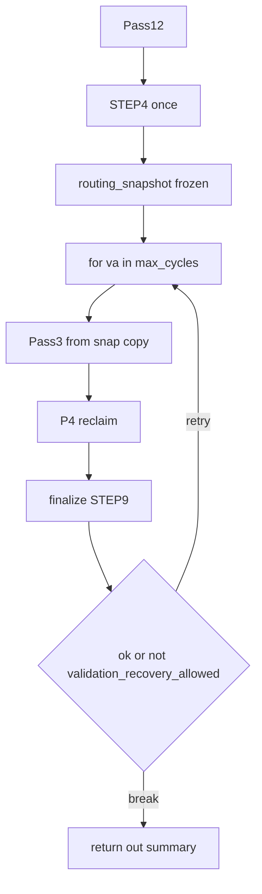

# 목표: 파이프라인·Recovery 제어 흐름과 §4.3 정렬

## 배경

- 정본: `documents/Algorithm/mining_solver_cursor_sessions/02_pipeline_control_flow.md` §4.1–§4.3, `11_step8_recovery.md` §13.2.
- 구현: `recovery_orchestrator.run_solver_timeline_pipeline`이 STEP4 이후 **고정 `routing_snapshot` 기준**으로 Pass3→P4→finalize를 반복하고, 실패 시 주로 `validation_recovery` 루프로 처리한다.

## Mini-audit 산출물 (구현 전)

- **1차 표·식별자 사전·A/B 초안:** [epic_a_control_flow_mini_audit.md](./epic_a_control_flow_mini_audit.md) (2026-05-12). Epic A 코드 착수 전에 표의 Expected 열을 정본 인용으로 맞출 것.

## 제어 구조(오케스트레이터 기준선)

`recovery_orchestrator.run_solver_timeline_pipeline`:

1. **한 번:** Pass12 → STEP4 → `routing_snapshot` 고정
2. **루프(`max_cycles`):** `routing_snapshot` 복사 → Pass3 → P4 → finalize(STEP9)
3. `out["ok"]` 이면 종료. 아니면 `validation_recovery_allowed(out)`이면 `pass3_recovery_context=True`로 **동일 루프** 재실행.
4. STEP4는 루프 안에서 **재호출되지 않음.**

## §4.3 Recovery trigger별 복귀 경로 — drift 표 (구현 매핑)

**판별 기준:** return path·rollback·`run_solver_timeline_pipeline` 루프만 본다(trace 필드명만으로 제어 의미 추론 금지). 정본 표 전문·Expected 요약은 [epic_a_control_flow_mini_audit.md](./epic_a_control_flow_mini_audit.md) §5.2–5.3.

| Trigger | Current code path | Algorithm return path | Drift | Change/Test |
|--------|-------------------|------------------------|-------|-------------|
| `step4_routing_failure` | STEP4 스테이지 내부(`step4_merge_routing` 등)·`placement_commit`의 `RECOVERY_TRIGGER_STEP4_ROUTING_FAILURE`. 오케스트레이터는 STEP4 **단일** 호출; 전용 외부 STEP4 재시도 루프 없음. | 표: STEP4 재시도·rollback·alternate trunk | **yes** | **B (MVP 예외):** 오케스트레이터 1:1 아님 → [epic_a_mvp_exceptions.md](./epic_a_mvp_exceptions.md)와 동기. |
| `step4_capacity_failure` | 별도 canonical `recovery_trigger` 문자열 없음. 용량·cascade는 STEP4 내부(`step4_p2c_corrective` 등) `cascade_corrective_attempts`로만 관측. `validation_recovery_allowed`는 용량을 게이트에 넣지 않음. | 표: STEP4 재시도·offending rollback | **yes** | **B:** 예외·매핑 문서화. **카운터:** `cascade_corrective_attempts`(STEP4)는 `validation_recovery_attempts_used` / `recovery_total_attempts_used`(recovery 체인)와 **별도 필드** — 혼동 시 코드 수정. |
| `pass3_connectivity_break` | `pass3.py`: bridge 실패 시 `pass3_reverted`, `map_final=map_after_routing` 후 **동일 사이클**에서 P4(reclaim 경로) 진행. | 표: §4.3.1 → STEP6 Reclaim; remedial STEP4는 별도 분기 | **부분** | **B:** “STEP6 = reclaim 루프” 해석이면 근접. canonical vs `pass3_connectivity_reject_sample` 구분은 mini-audit §2. |
| `post_reclaim_pass3_connectivity_break` | `solver_timeline._run_post_reclaim_pass3_once`: 검증 실패 시 **입력 맵 return**·`post_reclaim_pass3_pass3_reverted`. `p4_reclaim.run_p4_reclaim_stage`는 해당 호출을 **한 블록에서 1회**만 수행; 동일 rerun 블록 내 재탐색 루프 없음. | 표: rollback → STEP9; 추가 rerun 없음 | **no**(STEP7 블록) | 회귀: `p4_reclaim` 소스 단일 호출·gate `post_reclaim_pass3_reruns_used`. 이후 `validation_recovery`는 **STEP9 hard invariant**(`final_validation_failure`)일 때만 별 트리거. |
| `reclaim_incremental_failure` | `p4_reclaim` 루프 내 롤백 후 지속; `tag_reclaim_incremental_failure_from_summary`. | candidate rollback 후 STEP6 계속 | **no** | 기존 `recovery_policy`·P4 테스트 유지. |
| `final_validation_failure` | `validation_recovery_allowed`가 STEP9 hard invariant만 허용([`step9_reports_hard_invariant_failure_for_bounded_recovery`](../../django_apps/shapez_asteroid/services/asteroid_mining_layout/solver/recovery_policy.py)). 통과 시 Pass3→P4→finalize **추가 사이클**; STEP4 미재진입. | 표: recovery 후 STEP9 재검증; STEP4 자동 재실행 없음 | **no**(STEP4) / **부분**(표를 “STEP9만 재실행”으로 좁게 읽을 때) | **B:** MVP 예외 문서화. PR4-D: [`test_pr4d_algorithm_final_validation_boundary.py`](../../tests/unit/shapez_asteroid/test_pr4d_algorithm_final_validation_boundary.py), [`15_final_validation_assertion_only.md`](./15_final_validation_assertion_only.md). |

### Attempt / counter 분리 (Algorithm 불변식)

| 구분 | 필드·상수 | 역할 |
|------|-----------|------|
| 총 recovery 체인 길이 | `recovery_context_chain`, `recovery_total_attempts_used`, `MAX_TOTAL_RECOVERY_ATTEMPTS` | P4 진입 상한 등(기본 무제한 0). |
| validation recovery 루프 | `validation_recovery_cycles_used`, `MAX_VALIDATION_RECOVERY_ATTEMPTS`, `pass3_recovery_context` | 오케스트레이터 `for va in range(max_cycles)`. |
| STEP4 cascade 보정 | `cascade_corrective_attempts`(`step4_result.trunk_load` → `finalize` summary) | **별도**; `MAX_CASCADE_CORRECTIVE_ATTEMPTS` 상수는 본 저장소에 없음 — Algorithm이 별도 상한을 요구하면 `foundation/constants` 추가·검증은 후속. |

## 구현 결과 (2026-05-12, §4.3 회귀 정렬 PR)

- **문서:** 본 절 drift 표를 정본 대비 **현 상태**로 고정; A/B는 epic §5.3·[epic_a_mvp_exceptions.md](./epic_a_mvp_exceptions.md)와 정렬.
- **코드:** `validation_recovery_allowed`는 `ok`·unfinalized·`final_validation` hard invariant만 사용 — `recovery_post_reclaim_pass3_connectivity_break` 플래그만으로는 루프를 켜지 않음(STEP9 clean이면 종료).
- **테스트:** [`test_recovery_return_paths_algorithm.py`](../../tests/unit/shapez_asteroid/test_recovery_return_paths_algorithm.py) — post-reclaim 플래그·STEP9 clean, `p4_reclaim` 단일 `_run_post_reclaim_pass3_once` 호출, STEP4 단일 호출(기존 PR4-D와 병행).

## 현재 상태(요약)

- 트리거별 복귀가 정본 표와 **1:1이 아닌 행**은 위 표 **Drift=yes/부분** + **B**로 문서화한다.
- 오케스트레이터 독스트링은 “bounded Pass3→P4→finalize”로 요약되어 있다.

## 목표 상태

- 다음 중 하나를 **명시적으로 선택**하고 문서 또는 코드에 반영한다.
  - **A)** 구현을 정본 표에 맞춘다(복귀 지점·rollback 순서·재진입 조건).
  - **B)** 현 구현을 “MVP 단순화”로 정본에 **공식 예외**로 한 절 기술한다(표 옆 “구현 매핑” 열).

본 문서 §4.3 표는 **현재 채택: B + Info** (epic §5.3·5.4와 동일).

## 작업 항목(잔여·선택)

1. ~~트리거 목록마다 현 코드 경로 표~~ → 본 문서 §4.3 표로 반영.
2. 차이가 큰 항목: §4.3.1 세부는 **B** 유지 시 코드 변경 최소.
3. `recovery_contract_phases` / replay에 canonical trigger id를 남길지는 별 티켓.

## 검증

- 단위 테스트: `tests/unit/shapez_asteroid/test_recovery_return_paths_algorithm.py` 및 기존 recovery·PR4-D 구간.
- 품질: `ruff check .`, `mypy .`, `black --check .`.

## 위험

- 제어 흐름 변경은 Pass3·P4·finalize 상호 의존이 크므로 **회귀 테스트·NDJSON 계약**을 함께 갱신해야 한다.

## 참고 코드

- `django_apps/shapez_asteroid/services/asteroid_mining_layout/solver_pipeline/recovery_orchestrator.py`
- `solver_pipeline/pass3.py`, `p4_reclaim.py`, `finalize.py`
- `solver/solver_timeline.py` (`_run_post_reclaim_pass3_once`)
- `solver/recovery_policy.py`, `solver/recovery_context.py`
