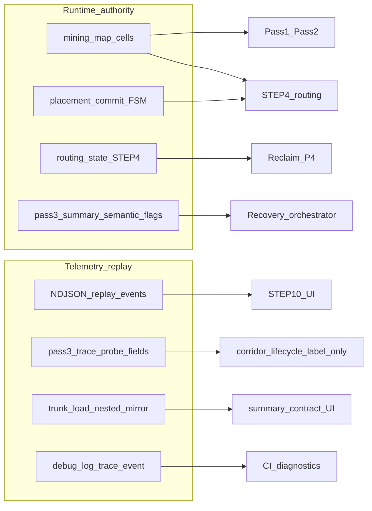

# 시맨틱 격리 검증 보고서 (런타임 권한 vs 텔레메트리·리플레이)

**상태**: `REPORT` (관측·감사 결과; [`documents/index/document_lifecycle.md`](../index/document_lifecycle.md) 참고)  
**작성일**: 2026-05-13  
**근거 정본**: [`documents/index/document_inventory.md`](../index/document_inventory.md) CANON 표 — 채굴 솔버 세션 02·03·08·11·12·13·14·15 및 [`documents/ai/step10_replay_timeline_contract_2026-05-12.md`](../ai/step10_replay_timeline_contract_2026-05-12.md). 운영 정본 요약은 [`AGENTS.md`](../../AGENTS.md), [`documents/ai/START_HERE.md`](../ai/START_HERE.md).

---

## 1. 검증된 권한 그래프 (verified authority graph)

아래는 **런타임 의사결정에 쓰이는 권한 소스**와 **출력·소비 전용 계측**의 분리를 요약한 그래프다.

### 역할 표 (정적 감사 기준)

| 구분 | 소스 | 런타임에서의 역할 |
|------|------|-------------------|
| 맵 | `mining_map` (cells) | Pass1/Pass2·STEP4·Pass3·reclaim이 읽고 갱신하는 **단일 작업 맵** |
| 라우팅 | `routing_state` (STEP4 산출·유지) | protected corridor **hard/soft 풀**의 정본; reclaim·soft replace가 이를 소비 |
| 배치 FSM | `placement_commit` / provisional 행 | STEP4와 상호작용하는 **배치 상태**; 리플레이가 아닌 파이프라인 내부 상태 |
| 요약 플래그 | `pass3_summary` 등 단계 요약 | 복구 트리거·정책 분기에 쓰이는 **시맨틱 플래그** (예: connectivity break) |
| NDJSON / `replay_events` | finalize 단계에서 append-only 조립 | STEP10·오프라인 도구용 **보내기**; 솔버 정책 입력 아님 ([`finalize.py`](../../django_apps/shapez_asteroid/services/asteroid_mining_layout/solver_pipeline/finalize.py) 781–782행 주석) |
| `pass3_trace` | Pass3 계측 dict | `protected_corridors_for_reclaim`에서는 `_`로 폐기; `protected_corridors_read_for_reclaim`에서 **probe_* 셀만** lifecycle 라벨용 ([`reclaim_corridor_contracts.py`](../../django_apps/shapez_asteroid/services/asteroid_mining_layout/reclaim/reclaim_corridor_contracts.py) 38–40행) |
| `trunk_load` | STEP4 merge 산출 | `step4_state_source` 등 **계약 메타**·UI/요약 미러; reclaim hard/soft와 분리 ([`reclaim_corridors.py`](../../django_apps/shapez_asteroid/services/asteroid_mining_layout/reclaim/reclaim_corridors.py) 주석) |
| `debug_log_event` / `trace_event` | 단계별 계측 | 도메인 분기보다 **관측·CI** 용도; recovery는 `Step4RoutingResult` 필드 등 구조화 결과에 의존 ([`recovery_orchestrator.py`](../../django_apps/shapez_asteroid/services/asteroid_mining_layout/solver_pipeline/recovery_orchestrator.py) 모듈 독스트링 5–7행) |

---

## 2. 남은 드리프트 위험 (remaining drift risks)

1. **`pass3_trace`를 hard/soft에 merge하는 신규 코드**  
   현재 `protected_corridors_for_reclaim`는 `pass3_trace`를 무시한다. 향후 PR에서 `probe_*` 외 키를 풀에 합치면 **단일 실패 지점**이 된다. 리뷰 시 `reclaim_corridors.py`·`protected_corridor_replace.py`의 `protected_corridors_read_for_reclaim` 호출부를 확인할 것.

2. **`protected_corridors_read_for_reclaim` vs `for_reclaim` 혼동**  
   soft corridor atomic replace 등은 **read** 경로로 probe 라벨을 받을 수 있으나, hard/soft 집합 자체는 `solver_routing_state`에서 온다. 문서·함수명만 보고 “trace가 정본”으로 오해하지 않도록 주석 유지가 필요하다.

3. **오프라인 스크립트와 코어 경계**  
   `solver_trace.py` 독스트링에 NDJSON 읽기가 언급된다 — **어댑터·디버그 소비자** 경로이며 파이프라인 런타임 입력이 아니다. 신규 기능을 `solver_pipeline`에 넣을 때 동일 분리를 유지할 것.

4. **`reclaim_shadow_*`에 `pass3_trace` 인자 전달**  
   시그니처 호환을 위해 전달되는 경우가 많다. 실제로 `_ = pass3_trace` 패턴인지, 아니면 새로 값을 읽는지 PR마다 grep으로 확인하는 것이 안전하다.

---

## 3. 향후 아키텍처 위험 (future architectural hazards)

- **“리플레이 드리븐 솔버”** (NDJSON을 읽어 동일 run을 재실행하거나 policy를 바꾸는 설계)를 도입하면, NDJSON 누락·순서·버전 불일치가 **곧바로 라우팅/복구 버그**로 이어진다. 현재 계약은 **동일 실행 내 append-only 기록**이며, 정본은 맵·`routing_state`·요약이다.

- **텔레메트리 필드를 트리거 조건에 재사용**  
   예: `pass3_trace`의 임의 키를 recovery 조건에 연결하면, 계측 포맷 변경이 게임플레이 의미를 바꾼다. 트리거는 [`step4_recovery_trigger.py`](../../django_apps/shapez_asteroid/services/asteroid_mining_layout/step4/step4_recovery_trigger.py)처럼 **결과 DTO 필드**에 한정하는 패턴을 유지하는 것이 낫다.

---

## 4. 나중에 제거 가능한 호환 레이어 (dead compatibility layers)

- **`pass3_trace` 시그니처 유지 + 본문에서 `_` 폐기**  
  호출부(replay/debug) 호환을 위해 인자를 남기고 런타임에서는 사용하지 않는 패턴. ABI가 안정되면 축소·통합을 검토할 수 있다.

- **`trunk_load_mirrors_result` 등 순수 계약 키**  
  UI/요약과의 정렬을 위한 메타; 라우팅 정본과 혼동하지 않도록 키 이름·주석으로 이미 구분되어 있다. 스키마 버전업 시 한 번에 정리 가능.

---

## 5. 신뢰도 평가 (confidence assessment)

| 등급 | 내용 |
|------|------|
| **High** | `django_apps/shapez_asteroid/.../asteroid_mining_layout` 내에서 NDJSON 파일 읽기·`replay_events`를 policy 입력으로 쓰는 패턴은 발견되지 않았다. `finalize.py`·`recovery_orchestrator.py`에 명시적 계약이 있다. |
| **Medium** | `pass3_trace`가 `protected_corridors_read_for_reclaim`·`try_atomic_replace_soft_corridor` 등에 전달되지만, hard/soft는 `solver_routing_state` 기반이며 probe는 lifecycle 라벨용이다. 향후 변경 시 회귀 위험은 **코드 리뷰 디스플린**에 의존한다. |
| **Low** (미검) | `scripts/debug`·웹 어댑터·레포 전역의 다른 진입점은 이번 grep 범위 밖이다. 전체 레포 “완전 무결” 주장은 하지 않는다. |

---

## 부록: 검증 실행 기록

| 항목 | 결과 |
|------|------|
| `python -m pytest tests/unit/shapez_asteroid/ -q` | **815 passed, 3 skipped** (약 41s, exit code 0) |
| `ruff check .` / `mypy .` / `black .` | **미실행** — 본 작업은 Markdown 보고서만 추가하였고 Python 소스 변경이 없다. CI 게이트는 별도 PR에서 수행한다. |
