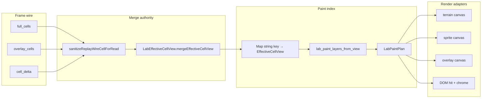

# Replay map sprite visibility — design spec

**Date:** 2026-06-12  
**Kanban:** `.devtool/features/replay-sprite-visibility-2026-06-12.md`  
**Epic relation:** Follows `replay-cell-semantics` (wire/merge); this epic owns **paint/render** authority.

---

## §1 — Problem & goal (APPROVED WITH AMENDMENTS)

### Problem

Replay map paint treats `full_cells`, `overlay_cells`, terrain canvas, sprite canvas, and DOM tone as **independent authorities**. At the same `(x,y)` terrain rgba, field SVG, candidate fill, and legacy `transport` interpretation stack — miner sprites appear **blurred**. The detail panel uses `EffectiveCellView` merge correctly; render uses a separate flat harvest path (`collectFrameSpatialTargets` / `stageCell` / `frameCellIndexMap`).

### Goal

1. **One cell model for paint** — Paint must consume one merged per-cell view equivalent to `EffectiveCellView`. Renderer must not independently reinterpret `full_cells`, `overlay_cells`, `transport`, or candidate semantics after merge.
2. **Candidate miner** — `candidate_miner` is an **occupant-intent** semantic, not a fill semantic. It may select miner/extension sprite variant; candidate visual state is **chrome-only** (ring/stroke).
3. **Wire canon** — Candidate overlay: `transport=none`, `output_transport_kind=space_belt|space_pipe`. `shape_belt` is **producer-invalid**. Read sanitizer normalizes legacy/invalid **persisted** frames for display compatibility only; producer-side emission must fail `test_shape_belt_ui_wire_ban`. Sanitizer must not hide new producer regressions.
4. **Anti-fade invariant** — If occupant sprite exists, no semi-transparent cell fill may be painted above or alongside it. Allowed: terrain below occupant; occupant sprite; chrome stroke/ring above. Forbidden: candidate fill, terrain rgba overlay, DOM bg tone over occupant.

### Non-goals

- Belt/pipe turn topology inference
- Solver placement changes
- Second replay controller
- Playwright visual snapshot (optional follow-up)

### Authority summary

```text
EffectiveCellView = semantic authority
LabPaintLayers     = visual slot contract
Canvas/DOM         = dumb adapters
Sanitizer          = legacy candidate compat only
```

---

## §2 — Architecture (APPROVED WITH AMENDMENTS)

### 2.1 Data flow

```text
wire rows → merge authority → LabPaintLayers → render adapters (no semantics)
```



**Hard rule:** `collectFrameSpatialTargets`, `stageCell`, `frameCellIndexMap`, and post-merge `labSpriteRelpathForCell(cell, frame)` **must not** decide occupant vs transport vs candidate. Harvest → sanitize → merge only; paint reads merged view only.

### 2.2 Merge location

| Layer | Module | Role |
|-------|--------|------|
| Python canon | `django_apps/asteroid_lab/replay/effective_cell_view.py` | `merge_effective_cell_view` — server detail POST, parity tests |
| JS mirror | `django_apps/web/static/web/js/lab_effective_cell_view.js` | `mergeEffectiveCellView` — detail + paint |
| JS paint | `django_apps/web/static/web/js/lab_replay_paint_plan.js` (new) | Index build + `lab_paint_layers_from_view` |
| Python parity | `tests/support/lab_replay_paint_plan.py` (new) | Mirror paint layers for golden tests |

### 2.3 Effective view index key

Effective view index key **MUST** be a stable string key. Do not use Coord object identity as JS `Map` key.

```javascript
function cellKey(x, y, layer) {
  if (layer != null && layer !== 0) {
    return String(layer) + ":" + String(x) + "," + String(y);
  }
  return String(x) + "," + String(y);
}
```

Index universe = **visible frame cell universe**:

- current `full_cells` / `overlay_cells` / `cell_delta` coordinate union
- plus **carried merged layout snapshot** when frame is sparse/delta (see §2.6 layout carry)
- bounded by island bbox when available

Do not rely on current wire rows only when layout carry is active.

Index: `Map<string, EffectiveCellView>` keyed by `cellKey(x, y, layer)`.

### 2.4 `LabPaintLayers` contract

```typescript
type LabChromeLayer = {
  kind: "candidate_ring" | "route_probe" | "route_path" | "diff" | "bundle_edge";
  strokeOnly: true;
  // kind-specific attrs as needed (diff role, route tone, etc.)
};

type LabPaintLayers = {
  terrain: null | {
    mode: "field_sprite" | "background_fill" | "void_fill";
    rel?: string;   // field_sprite
    fill?: string;  // background_fill | void_fill
  };
  occupant: null | { rel: string; rotation: number };   // miner / extension / equipment
  transport: null | { rel: string; rotation: number }; // belt / pipe tile
  chrome: readonly LabChromeLayer[];
};
```

**Resolver:** `lab_paint_layers_from_view(view) → LabPaintLayers`

| Condition | Slot |
|-----------|------|
| `view.occupant.kind === candidate_miner` + `output space_belt` | occupant: `Miner/Layout_ShapeMiner.svg`; chrome: `candidate_ring` |
| `view.occupant.kind === candidate_miner` + `output space_pipe` | occupant: `Miner/Layout_FluidMiner.svg`; chrome: `candidate_ring` |
| committed miner / extension | occupant: existing cell_kind → identifier map |
| `view.transport.kind` + `transport_tile_id` | transport: `SpaceBelt/*` or `SpacePipe/*` |
| `view.terrain.kind` | terrain slot |
|---------------------|--------------|
| `asteroid_shape_field` / `asteroid_fluid_field` | **Preferred:** `field_sprite` with static rel |
| same | `background_fill` only as non-sprite terrain fallback when **no** occupant/transport sprite |
| `internal_void` / external void kinds | `void_fill` — **not** for asteroid field terrain |

**Slot invariant:**

```text
Equipment occupant and transport sprite must not both claim the same visual slot
unless EffectiveCellView explicitly allows it (default: mutually exclusive per cell).
```

**Anti-fade:** If `occupant.rel` or `transport.rel` is set, forbid `terrain.mode === background_fill` on that cell; chrome entries must have `strokeOnly: true`; no DOM bg fill classes.

Remove `candidate_miner` from `NON_SPRITE_OVERLAY_CELL_KINDS` paint exclusion; candidate uses occupant + ring chrome.

### 2.5 Wire sanitizer boundary

| Concern | Location | Behavior |
|---------|----------|----------|
| Producer (strict) | `overlay_wire_contract.py` | `build_output_hint_overlay_cell`; `assert_candidate_overlay_wire_contract` on emit |
| Producer gate | `test_shape_belt_ui_wire_ban.py` | Unchanged — CI fails on new `shape_belt` emission |
| Read sanitizer | `replay_wire_read_sanitize.py` + JS `sanitizeReplayWireCellForRead` | **Candidate/output-hint overlays only.** If banned token in `transport` → normalize to `output_transport_kind`, set `transport=none`. |
| Committed cells | Audit, not sanitizer | Committed transport/equipment with banned/unknown transport → **audit failure**, not silent normalize |

```text
Sanitizer must not normalize committed transport cells.
Only candidate/output-hint overlays are eligible.
```

Runs once at merge input.

**Persisted audit:** `test_persisted_replay_frames_wire_audit.py` scans fixtures + golden assembler output.

### 2.6 Canvas / DOM split

| Surface | Draws | Must not |
|---------|-------|----------|
| terrain canvas | `background_fill`, `void_fill` for cells without occupant/transport sprite | Field rgba when occupant/transport sprite present |
| sprite canvas | `occupant`, `transport`, `field_sprite` | Candidate fill; rgba overlay |
| overlay canvas | route/diff chrome strokes | Semi-transparent full-cell fill over sprite |
| DOM grid | hit targets, HUD, bundle edges, chrome stroke classes | sprite + bg tone when plan assigns occupant/transport sprite |

**Replace:** `buildCanvasPaintPlan(frame)` → `buildLabPaintPlanFromEffectiveViews(viewIndex)`.

**Layout carry:** Reevaluate `lastFrameWithSpriteCapableCells` — carry merged layout snapshot, not raw wire harvest.

### 2.7 Quarantine (Slice 5)

Old harvest paint logic **quarantined** behind deprecated wrapper; delete only after parity + anti-fade + frame-38 fixture pass.

```javascript
// Deprecated: harvest only. Must not decide paint semantics.
function collectFrameSpatialTargets(frame) { ... }
```

---

## §3 — Testing & rollout

### 3.1 Test matrix

| Test | Tier | Asserts |
|------|------|---------|
| `test_stable_view_index_key` | unit | Same `x,y` lookup → same merged view regardless of object identity; string key stable |
| `test_sanitizer_compat_legacy_transport` | unit | Candidate + `transport: shape_belt` → merge equals canonical `output_transport_kind` wire |
| `test_sanitizer_does_not_normalize_committed_transport` | unit | Committed belt/pipe with invalid `shape_belt` → audit failure; not silently output-hint |
| `test_transport_sprite_does_not_override_candidate_miner` | unit | `candidate_miner` + `output_transport_kind=space_belt` → miner occupant + ring; **not** belt sprite |
| `test_paint_plan_matches_effective_cell_view` | unit/golden | Golden transport-complete frame: merge → layers → rels match detail semantics |
| `test_candidate_miner_frame_38_fixture` | unit | `(10,7)`: miner sprite + candidate ring; no rgba stack |
| `test_anti_fade_invariant` | unit | If `occupant.rel` or `transport.rel` → no overlay fill token for idx |
| `test_shape_belt_ui_wire_ban` | regression | Existing producer gate unchanged |
| `test_persisted_replay_frames_wire_audit` | audit | Fixtures/assembler output: no banned candidate occupancy transport |
| `test_js_sanitize_replay_wire_cell_for_read_exists` | contract | JS module exports `sanitizeReplayWireCellForRead` |
| `test_js_sanitizer_matches_python_candidate_compat_cases` | contract/parity | Same legacy candidate rows → same normalized wire (Py vs JS string snapshot) |

**Parity rule:** For every occupied cell in golden frames, Python `lab_replay_paint_plan` and JS plan (where testable) must agree on `occupant.rel`, `transport.rel`, and chrome kinds.

### 3.2 Validation commands (per slice)

```bash
# Slice 1 — Python sanitizer, audit, index key
python -m pytest \
  tests/unit/asteroid_lab/replay/test_replay_wire_read_sanitize.py \
  tests/unit/asteroid_lab/replay/test_replay_wire_audit.py \
  tests/unit/asteroid_lab/test_shape_belt_ui_wire_ban.py \
  tests/unit/asteroid_lab/replay/test_effective_cell_view.py \
  tests/unit/asteroid_lab/test_lab_canvas_renderer.py \
  -q

# Slice 1 — JS sanitizer contract (static source scan + parity cases)
python -m pytest tests/unit/asteroid_lab/test_lab_canvas_renderer.py -q -k "sanitize or wire_sanitize"
powershell -File scripts/test_fast.ps1  # if static/JS bundle covered here

# Slice 2+
python -m pytest tests/unit/asteroid_lab/test_lab_replay_sprite_paint_golden.py -q

# After JS paint swap (Slice 3–4)
powershell -File scripts/test_fast.ps1
```

### 3.3 Rollout slices

| Slice | Scope | Stop condition |
|-------|-------|----------------|
| **1** | Read sanitizer (Py+JS) + persisted audit + 3 sanitizer/index tests | Tests green; no UI change |
| **2** | `lab_paint_layers_from_view` + Python mirror + parity golden | Detail vs paint plan match |
| **3** | Canvas plan swap (`buildLabPaintPlanFromEffectiveViews`) | Anti-fade + frame-38 fixture pass |
| **4** | DOM chrome-only; remove candidate NON_SPRITE paint path | No full fill on sprite cells |
| **5** | Quarantine deprecated harvest; delete after full matrix green | No semantic calls in harvest |

Each slice: independently reviewable PR-sized diff; Lab manually smoke on golden solver replay.

### 3.4 Rollback

Slice 3–4 feature flag on `#lab-root`:

- `data-lab-paint-v2="1"` → **enables v2 paint** (EffectiveCellView-driven plan)
- Flag **absent** or `data-lab-paint-v2="0"` → fallback to quarantined legacy harvest plan
- Remove fallback path after Slice 5

Alternative (if clearer in templates): `data-lab-paint-legacy="1"` forces legacy fallback only.

### 3.5 Deferred

- Playwright PNG regression for blur detection
- Server-side paint plan API (client-only sufficient for v1)
- Obsidian/wiki doc update (optional after ship)

---

## Acceptance (epic)

- [ ] §1–§3 contracts implemented across slices 1–5
- [ ] `(10,7)` frame-38 fixture: sharp miner sprite + ring, no fade stack
- [ ] `shape_belt` absent from new producer wire; sanitizer compat only
- [ ] Parity: detail effective cell ↔ paint plan for golden frames
- [ ] Deprecated harvest quarantined then removed

---

## References

- `documents/architecture/replay-cell-semantics/spec.md`
- `django_apps/asteroid_lab/replay/overlay_wire_contract.py`
- `django_apps/asteroid_lab/replay/effective_cell_view.py`
- `django_apps/web/static/web/js/lab_effective_cell_view.js`
- `tests/unit/asteroid_lab/test_shape_belt_ui_wire_ban.py`
