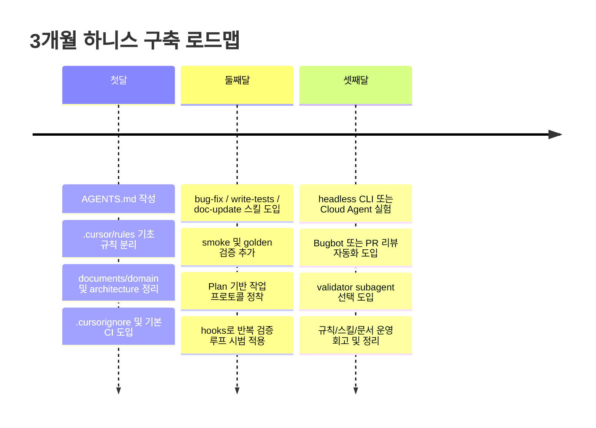
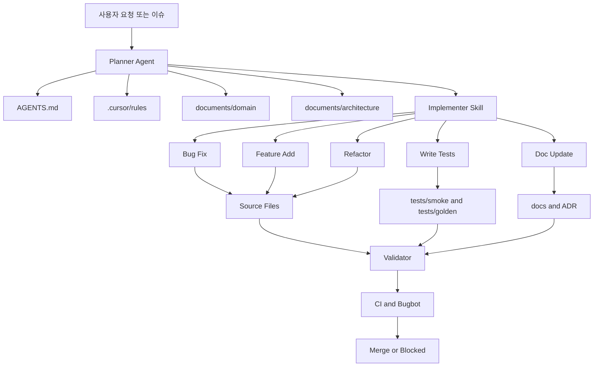

# Cursor AI 기준 새 프로젝트 하니스와 에이전트 운영 설계 보고서

Role: AI Systems Architect

## 핵심 요약

이 보고서의 결론은 간단합니다. 새 프로젝트에서 가장 먼저 설계해야 할 것은 “좋은 모델”이 아니라 **좋은 하니스**입니다. 제공된 Maker-Evan 관련 영상 단서와 업로드된 transcript의 공통 축은 하니스를 `지속 규칙`, `도메인 매뉴얼`, `재사용 가능한 스킬`, `자동 검증`, `작업 계획`의 묶음으로 보는 관점이며, Cursor 공식 문서 역시 이를 거의 같은 구조로 지원합니다. Cursor는 **Rules, AGENTS.md, Skills, Plan Mode, MCP, CLI/Cloud Agent, Hooks, Bugbot**을 통해 이 구조를 구현할 수 있고, Anthropic·OpenAI의 1차 자료도 공통적으로 **단순한 단일 에이전트 중심 설계로 시작하고, 도구/컨텍스트/검증을 분리하며, 필요한 경우에만 다중 에이전트와 긴 러닝 루프를 추가하라**고 권합니다. 따라서 Shapez2/Asteroid Solver 류의 코드베이스에는 `AGENTS.md + .cursor/rules + .cursor/skills + documents/domain + tests/golden + CI`를 중심으로 한 **문서 기반-계획 기반-검증 우선** 운영체계를 먼저 깔고, 이후에 Hooks·Cloud Agent·Headless CLI·Bugbot을 점진적으로 붙이는 구성이 가장 재현성과 유지보수성이 높습니다. citeturn1search0turn2search7turn42search1turn9view0turn9view1turn18view0turn25view0turn35view1

**근거와 신뢰도 평가**

| 근거 축 | 핵심 내용 | 신뢰도 평가 |
|---|---|---|
| 제공된 YouTube 및 Maker-Evan 채널 단서 | Maker-Evan 검색 결과에서 하니스, 스킬, 도메인 매뉴얼, 반복 프롬프트 절감, 장기 시행착오가 반복적으로 핵심 주제로 나타납니다. 다만 이번 세션에서 4개 링크의 전체 원문은 모두 확보되지 않았고, YouTube 본문 fetch 일부는 throttling 되었습니다. citeturn1search0turn2search2turn2search7turn2search17turn43search1 | **중간**. 주제 방향성은 신뢰할 수 있으나, 일부 영상은 제목/스니펫 기반입니다. |
| Cursor 공식 문서 | Rules, AGENTS.md, Skills, Subagents, Plan Mode, MCP, CLI, Cloud Agent, Hooks, Security, Bugbot 등은 모두 공식 문서에 존재하며 파일 위치와 동작 방식이 비교적 명확합니다. citeturn9view0turn9view1turn9view2turn10view1turn12view1turn12view4turn16view5turn19search3 | **높음**. 이 보고서의 실무 구조 설계의 주 근거입니다. |
| Anthropic 1차 자료 | “단순하게 시작”, “도구는 최소·명확”, “컨텍스트는 점진 로딩”, “컴팩션/메모리/서브에이전트”, “하니스는 자동 검증과 평가를 포함”이라는 설계 원칙이 체계적으로 제시됩니다. citeturn25view0turn29search0turn31view0turn34view0turn25view2 | **높음**. 하니스/스킬/컨텍스트/평가 설계 원칙의 1차 출처입니다. |
| OpenAI 1차 자료 | 에이전트의 핵심 구성요소를 모델·도구·지침으로 설명하고, 단일 에이전트 최대화와 계층형 guardrail을 권합니다. citeturn35view1 | **높음**. 구조화된 에이전트 설계/guardrail 원칙의 보강 근거입니다. |
| GitHub 공식 문서 | Actions, matrix, required status checks, protected branch는 CI 운영의 기준선으로 충분합니다. citeturn33search0turn33search2turn33search3turn33search10 | **높음**. 자동 검증 파이프라인의 저장소 정책 설계 근거입니다. |

**실행 항목**

- 루트에 `AGENTS.md`를 두고, `.cursor/rules/`와 `.cursor/skills/`를 곧바로 분리하십시오.
- 모든 구현 작업을 “계획 → 구현 → 검증 → 문서 갱신” 루프로 강제하십시오.
- 다중 에이전트는 초기에 넣지 말고, **검증 에이전트** 하나만 선택적으로 추가하십시오.

## 권장 저장소 구조

아래 구조는 **언어/플랫폼: 미지정** 상태를 전제로 한 Cursor 우선 설계입니다. 추측입니다만, Shapez2/Asteroid Solver 류 프로젝트는 상태 전이·시뮬레이션·알고리즘 회귀가 중요할 가능성이 높으므로, `documents/domain`, `tests/golden`, `harness/validators`의 비중을 높게 잡는 편이 일반적으로 유리합니다. 정확하지 않을 수 있습니다.

| 파일/디렉터리 | 목적 | 예시 항목 |
|---|---|---|
| `AGENTS.md` | 저장소 전역의 읽기 쉬운 “운영 계약서”. Cursor는 루트와 하위 디렉터리의 `AGENTS.md`를 읽고, 하위 파일이 더 구체적인 우선순위를 가집니다. citeturn9view0 | 목표, 변경 금지 구역, 표준 워크플로우, 검증 명령, 실패 시 행동 |
| `.cursor/rules/` | 경로 범위·설명·alwaysApply 여부까지 제어하는 프로젝트 규칙. `.md`와 `.mdc`를 지원합니다. citeturn9view0 | `always-validate.mdc`, `tests.mdc`, `docs.mdc`, `sim-core.mdc` |
| `.cursor/skills/` | Cursor가 자동 발견하는 프로젝트 수준 스킬 디렉터리. `SKILL.md`, `scripts/`, `references/`, `assets/`로 구성할 수 있습니다. citeturn9view1 | `bug-fix/`, `refactor/`, `feature-add/`, `write-tests/`, `doc-update/` |
| `.cursor/plans/` | Plan Mode로 저장한 구현 계획 저장소. 계획을 문서 자산으로 축적할 수 있습니다. citeturn18view0turn18view1 | `solver-cache-optimization.md`, `shape-routing-refactor.md` |
| `.cursor/hooks.json` | 중단 시점·완료 시점 등에 자동 후속 행동을 붙이는 현관문. Cursor 공식 블로그는 `stop` hook으로 “테스트가 모두 통과할 때까지 반복”하는 패턴을 예시로 듭니다. citeturn47view0turn47view1 | stop hook, docs sync hook, regression reminder hook |
| `.cursor/hooks/` | hook 스크립트를 모아두는 추천 디렉터리. 공식 예시는 `.cursor/hooks/grind.ts`를 사용합니다. citeturn47view0turn47view1 | `grind.ts`, `sync-docs.ts`, `emit-summary.py` |
| `.cursor/mcp.json` | 프로젝트 범위 MCP 설정. Cursor는 프로젝트와 글로벌 둘 다 지원하고, 환경변수 interpolation도 지원합니다. citeturn12view4 | Playwright, GitHub, issue tracker, documents/search, logs |
| `.cursor/BUGBOT.md` | PR 검토용 Bugbot의 프로젝트 문맥 파일. 루트 파일은 항상 포함되고, 하위 경로도 계층적으로 적용됩니다. citeturn7search1turn19search3 | 보안 금칙, 리뷰 기준, blocking bug 조건 |
| `.cursorignore` | Agent, semantic search, inline edit, @ mention에 들어가면 안 되는 파일을 제외하는 제어 파일입니다. 단, terminal/MCP tool 호출까지 완전 차단하는 보안 경계는 아닙니다. citeturn40search0turn16view5 | `.env*`, 빌드 산출물, 대형 바이너리, 민감 로그 |
| `documents/domain/` | 도메인 매뉴얼. Maker-Evan류 하니스 관점에서 가장 중요하게 다뤄지는 “사람의 프로젝트 해석법”을 문서화하는 곳입니다. 공식적으로도 Rules/Skills는 내부 문서처럼 짧고 명확하게 유지하는 것이 권장됩니다. citeturn1search0turn18view0turn9view0 | `game-rules.md`, `solver-invariants.md`, `board-state.md` |
| `documents/architecture/` | 시스템 구조·모듈 책임·데이터 흐름의 canonical reference | `module-map.md`, `events.md`, `storage.md` |
| `documents/runbooks/` | 반복 개발 절차를 문서화한 실행 가이드 | `bugfix-runbook.md`, `release-check.md`, `perf-investigation.md` |
| `documents/adr/` | 아키텍처 결정 기록 | `ADR-solver-cache.md`, `ADR-path-encoding.md` |
| `harness/validators/` | 검증 스크립트·golden comparator·smoke runner | `compare_golden.py`, `smoke.sh`, `perf_budget.js` |
| `harness/prompts/` | 반복 작업 프롬프트 템플릿 보관 | `feature-task.md`, `bug-task.md`, `review-task.md` |
| `tests/golden/` | 결정적 회귀 검증 데이터셋 | 입력 보드, expected route, expected score, snapshot |
| `.github/workflows/` | CI 파이프라인. GitHub Actions는 PR 빌드/테스트, matrix, required status checks를 공식 지원합니다. citeturn33search0turn33search2turn33search10 | `ci.yml`, `nightly.yml`, `agent-review.yml` |

**실행 항목**

- `AGENTS.md`, `.cursor/rules/`, `.cursor/skills/`, `documents/domain/`, `tests/golden/`를 첫 커밋에 포함시키십시오.
- `.cursorignore`에 비밀값·대형 파일·생성 산출물을 먼저 넣으십시오.
- `.cursor/plans/`를 단순 캐시가 아니라 “작업 명세 저장소”로 취급하십시오.

## AGENTS.md와 규칙

**설계 원칙**

Cursor는 `Project Rules`, `User Rules`, `Team Rules`, 그리고 `AGENTS.md`를 모두 규칙 계층으로 취급합니다. Project Rules는 `.cursor/rules`에 저장되며, `alwaysApply`, `description`, `globs`로 자동 적용 방식을 제어할 수 있습니다. `AGENTS.md`는 이보다 단순한 markdown 계약서로서 루트와 하위 디렉터리에 둘 수 있고, 더 구체적인 디렉터리의 파일이 우선합니다. 공식 precedence는 Team → Project → User Rules이고, `AGENTS.md`는 Project Rules의 단순 대안으로 쓰는 것이 가장 자연스럽습니다. citeturn9view0

**권장 운영 해석**

이 프로젝트에서는 `AGENTS.md`를 **사람과 AI가 함께 보는 최상위 운영 계약서**로, `.cursor/rules/`는 **경로별 기계 친화 규칙**으로 나누는 구성이 가장 좋습니다. 이 분리는 Cursor 공식의 파일 성격과도 맞고, Maker-Evan류의 “하니스는 반복되는 설명을 구조화해 재사용하는 것”이라는 메시지와도 잘 맞습니다. citeturn9view0turn1search0turn2search2

**AGENTS.md 샘플 템플릿**

```md
# AGENTS.md

## Mission
이 저장소의 목표는 <PROJECT_GOAL> 이다.
당신은 항상 "작은 안전한 변경 + 빠른 검증 + 문서 동기화" 원칙으로 행동한다.

## Trigger
다음 중 하나가 보이면 이 문서를 최우선 운영 계약으로 사용한다.
- 새 기능 요청
- 버그 리포트
- 테스트 실패
- 리팩터 요청
- 성능/안정성 개선 요청

## Repository map
- 도메인 매뉴얼: @documents/domain/
- 아키텍처 문서: @documents/architecture/
- 실행 가이드: @documents/runbooks/
- 규칙: @.cursor/rules/
- 스킬: @.cursor/skills/
- 검증기: @harness/validators/
- 회귀 기준: @tests/golden/

## Required workflow
1. 먼저 관련 문서와 코드를 읽고 문제를 재정의한다.
2. Plan Mode 스타일로 변경 대상 파일, 리스크, 검증 방법을 정리한다.
3. 구현은 가장 작은 단위로 수행한다.
4. 변경 후 반드시 로컬 검증을 실행한다.
5. 동작/설계가 바뀌면 docs 와 plan 을 갱신한다.
6. 최종 응답에는 변경 파일, 실행 명령, 검증 결과, 남은 리스크를 적는다.

## Permissions
- 기본 권한: 읽기, 검색, 계획 수립
- 허용된 쓰기: workspace 내부의 소스/테스트/문서
- 사용자 승인 필요:
  - 환경설정 파일
  - CI/배포 설정
  - 보안/권한 관련 파일
  - 대규모 rename / delete
- 금지:
  - secrets 읽기 시도
  - .env, credential, token 파일 노출
  - 생성 산출물 직접 수정
  - 검증 없이 완료 선언

## Tools
- 코드 탐색/검색: 적극 사용
- 터미널: 검증과 재현에만 사용, destructive command 금지
- 브라우저: UI/시각 검증 필요 시 사용
- MCP: 프로젝트에 설정된 것만 사용
- 스킬: 관련 스킬이 있으면 우선 호출/참조

## Input contract
입력은 다음 중 하나여야 한다.
- 이슈/티켓 설명
- 실패 로그
- 원하는 동작의 예
- 기준 파일/스펙 문서
정보가 부족하면 구현 전에 부족한 입력을 명시한다.

## Output contract
항상 아래 형식으로 마무리한다.
- Summary:
- Files changed:
- Commands run:
- Validation:
- Risks / follow-up:
- Docs updated:

## Failure handling
아래 상황이면 억지로 진행하지 말고 중단한다.
- 도메인 규칙이 서로 충돌
- 검증 명령을 찾지 못함
- 회귀 가능성이 큰데 기준 테스트가 없음
- 사용자 승인 없는 고위험 변경 필요

중단 형식:
BLOCKED:
- missing context:
- risky change:
- recommended next step:

## Security and privacy
- .cursorignore 대상은 읽지 않는다.
- 민감값은 절대 요약/출력하지 않는다.
- 외부 전송이 필요한 도구는 최소 권한만 사용한다.
- terminal / MCP auto-run 은 명시된 allowlist 밖에서 가정하지 않는다.

## Definition of done
- 요청 범위를 벗어나지 않았다.
- 테스트/빌드/검증 결과가 제시되었다.
- 실패한 검증이 남아 있으면 명시되었다.
- 문서와 코드가 서로 모순되지 않는다.
```

이 템플릿은 Cursor 공식의 `AGENTS.md` 개념과, OpenAI/Anthropic가 공통적으로 강조하는 **지침·도구·검증·guardrail 분리** 원칙에 맞춰 구성했습니다. citeturn9view0turn35view1turn25view0

**하니스 규칙과 AI 사용 규칙**

**하니스 규칙**

| 우선순위 | 규칙 | 설명 |
|---|---|---|
| P0 | 계획 없는 편집 금지 | Cursor Plan Mode는 코드베이스를 조사하고, 질문하고, 파일 경로가 포함된 검토 가능한 계획을 만든 뒤 승인 대기를 하는 흐름을 공식 지원합니다. 이 프로젝트는 모든 중간 이상 난도 작업을 이 흐름으로 시작해야 합니다. citeturn18view0turn18view1turn12view1 |
| P0 | 검증 없는 완료 금지 | Cursor 공식 권장 워크플로우는 “테스트 작성 → 실패 확인 → 구현 → 테스트 통과까지 반복”이며, hooks로 이 반복을 자동화할 수도 있습니다. citeturn47view1 |
| P0 | 도메인 문서 우선 | Rules는 짧고 핵심만 담고, canonical example과 파일 참조를 활용하라고 Cursor가 권장합니다. 즉, 도메인 지식의 본문은 `documents/domain/`에 두고 Rules/Skills는 이를 가리켜야 합니다. citeturn9view0turn18view0 |
| P0 | 민감정보 비노출 | Cursor 보안 문서는 `.cursorignore` 사용, terminal/MCP 승인 유지, “Run Everything” 비권장을 명시합니다. citeturn16view5turn40search0 |
| P1 | 경로 스코프 규칙화 | Project Rules와 Skills 모두 파일 패턴 기반 스코프를 지원하므로, 테스트/문서/핵심 엔진 규칙을 분리해 컨텍스트 오염을 줄여야 합니다. citeturn9view0turn9view1 |
| P1 | 고위험 작업은 worktree 격리 | Cursor CLI는 `--worktree`를 지원하므로 대규모 리팩터·도구 업그레이드·CI 변경은 격리된 작업트리에서 수행하는 것이 안전합니다. citeturn12view1 |
| P1 | PR 리뷰 규칙 문서화 | Bugbot은 PR에서 버그·보안·코드 품질 문제를 검토하고, `.cursor/BUGBOT.md`로 프로젝트 규칙을 읽습니다. citeturn19search3turn7search1 |
| P2 | 긴 작업은 clouds/automations로 오프로드 | Cursor Cloud Agents는 지속 실행을 지원하고, automations는 스케줄/이벤트 트리거를 지원합니다. citeturn6search3turn19search1turn18view2 |

**AI 사용 규칙**

| 우선순위 | 규칙 | 설명 |
|---|---|---|
| P0 | 단일 에이전트 우선, 멀티 에이전트는 선택적 | OpenAI는 단일 에이전트 능력을 먼저 최대화하라고 권하고, Anthropic도 단순한 composable pattern에서 시작하라고 권합니다. citeturn35view1turn25view0 |
| P0 | 툴은 적고 구분 가능하게 | Anthropic는 중복 기능의 bloated tool set이 대표 실패 원인이라고 지적합니다. Cursor MCP 역시 필요한 도구만 프로젝트 단위로 붙이는 방식이 적합합니다. citeturn29search0turn12view4 |
| P0 | 모르면 꾸며내지 않고 BLOCKED로 멈춤 | 에이전트 시스템은 장기 실행 중 오류가 누적되기 쉬우므로, 실패를 숨기지 않고 명시하는 것이 평가·재시도 비용을 줄입니다. citeturn25view2turn34view0 |
| P1 | 컨텍스트는 “많이”보다 “제때” | Cursor Agent는 검색·semantic search·web·MCP를 사용해 온디맨드로 컨텍스트를 찾고, Anthropic도 just-in-time retrieval과 hybrid context를 권합니다. citeturn10view1turn29search0 |
| P1 | 대화가 길어지면 새 스레드로 재시작 | Cursor는 긴 대화가 노이즈를 쌓아 agent focus를 떨어뜨릴 수 있다고 권고합니다. citeturn18view0 |
| P1 | 과거 맥락은 복붙보다 참조 | Cursor는 `@Past Chats` 등 선택적 참조가 전체 대화 복사보다 효율적이라고 안내합니다. citeturn18view0 |
| P2 | 자동 승인보다 allowlist | Cursor는 민감 작업에 수동 승인을 기본으로 두고, auto-run은 allowlist 기반 best-effort라고 설명합니다. citeturn16view5turn37search1 |

**실행 항목**

- 루트 `AGENTS.md`에 **Required workflow**, **Permissions**, **Failure handling**을 꼭 넣으십시오.
- `.cursor/rules/`는 “항상 적용” 규칙을 최소화하고, 경로별 규칙으로 쪼개십시오.
- `BLOCKED:` 출력 형식을 팀 표준으로 합의하십시오.

## 스킬 라이브러리와 작업 워크플로우

**설계 원칙**

Cursor Skills는 프로젝트/글로벌 디렉터리에서 자동 발견되며, `name`, `description`, `paths`, `disable-model-invocation`, `metadata`를 가진 `SKILL.md`와 선택적 `scripts/`, `references/`, `assets/`로 구성할 수 있습니다. Cursor는 관련성이 있을 때 자동으로 스킬을 끌어오고, `/skill-name`으로 수동 호출도 가능합니다. Anthropic는 이 구조를 “신입에게 주는 onboarding guide”에 비유하며, **progressive disclosure**—즉, 앞단에는 짧은 메타데이터만, 실제 세부 내용은 필요 시 로딩—를 핵심 원리로 설명합니다. citeturn9view1turn31view0turn32view0

**권장 워크플로우**

이 저장소의 기본 워크플로우는 **Planner → Implementer → Validator → Docs Updater**의 단일 루프입니다. 다중 에이전트는 기본값이 아닙니다. Anthropic 연구에 따르면 멀티 에이전트는 병렬 탐색이 많은 리서치에는 강하지만, 코딩 작업은 아직 실시간 조정 비용이 높을 수 있습니다. 따라서 이 프로젝트에는 먼저 **검증 스킬/검증 훅**을 붙이고, 필요 시에만 검증 전용 subagent를 추가하는 편이 안전합니다. citeturn34view0turn25view0turn35view1

**스킬 템플릿**

```md
---
name: <skill-name>
description: <이 스킬이 언제 유용한지, 어떤 문제를 푸는지 한 문장으로 설명>
paths:
  - "<glob-1>"
  - "<glob-2>"
disable-model-invocation: false
metadata:
  owner: "project"
  risk: "low|medium|high"
  requires_validation: true
---

# <Skill Title>

## Intent
이 스킬의 목표와 성공 조건을 적는다.

## Inputs
- issue / prompt
- acceptance test failure or log
- spec or expected behavior
- changed files (optional)

## Procedure
1. 관련 문서와 예시 파일을 읽는다.
2. 최소 수정 범위를 계획한다.
3. 필요하면 `scripts/` 안의 검증기를 실행한다.
4. 변경 후 검증을 다시 실행한다.
5. docs 변경 필요 여부를 검사한다.

## Output
- summary
- files changed
- commands run
- validation result
- risks / follow-up

## Failure handling
- 재현 불가면 BLOCKED
- 검증 명령 미발견 시 documents/runbooks 참조
- 리스크가 높으면 사용자 승인 전 구현 중단

## References
- @documents/domain/<file>.md
- @documents/runbooks/<file>.md
- @harness/validators/<file>
```

**예시 스킬 다섯 개**

**버그 수정 스킬**

```md
---
name: bug-fix
description: 실패 로그나 재현 절차가 주어졌을 때 최소 수정으로 원인을 제거하고 회귀 테스트를 추가한다.
paths: ["src/**", "tests/**", "documents/**"]
---

# Bug Fix

## Procedure
1. 로그/재현 절차를 읽고 root cause 가설을 1~2개로 줄인다.
2. 관련 소스와 테스트를 찾는다.
3. 수정 전 실패 테스트가 없으면 최소 재현 테스트를 만든다.
4. 수정은 smallest diff 원칙으로 수행한다.
5. 동일 종류 회귀를 막는 테스트 한 개 이상을 추가한다.
6. 변경한 원인과 검증 결과를 요약한다.
```

**리팩터 스킬**

```md
---
name: refactor
description: 동작 보존을 전제로 구조를 개선할 때 사용한다.
paths: ["src/**", "tests/**"]
---

# Refactor

## Procedure
1. public behavior 와 invariants 를 문서/테스트로 확인한다.
2. 큰 리팩터는 worktree 또는 단계별 plan 으로 쪼갠다.
3. 동작 보존 테스트가 약하면 characterization test 를 먼저 추가한다.
4. rename / move / extract 를 작은 단계로 진행한다.
5. 성능/동작 차이를 검증한다.
```

**기능 추가 스킬**

```md
---
name: feature-add
description: 새로운 기능을 추가할 때 사용한다. 계획서와 검증 기준 없는 구현을 금지한다.
paths: ["src/**", "tests/**", "documents/**"]
---

# Feature Add

## Procedure
1. 요구사항을 acceptance criteria 로 다시 쓴다.
2. 영향 파일, 리스크, 롤백 방안을 plan 에 적는다.
3. 큰 기능은 feature flag 또는 단계적 노출을 우선 고려한다.
4. happy path + edge case 테스트를 추가한다.
5. documents/domain 또는 architecture 문서를 갱신한다.
```

**테스트 작성 스킬**

```md
---
name: write-tests
description: 구현 전/후에 테스트를 작성하거나 회귀 테스트를 보강할 때 사용한다.
paths: ["tests/**", "src/**"]
---

# Write Tests

## Procedure
1. 기대 입출력 또는 invariant 를 명문화한다.
2. spec acceptance에 맞는 acceptance test를 먼저 작성하고, 구현 전 기대대로 실패하는지 확인한다.
3. mock 은 꼭 필요한 경계에서만 사용한다.
4. golden / snapshot / integration 중 가장 유지비가 낮은 방식을 고른다.
5. flaky 가능성이 있으면 원인과 완화책을 기록한다.
```

**문서 업데이트 스킬**

```md
---
name: doc-update
description: 코드 변경 후 문서, 계획, ADR, runbook 을 동기화할 때 사용한다.
paths: ["documents/**", "AGENTS.md", ".cursor/rules/**"]
disable-model-invocation: true
---

# Doc Update

## Procedure
1. 최근 변경 파일과 plan 을 읽는다.
2. 영향받는 docs 영역을 찾는다.
3. 코드와 문서가 충돌하는 문장을 우선 수정한다.
4. 필요한 경우 ADR 또는 runbook 을 추가한다.
5. 더 이상 유효하지 않은 예시는 제거한다.
```

위 예시는 Cursor의 `SKILL.md` 구조와 Anthropic의 progressive disclosure 원칙에 맞춰 **짧은 진입 설명 + 단계적 참조 + 필요 시 스크립트 실행** 구조로 설계한 것입니다. citeturn9view1turn31view0turn32view0

**실행 항목**

- 첫 주에는 `bug-fix`, `write-tests`, `doc-update` 세 개만 먼저 넣으십시오.
- `feature-add`와 `refactor`는 golden test 또는 characterization test가 생긴 뒤 활성화하십시오.
- 스킬 본문에는 긴 설명을 넣지 말고, 세부 설명은 `references/`로 분리하십시오.

## Cursor AI 맞춤 설정과 자동검증

**Cursor AI 특화 설정 및 프롬프트 지침**

| 항목 | 권장값 | 설명 |
|---|---|---|
| 기본 모드 | Plan → Agent → Ask 순서 사용 | Cursor Plan Mode는 관련 파일 조사, 질의응답, 검토 가능한 계획 생성 후 승인을 기다리는 흐름을 공식 지원합니다. Ask 모드는 탐색 전용입니다. citeturn12view1turn18view1 |
| 계획 저장 | `.cursor/plans/` 사용 | “Save to workspace”로 계획을 저장하면 팀 문서 자산이 됩니다. citeturn18view0 |
| 격리 실행 | 고위험 작업은 `agent --worktree` | 리팩터·업그레이드·CI 수정처럼 위험한 작업에 권장됩니다. citeturn12view1 |
| Cloud handoff | 장기 작업은 `& <task>` | CLI는 대화를 Cloud Agent로 넘겨 장시간 실행할 수 있습니다. Cursor 3는 로컬/클라우드 handoff와 병렬 에이전트를 강하게 밀고 있습니다. citeturn12view1turn18view2 |
| Headless automation | 사용 | Cursor CLI headless mode는 자동화와 CI/CD 파이프라인용으로 공식 문서가 별도 존재합니다. citeturn44search0turn44search1 |
| MCP 설정 | 프로젝트 `.cursor/mcp.json`, 글로벌 `~/.cursor/mcp.json` | Cursor는 stdio/SSE/HTTP transport와 `${env:...}` interpolation을 지원합니다. citeturn12view4 |
| 권한 정책 | 기본 수동 승인 유지 | Cursor는 민감 작업, terminal, MCP tool call에 대해 승인 중심 guardrail을 권장합니다. auto-run은 allowlist 기반으로만 쓰는 것이 좋습니다. citeturn16view5turn37search1 |
| Secrets 처리 | `.cursorignore` + 최소권한 env 사용 | `.cursorignore`는 AI 문맥 경로를 줄여주지만 완전한 보안장치는 아니므로, terminal/MCP까지 고려해 비밀은 환경변수/CI secret store로 관리해야 합니다. citeturn40search0turn16view5 |
| 플러그인/확장 | no specific constraint | Cursor는 Marketplace plugins와 VS Code extensions를 모두 지원합니다. 현재 언어/플랫폼이 미지정이므로 확장 세트는 저장소 기술스택 확정 후 결정하는 편이 맞습니다. citeturn37search0turn37search2 |
| SDK 도입 시 env | `CURSOR_API_KEY` | Cursor SDK 공식 예시는 `process.env.CURSOR_API_KEY`를 사용합니다. 다만 CLI 인증 상세는 현재 auth docs 기준으로 최종 확정하십시오. citeturn46search1turn48search1turn48search4 |

**권장 부트스트랩 프롬프트**

```text
현재 저장소의 AGENTS.md, 적용되는 .cursor/rules, documents/domain, documents/architecture를 먼저 읽어라.
그 다음 아래 형식으로만 응답하라.
1) 문제 재정의
2) 변경할 파일 후보
3) 리스크
4) 검증 명령
5) 내가 승인하면 수행할 최소 구현 계획
코드는 아직 작성하지 마라.
```

이 프롬프트는 Cursor 공식의 Plan-first 권고와 잘 맞고, “불필요한 파일 태깅보다 agent의 검색 능력을 활용하라”는 가이드와도 충돌하지 않습니다. citeturn18view0turn10view1

**권장 구현 프롬프트**

```text
승인한다. 가장 작은 변경부터 구현하라.
반드시 다음을 지켜라.
- 변경 범위를 계획에서 벗어나지 말 것
- 테스트를 먼저 또는 함께 보강할 것
- 검증 명령을 실제로 실행할 것
- 실패 시 성공한 척하지 말고 BLOCKED 형식으로 멈출 것
- 완료 시 changed files / commands run / validation / follow-up 을 요약할 것
```

**자동검증 파이프라인**

권장 구조는 **Tier 0 → Tier 1 → Tier 2 → Tier 3** 입니다.

| Tier | 목적 | 예시 명령 |
|---|---|---|
| Tier 0 | 초고속 정적 게이트 | `format --check`, `lint`, `typecheck` |
| Tier 1 | 변경 범위 중심 테스트 | changed module unit test, smoke test, golden diff |
| Tier 2 | 전체 빌드/통합/회귀 | full test suite, build, integration, snapshot/golden refresh detect |
| Tier 3 | AI 보조 검토 | Bugbot review, agent summary, doc sync, security rule scan |

**언어/플랫폼 미지정**이므로 아래 명령은 템플릿으로 보시는 것이 맞습니다.

```bash
# Python 예시
ruff check .
mypy .
pytest
pytest tests/smoke

# Node/TypeScript 예시
pnpm lint
pnpm typecheck
pnpm test
pnpm build

# Rust 예시
cargo fmt --check
cargo clippy -- -D warnings
cargo test

# C++/CMake 예시
cmake -S . -B build
cmake --build build
ctest --test-dir build --output-on-failure
```

**Tier별 체크리스트**

- Tier 0: 스타일/타입/기본 문법 문제가 없어야 합니다.
- Tier 1: 변경된 기능을 재현하는 테스트가 최소 하나 이상 있어야 합니다.
- Tier 2: 빌드 산출물과 golden/snapshot 차이가 의도된 것인지 확인해야 합니다.
- Tier 3: PR 단위 자동 리뷰와 문서 동기화 여부를 확인해야 합니다.

**CI 연동 권장**

GitHub Actions는 CI/CD, PR 테스트, matrix, required status checks, protected branch를 공식 지원하므로 기본 선택지로 적합합니다. 최소한 `ci.yml`과 `required status checks`를 연결해 두는 것이 좋습니다. citeturn33search0turn33search2turn33search3turn33search10

```yaml
name: ci

on:
  pull_request:
  push:
    branches: [main]

jobs:
  validate:
    runs-on: ubuntu-latest
    strategy:
      matrix:
        task: [lint, test]
    steps:
      - uses: actions/checkout@v4
      - name: Setup runtime
        run: echo "no specific constraint"
      - name: Run validation
        run: |
          case "${{ matrix.task }}" in
            lint) echo "replace with lint/typecheck commands" ;;
            test) echo "replace with build/test commands" ;;
          esac
```

**Cursor 연동 자동화 옵션**

- **Headless CLI**: CI에서 리포지토리 요약, 실패 원인 정리, PR 코멘트 초안 생성에 적합합니다. citeturn44search0turn39search8
- **GitHub Actions integration**: AI 기반 자동 리뷰/보조 워크플로우에 적합합니다. citeturn44search1
- **Bugbot**: PR 버그/보안/코드 품질 검토와 autofix 후보 발굴용입니다. citeturn19search3turn7search1
- **Hooks**: “테스트 전부 통과할 때까지 반복”, “문서 자동 동기화”, “요약 산출” 같은 저장소별 생활 자동화에 적합합니다. citeturn47view1

**실행 항목**

- 기본 프롬프트를 “문서 읽기 → 계획 제시 → 승인 후 구현” 패턴으로 통일하십시오.
- `required status checks` 없이 main 머지는 허용하지 마십시오.
- 처음부터 auto-run을 열지 말고, `permissions.json` allowlist로 좁게 시작하십시오.

## 구현 로드맵과 시각자료

**단계별 로드맵**

| 단계 | 기간 | 목표 | 산출물 |
|---|---|---|---|
| 기초 정렬 | 첫 2주 | 저장소 운영 계약과 문서 지형 정리 | `AGENTS.md`, `.cursor/rules/`, `.cursorignore`, `documents/domain/`, 기본 CI |
| 검증 확보 | 다음 2주 | 최소 회귀 기반 확보 | `tests/smoke/`, `tests/golden/`, Tier 0/1 자동화 |
| 스킬화 | 다음 3주 | 반복 작업을 스킬로 승격 | `bug-fix`, `write-tests`, `doc-update`, 일부 hooks |
| 장기 작업 대응 | 다음 2주 | 장기 루프·병렬 검증 도입 | stop hook, worktree 흐름, 선택적 validator subagent |
| 자동화 고도화 | 마지막 3주 | PR/CI/Cloud Agent 붙이기 | headless CLI, Bugbot, optional cloud handoff |

3개월 내 목표는 다음 네 가지로 잡는 것이 좋습니다. 첫째, 사람이 새로 합류해도 `AGENTS.md`와 `documents/domain/`만 읽으면 저장소의 의사결정 규칙을 이해할 수 있어야 합니다. 둘째, Cursor Agent가 신규 기능과 버그 수정을 **반복 프롬프트 없이** 수행할 수 있어야 합니다. 셋째, 최소한 한 종류의 결정적 회귀 검증—예를 들어 solver golden test 또는 simulation smoke test—이 반드시 돌아야 합니다. 넷째, PR마다 자동 검증과 AI 보조 리뷰가 함께 작동해야 합니다. 이 목표는 Cursor의 plan/skills/hooks/CLI/cloud 방향성과도 부합합니다. citeturn18view0turn47view1turn44search0turn18view2turn46search1





**실행 항목**

- 첫 달 목표를 “문서와 검증의 뼈대 확보”로 한정하고, 기능 자동화는 욕심내지 마십시오.
- 둘째 달에 스킬 세트가 5개를 넘지 않도록 억제하십시오.
- 셋째 달 이후에만 Cloud Agent, SDK, 다중 에이전트를 검토하십시오.

## 참고 우선순위와 한계

**참고 우선순위 출처 목록**

| 우선순위 | 출처군 | 왜 우선인가 |
|---|---|---|
| 최우선 | 제공된 YouTube 및 Maker-Evan 관련 영상 단서 | 사용자가 직접 요구한 출처군이며, 하니스·스킬·도메인 매뉴얼 관점을 형성한 출처입니다. 이번 세션에서는 전체 링크 목록이 보이지 않았고, 일부 YouTube fetch는 제한되어 제목/스니펫 중심으로 반영했습니다. citeturn1search0turn2search2turn2search7turn2search17turn43search1 |
| 최우선 | Cursor 공식 문서·블로그 | 실제 IDE/CLI/Cloud/Rules/Skills/Hooks/MCP/PR Review 동작을 직접 규정합니다. citeturn9view0turn9view1turn10view1turn12view1turn12view4turn16view5turn18view0turn18view1turn18view2turn19search3turn44search0turn44search1turn46search1 |
| 상위 | Anthropic 공식 엔지니어링/문서 | 하니스, 컨텍스트 엔지니어링, 멀티 에이전트, 스킬, 툴 설계, eval의 1차 원칙을 제공합니다. citeturn25view0turn25view1turn25view2turn25view3turn29search0turn31view0turn34view0 |
| 상위 | OpenAI 공식 가이드 | 에이전트 구성요소, 오케스트레이션, 단일 에이전트 우선, layered guardrails를 구조적으로 정리합니다. citeturn35view1 |
| 보완 | GitHub 공식 문서 | CI, matrix, required checks, protected branch 설정의 기준선입니다. citeturn33search0turn33search2turn33search3turn33search10 |

**Open questions / limitations**

이번 연구에는 두 가지 한계가 있습니다. 첫째, 사용자가 언급한 “제공한 유튜브 4개 링크”의 정확한 목록이 이번 세션 텍스트에는 나타나지 않아, 실제 분석은 **제공 transcript의 내용 + Maker-Evan 채널에서 검색 가능한 관련 영상 제목/스니펫**을 우선 반영했습니다. 둘째, Cursor 인증/BYOK/UI 세부 설정 중 일부는 공식 페이지 존재는 확인되었지만 본문 세부가 이번 수집에서 충분히 펼쳐지지 않아, 그런 항목은 문서상 존재 여부만 반영하거나 `미지정`으로 두었습니다. 따라서 이 보고서는 **구조 설계에는 높은 신뢰도**, **일부 UI·플랜·인증 세부값에는 중간 신뢰도**로 보는 것이 맞습니다. citeturn43search1turn48search0turn48search1

**결론 요약**

현 시점에서 가장 실무적인 선택은 **Cursor를 “코드 작성기”가 아니라 “하니스 실행기”로 다루는 것**입니다. 즉, 루트 `AGENTS.md`로 운영 계약을 만들고, `.cursor/rules/`로 경로별 가이드를 붙이며, `.cursor/skills/`로 반복 업무를 패키징하고, `documents/domain/`과 `tests/golden/`으로 지식과 검증을 외부화하십시오. 그 위에 Plan Mode, hooks, headless CLI, Bugbot을 단계적으로 붙이면, 모델이 바뀌어도 유지되는 개발 방식이 만들어집니다. 이 방향은 Maker-Evan 류의 하니스 중심 관점과 Cursor·Anthropic·OpenAI의 공식 설계 원칙이 가장 많이 만나는 교집합입니다. citeturn1search0turn9view0turn9view1turn18view0turn25view0turn35view1