# protocols

에이전트·기여자가 따르는 **절차 정본**이다. 세부 톤·역할 대사는 [.cursor/rules/persona-dialogue.mdc](../.cursor/rules/persona-dialogue.mdc)와 [persona/README.md](../persona/README.md)를 본다.

> 이 문서가 **다단계 파이프라인의 정본**이다. `AGENTS.md`·`.cursor/rules/*`·`persona/*`는 이 문서를 요약·참조만 한다.

## 프로젝트 맥락: shapez2Solver

저장소 이름은 **shapez2Solver**이며, [shapez 2](https://shapez2.com/)의 공장·도형·물류 규칙을 코드로 다루는 것이 목적이다. 게임 시스템 요약·출처 표기는 [documents/research_shapez2_game_systems_2026-05-01.md](../documents/research_shapez2_game_systems_2026-05-01.md)를 본다. 파이프라인 10단계·Persona Dialogue 규칙은 게임과 무관하게 동일하게 적용된다.

문서 운영 예시(리서치·플랜·메모): [documents/research_pipeline_update_2026-04-17.md](../documents/research_pipeline_update_2026-04-17.md), [documents/plan_pipeline_update_2026-04-17.md](../documents/plan_pipeline_update_2026-04-17.md), [documents/CURSOR_MEMO.md](../documents/CURSOR_MEMO.md).

## 하네스 엔지니어링 4요소와 본 레포 (Cursor)

외부 예시는 Claude Code용 `.claude/agents/`·`.claude/skills/`로 역할과 절차를 나눈다([dingcodingco/youtube-minsim-with-harness](https://github.com/dingcodingco/youtube-minsim-with-harness)). **Cursor에서는 아래처럼 같은 4요소를 다른 파일로 둔다.**

| 4요소 | 의미 | 본 레포에서의 위치 |
|--------|------|---------------------|
| 에이전트 정의 | 누가 무엇을 맡는가 | [persona/*.md](../persona/) 카드 |
| 스킬(절차) | 어떻게 일하는가 | [documents/ai/manuals/](../documents/ai/manuals/) + [.cursor/rules/*.mdc](../.cursor/rules/) (항상 적용 규칙·Persona Dialogue) |
| 오케스트레이션 | 단계·핸드오프 | 본 문서 **10단계**·아래 Mermaid |
| 품질 게이트 | 경계·자동 검증 | **7~10단계**(리뷰어 → QA → 렉스 하네스 → 시몬 최종·문서) |

선택: 채팅에서 절차를 한 번에 불러올 때는 프로젝트 Skill [`.cursor/skills/shapez2-harness/SKILL.md`](../.cursor/skills/shapez2-harness/SKILL.md)를 `@shapez2-harness` 등으로 연다. 데이터 파이프라인 설계(스키마·ETL·검증·모니터링 위임)는 [`.cursor/skills/data-pipeline-harness/SKILL.md`](../.cursor/skills/data-pipeline-harness/SKILL.md) (`@data-pipeline-harness`). 종합 코드 리뷰(아키텍처·보안·성능·스타일 병렬 감사·통합 리포트)는 [`.cursor/skills/code-review-harness/SKILL.md`](../.cursor/skills/code-review-harness/SKILL.md) (`@code-review-harness`). 다각도 리서치(웹·학술·커뮤니티·교차검증·종합 보고)는 [`.cursor/skills/research-harness/SKILL.md`](../.cursor/skills/research-harness/SKILL.md) (`@research-harness`).

## 기획과 코딩의 분리 ([AGENTS.md](../AGENTS.md))

1. **리서치**: 관련 코드·규칙을 읽고 조사 메모를 [documents/](../documents/)에 남긴다.
2. **플랜**: 변경 범위·경로·트레이드오프를 담은 플랜 MD를 **같은 `documents/`** (또는 팀이 정한 하위 폴더)에 둔다.
3. **승인**: 사람이 플랜 본문을 검토·수정·승인한다.
4. **구현**: 승인 후에만 코드를 수정한다.

플랜이 닫히기 전에는 Persona Dialogue 3단계의 "구현 진입"을 허용하지 않는다. 위 4단계는 아래 10단계 중 **1~5번**에 해당한다.

## 다단계 파이프라인 (10단계)

각 AI가 전부 잘할 거라는 기대 대신, **좁은 역할**을 맡아 서로의 실수를 잡아준다. 10단계는 **설계 → 승인 → 구현 → 리뷰 → 검증 → 자동화 → 클로징**을 한 줄로 엮는다.

1. **사용자** — 맥락·요구 제시.
2. **디렉터(시몬)** — 요구 정리, 목표·작업 단위 초안. → [persona/simon.md](../persona/simon.md)
3. **기획자 듀오(도미닉 ↔ 유리)** — 기획서 초안, 상호 검토, 합의안. 도메인 관점과 애플리케이션(유스케이스·포트·DTO) 관점이 **상호 보정**한다. → [persona/dominic.md](../persona/dominic.md), [persona/yuri.md](../persona/yuri.md)
4. **디렉터 재검수(시몬)** — 방향 오류·누락 시 **반려** → 3으로 되돌림.
5. **사람 승인** — 플랜 MD 본문 승인. 위 "기획과 코딩의 분리" 3번과 같다.
6. **개발팀** — Persona Dialogue **3단계**로 구현. 레이어는 [architecture.mdc](../.cursor/rules/architecture.mdc). 도미닉·유리·아다·지나가 각 레이어에서 동시에 움직인다. → [.cursor/rules/persona-dialogue.mdc](../.cursor/rules/persona-dialogue.mdc). 에이전트 **채팅·handoff 산출**은 [caveman-output.mdc](../.cursor/rules/caveman-output.mdc) **6절**만.
7. **리뷰어(유리 주도, 시몬 보조)** — **기획 대비 구현·계약 정합성** 점검. 플랜·포트·유스케이스와의 일치를 본다. 스펙·코드 정합 문제를 찾고 수정 루프를 돌린다. 리뷰 코멘트 handoff도 가능하면 Caveman 6절.
8. **QA(테스)** — **실제 동작·시나리오·경계값·이상 입력**을 테스트 시트·증거(로그/캡처) 기반으로 검증. → [persona/tess.md](../persona/tess.md)
9. **하네스(렉스)** — **자동 검증**. 구현 중 **narrow `pytest` 우선**; PR·병합 **full gate**: `ruff check .` → `black --check .` → `mypy .` → `python -m pytest` ([testing.md](../documents/ai/manuals/testing.md) § Quality gate). 실패 시 담당 레이어로 **강제 반복**. → [persona/rex.md](../persona/rex.md)
10. **최종 디렉터(시몬) → 위키** — 하네스 통과 후에도 **의도·스코프**를 최종 점검하고, 구조·결정 요약을 [documents/](../documents/)에 동기화해 다음 작업의 맥락 비용을 낮춘다.

한 줄 정리: **3단계 Persona Dialogue는 6번(구현) 안에서만** 적용한다. 1~5는 설계·승인, 7~10은 리뷰·검증·자동화·클로징이다.

## 역할 축 구분 (리뷰어 ≠ QA ≠ 하네스)

| 축 | 핵심 질문 | 담당 | 주 산출물 |
|---|---|---|---|
| 리뷰어 (7) | 기획대로 만들었나? | 유리 주도, 시몬 보조 | 정합성 지적·수정 루프 |
| QA (8) | 실제로 제대로 동작하나? | 테스 | 테스트 시트 결과·증거 |
| 하네스 (9) | 자동 검증에 통과하나? | 렉스 | narrow/full `pytest` · `ruff` · `mypy` · `black`/`black --check` |

## 1:1 매핑표 (영상 역할 ↔ 이 레포 용어 ↔ 페르소나)

| 영상 역할 | 핵심 질문 | 페르소나·매핑 | 비고 |
|---|---|---|---|
| 디렉터 | 방향이 맞나? 다음 단계로 넘겨도 되나? | **시몬** | 요구 정리, 기획물 검수·**반려**, 구현 전 게이트, **최종 의도 검수** |
| 기획자 듀오 | 어떻게 구현해야 하나? 누락은 없나? | **도미닉 + 유리** | 도메인 ↔ 애플리케이션 **상호 보정**; 산출물은 리서치·플랜 MD |
| (사람) 승인 | 조직이 이 플랜을 책임질 것인가? | **사람** | 플랜 MD 본문 승인 |
| 개발팀 | 기획대로 만들면 어떻게 되나? | **도미닉·유리·아다·지나** | 레이어 규칙은 [architecture.mdc](../.cursor/rules/architecture.mdc) |
| 리뷰어 | 기획대로 만들었나? | **유리 주도**, **시몬 보조** | QA와 별개; 새 `persona/reviewer.md`는 두지 않음 |
| QA | 실제로 제대로 동작하나? | **테스** | 시트·경계·이상값·증거 |
| 하네스 | 자동 검증에 통과하나? | **렉스** | 실패 시 담당 레이어로 되돌림 |
| 최종 디렉터 검수 | 전체가 의도에 부합하나? | **시몬** | 하네스 통과 후 의도·스코프 점검 |
| 위키·문서 | 다음 작업자가 빨리 이해하나? | **시몬 클로징** + 담당자 `documents/` 초안 | 구조·변경 요약을 메모리 계층으로 유지 |

## Mermaid

```mermaid
flowchart LR
  subgraph planPhase [PlanPhase]
    UserReq[User_request]
    SimonD1[Simon_director]
    DualPlan[DualPlanning_DominicYuri]
    SimonD2[Simon_director_recheck]
    HumanApprove[Human_plan_approve]
  end
  subgraph implPhase [ImplPhase]
    DevTeam[Dev_PersonaDialogue3]
    Reviewer[Reviewer_YuriSimon]
  end
  subgraph verifyPhase [VerifyPhase]
    TessQA[Tess_QA]
    RexHarness[Rex_harness]
    SimonFinal[Simon_final_check]
    WikiSync[Wiki_documents]
  end
  UserReq --> SimonD1 --> DualPlan --> SimonD2 --> HumanApprove --> DevTeam --> Reviewer --> TessQA --> RexHarness --> SimonFinal --> WikiSync
```

## Cursor 규칙 우선순위

1. [.cursor/rules/root.mdc](../.cursor/rules/root.mdc)
2. [.cursor/rules/architecture.mdc](../.cursor/rules/architecture.mdc)
3. [.cursor/rules/persona-dialogue.mdc](../.cursor/rules/persona-dialogue.mdc)
4. 그 외 glob 규칙
