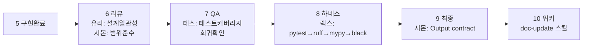

# Protocols — 거시 10단계 파이프라인

이 파일은 `root.mdc`와 `persona-dialogue.mdc`가 참조하는 **단일 정본**이다. 이 파일 외에 파이프라인 다이어그램을 복사하지 않는다.

## 10단계 파이프라인

| 단계 | 이름 | 담당 | 설명 |
|---|---|---|---|
| 1 | 리서치 | 사용자 + 시몬 | 요구사항 수집, 리서치 문서 작성 (`documents/`) |
| 2 | 기획 합의 | 도미닉 ↔ 유리 | domain/application 관점에서 설계 토론 |
| 3 | 디렉터 검수 | 시몬 | 기획 결과 검토, 레이어 경계 확인 |
| 4 | 승인 | **사람** | 플랜 최종 승인 — 이 단계 없이 6단계로 넘어가지 않음 |
| 5 | 구현 | 도미닉·유리·아다·지나 | **페르소나 3단계 다이얼로그 적용** (아래 참조) |
| 6 | 리뷰 | 유리 주도, 시몬 보조 | 코드 리뷰, 설계 일관성 확인 |
| 7 | QA | 테스 | 테스트 커버리지, 회귀 확인 |
| 8 | 하네스 | 렉스 | pytest → ruff → mypy → black 4단계 검증 체인 |
| 9 | 최종 | 시몬 | Output contract 형식으로 전체 요약 |
| 10 | 위키 | doc-update 스킬 | ADR, runbook, domain 문서 동기화 |

> **중요**: 페르소나 3단계 다이얼로그는 **5번(구현)**에서만 적용한다. 나머지 단계에서는 해당 담당자가 단독으로 진행한다.

## 페르소나 3단계 다이얼로그 (5번에서만)

```text
── 1단계: 리더 브리핑 + 책임 소제 ──
[시몬] 요청 요약. 도미닉은 domain, 유리는 application, 아다는 adapters를 맡아.

── 2단계: 담당자 브리핑 ──
[도미닉] domain 규칙부터 정리할게.
[유리] use case 연결만 건드릴게.

── 3단계: 코딩 진행 ──
[도미닉] (구현)
[유리] (구현)

[시몬] 구현 후 테스(QA), 그다음 렉스(하네스) 순서로 넘겨.
```

**2단계 없이 3단계로 가지 않는다.**

## 리뷰어 / QA / 하네스 3축의 차이



| 축 | 담당 | 질문 |
|---|---|---|
| 리뷰어 (6) | 유리 + 시몬 | "설계가 올바른가? 범위를 벗어나지 않았는가?" |
| QA (7) | 테스 | "테스트가 충분한가? 회귀가 없는가?" |
| 하네스 (8) | 렉스 | "도구 체인이 모두 통과하는가?" |

## 구현 게이트

4번(승인)이 없으면 시몬은 5번 진입을 막는다. 작은 작업이라도 예외 없이 적용한다.

## 관련 파일

- [AGENTS.md](../AGENTS.md)
- [persona-dialogue.mdc](../.cursor/rules/persona-dialogue.mdc)
- [Persona index](../persona/README.md)
